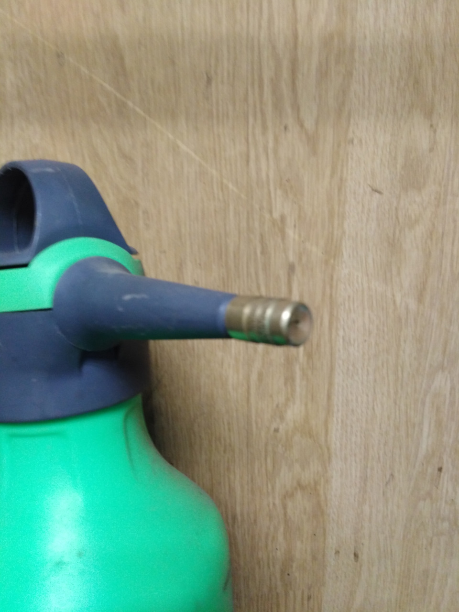

# Антикоррозийная обработка кузова — скрытые полости и днище

> Применимость: все модели Соболь
> Модели: Соболь 2217, 2752, 2310 — все

## Почему Соболь гниёт особенно активно

Соболь — коммерческий транспорт. Завод экономит на заводской антикоррозийной обработке: заводской антикор — тонкий, покрывает не все полости. Добавь сюда: перегруз, бездорожье, соль зимой, коммерческая эксплуатация без ТО — кузов сгнивает за 7–10 лет.

**Самые проблемные зоны Соболя:**
- Пороги (изнутри — сгнивают первыми)
- Нижняя часть дверей (дренажные отверстия забиваются)
- Лонжероны
- Задние арки
- Швы рамки ветрового стекла
- Полости под задними сиденьями
- Нижняя часть стоек

## Когда делать

- При покупке б/у Соболя — сразу после мойки и осмотра
- Раз в 2–3 года как профилактика
- Если нашли очаги ржавчины — перед следующей зимой
- После зимы — осмотр и подновление

## Материалы — что использовать

### Для скрытых полостей (внутрь порогов, лонжеронов)

| Материал | Особенности |
|---|---|
| **Мовиль** | Классика, дёшево. Проникает в щели, вытесняет влагу. Требует обновления раз в 1–2 года. |
| **Раст-Стоп (Rust Stop)** | Хорошо держится, проникает в капиллярные трещины. Раз в 1–2 года. |
| **Динитрол ML** | Очень текучий, отличная пенетрация. Ресурс 5–7 лет. |
| **Мовиль + нигрол + пушечное сало** | Самодельная смесь 1:1:1. Дёшево, эффективно. |
| **Waxoyl** | Восковая основа, держится 2 года без обновления. |

**Не использовать:** битумные мастики в скрытые полости — не проникают, задерживают влагу внутри.

### Для днища и наружных поверхностей

| Материал | Особенности |
|---|---|
| **Антигравий (антикор Dinitrol, Tectyl)** | Твёрдое покрытие. Хорошо на арки и плоское днище. |
| **Битумная мастика** | Дёшево, только для плоских поверхностей. Не на зону сварных швов. |
| **Жидкий антикор с цинком (Tectyl)** | Цинкование + защитный слой. Обновлять раз в 3 года. |

## Подготовка кузова

1. Вымыть днище и пороги мойкой — горячей водой под давлением
2. Дать высохнуть (сутки в тепле)
3. Осмотреть — найти очаги ржавчины
4. Зачистить ржавчину металлической щёткой или наждачкой до металла
5. Обработать преобразователем ржавчины (фосфорная кислота)
6. Дать высохнуть
7. Прочистить или просверлить технологические отверстия в полостях

## Технологические отверстия

Для попадания состава внутрь закрытых полостей нужны отверстия:

**Пороги:** штатные дренажные отверстия снизу (прочистить). Если нет доступа в переднюю часть — сверлить дополнительное отверстие ∅8–10 мм в задней арке.

**Лонжероны:** заводские отверстия сзади. Обычно достаточно.

**Двери:** штатные дренажные отверстия снизу (прочистить от грязи).

**После обработки:** технологические отверстия закрыть резиновыми заглушками.

## Нанесение на скрытые полости

**Инструмент:**
- Компрессор + пистолет с длинной трубкой-распылителем (продаётся к Мовилю)
- Или баллончики-аэрозоли с гибкой трубкой-насадкой (Liqui Moly, Dinitrol)

**Порядок:**
1. Разогреть Мовиль/Раст-Стоп до текучести (если густой)
2. Вставить трубку в технологическое отверстие
3. Медленно вводить, одновременно подавая состав под давлением
4. Двигать трубку туда-обратно — равномерно покрыть всю полость
5. Дать стечь излишку
6. Заглушить отверстие

## Нюансы Соболя

- **Левый порог** — особенно проблемный. Вода затекает через уплотнитель нижней петли водительской двери. Нужно сверлить дополнительное отверстие в задней части порога — штатного дренажа нет.
- **На микроавтобусах (2217)** — дополнительно обработать полости под третьим рядом сидений: туда набивается снег через уплотнители.
- **Задние арки фургона** — при монтаже фанерной обшивки между металлом и фанерой скапливается влага → ранняя коррозия. При монтаже — проложить паронепроницаемый слой.
- Соболь 4x4 — рама и балки переднего моста: обработать Тектилом или жидким цинком отдельно.
- Двери обрабатывать в открытом положении — дать вытечь лишнему составу через дренаж, иначе растворитель испортит уплотнители.

## Периодичность

| Зона | Интервал |
|---|---|
| Скрытые полости (Мовиль, Раст-Стоп) | Раз в 1–2 года |
| Скрытые полости (Динитрол, Waxoyl) | Раз в 3–5 лет |
| Днище (мастика, антигравий) | Раз в 3–5 лет |
| Осмотр и контроль | Каждую весну |

## Типичные ошибки

**Обрабатывать по ржавчине без подготовки** — антикор поверх ржавчины не останавливает коррозию изнутри.

**Лить битумную мастику в полости** — слишком густая, в щели не проникает, задерживает влагу в труднодоступных местах.

**Забыть открыть дренажные отверстия** — вода не уходит, коррозия продолжается.

**Обрабатывать во влажную погоду или в мороз** — состав не схватывается, сползает.

**Обрабатывать снаружи, не трогая внутреннее пространство порогов** — основная коррозия идёт изнутри.

## Что нужно

- Мовиль или Раст-Стоп: 2–4 баллончика (аэрозоль) или 1 л + компрессор
- Динитрол / Dinitrol: 1 л на полости, 1 л на днище
- Металлическая щётка на болгарку или дрель
- Преобразователь ржавчины
- Сверло 8–10 мм (для дополнительных отверстий)
- Резиновые заглушки ∅8 мм

## Источники

- [Антикоррозийная обработка Соболь 4x4, Раст-Стоп — drive2.ru](https://www.drive2.ru/l/471177017459474891/)
- [Антикоррозийная обработка ГАЗ Соболь 4x4 — vodkomotornik.ru](https://www.vodkomotornik.ru/forum/viewtopic.php?t=6673)
- [Антикор скрытых полостей — group-rb.ru](https://group-rb.ru/antikor-skrytyh-polostej-avtomobilya-kak-sdelat/)

---
*Собрано: 2026-05-26*
