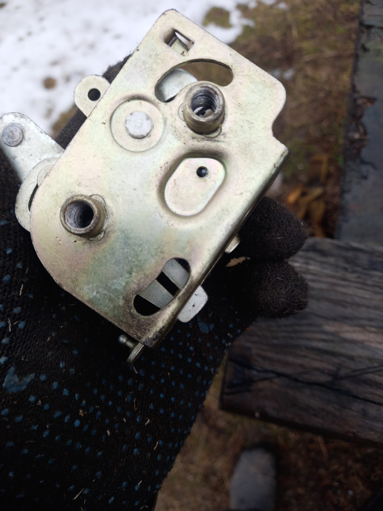

# Замки и петли дверей — ремонт и обслуживание

> Применимость: все модели Соболь
> Модели: Соболь 2217, 2752, 2310 — все

## Двери Соболя — обзор

Соболь имеет:
- Передние распашные двери (водитель + пассажир)
- Задние распашные двери (фургон 2752, микроавтобус)
- Сдвижная боковая дверь (2217 и 2752)

У каждого типа — своя конструкция замка и петель.

## Симптомы проблем с замками и петлями

| Симптом | Вероятная причина |
|---|---|
| Дверь не закрывается или открывается самостоятельно | Износ защёлки или регулировка замка |
| Дверь болтается, зазоры неравномерные | Разбитые петли |
| Дверь туго открывается, заедает | Загрязнение или коррозия механизма |
| Задние двери барабанят при езде | Разбитые петли, нет упора |
| Сдвижная дверь не закрывается плотно | Износ роликов, регулировка |
| Скрип при открывании | Петли требуют смазки |

## Обслуживание петель

### Периодичность

- Смазка петель и замков: раз в 4–6 месяцев (весна, осень)
- Весной — после зимней соли обязательно

### Чем смазывать

| Место | Смазка |
|---|---|
| Петли (ось) | Литол-24, ШРУС-4, Molykote |
| Механизм замка (движущиеся части) | Силиконовая смазка или литиевая (не WD-40!) |
| Защёлки и фиксаторы | Смазка Litol, ЦИАТИМ |
| Резиновые уплотнители | Силиконовый спрей (не масло!) |

**WD-40 — не смазка.** Вытесняет влагу и вымывает смазку. После WD-40 — нанести нормальную смазку поверх.

### Смазка петель передних дверей

1. Открыть дверь максимально
2. Нанести смазку на ось петли (обе петли: верхняя и нижняя)
3. Поработать дверью вверх-вниз для проникновения смазки
4. Вытереть излишки

### Смазка замка

1. Нанести силиконовую смазку на фиксирующий элемент (язычок) замка
2. Смазать штырь/ответную часть (на стойке кузова)
3. Несколько раз открыть-закрыть для равномерного распределения

## Ремонт петель задних дверей

Петли задних дверей — одна из частых проблем Соболя. После 5–7 лет эксплуатации ось петли изнашивается, дверь «провисает» и болтается.

### Метод восстановления изношенной петли

При небольшом износе:
1. Снять дверь (отвернуть болты петли)
2. Высверлить старую ось петли (∅ оригинала ~8 мм)
3. Рассверлить отверстие под М8
4. Нарезать резьбу метчиком
5. Вкрутить болт М8 с конусным концом — он выбирает люфт
6. Нанести Литол на ось
7. Установить дверь обратно

При сильном износе — замена петли в сборе.

**Артикулы петель:**
- Петля задней двери Соболь фургон: уточнять по году в каталоге
- Петля задней двери микроавтобуса: другая конструкция

### Устранение болтания задних дверей при езде

Задние распашные двери болтаются на ухабах и бьют друг о друга:
- Установить пластиковые или резиновые клинышки-упоры между дверями
- Проверить штырь ограничителя открывания
- Проверить ход защёлки — должна фиксироваться чётко

## Ремонт замка сдвижной боковой двери

Сдвижная дверь Соболя 2217 — проблемная. Замок сложный, с несколькими тягами.

### Причины отказа

- Деформация G-образного флажка (фиксатор)
- Поломка пружины механизма
- Деформация тяги привода
- Накопление грязи и коррозии при длительном простое

### Порядок ремонта (своими руками)

1. Снять обшивку сдвижной двери (4–6 саморезов + защёлки)
2. Получить доступ к механизму замка
3. Смазать механизм машинным маслом — для растворения старой грязи
4. Осмотреть G-образный флажок — вернуть в рабочее положение
5. Проверить пружину — если сломана, загнуть сломанный виток в упорный крючок или заменить
6. Выпрямить деформированную тягу или заменить её тросом с пластиковым толкателем (надёжнее)
7. Отрегулировать натяжение тяги/троса
8. Проверить закрывание: дверь должна чётко защёлкиваться без перекосов

**Инструмент:** трещотка с удлинителем, головки 8 и 10 мм, крестовая и плоская отвёртки, плоскогубцы.

### Артикулы

- Замок сдвижной двери: **2705-6305486** (или аналог)
- Уточнять по году выпуска — механизм несколько раз менялся

### Регулировка замка сдвижной двери

При неплотном закрывании:
1. Ослабить болты крепления ответной части (штыря) на кузове
2. Сдвинуть ответную часть к двери на 1–2 мм
3. Затянуть болты
4. Проверить: дверь должна закрываться без удара, но плотно

## Нюансы Соболя

- **Уплотнители дверей** — дубеют через 3–5 лет. Дверь закрывается туже, петли нагружаются — ускоряется износ. Менять уплотнители своевременно.
- **Зимой** замки могут примёрзнуть. Использовать размораживатель (аэрозоль WD-40 или специальный). Смазать после размораживания.
- **Петли не смазывали** — скрип при открывании. Заливать смазку сверху бесполезно — смазывать на оси.
- На микроавтобусах 2217 — регулярно проверять крепёжные болты петель: ослабевают от вибрации.

## Типичные ошибки

**Смазать WD-40 и забыть** — WD-40 испаряется, механизм снова становится сухим быстрее, чем без смазки.

**Игнорировать болтание задних дверей** — разбитые петли ведут к перекосу дверей, нарушению уплотнения, сквозняку и влаге в кузове.

**Тянуть дверь при ремонте замка** вместо снятия обшивки — деформируют тяги, делая ремонт сложнее.

**Не регулировать ответную часть замка** после замены петель — дверь будет закрываться с трудом или неплотно.

## Инструмент и расходники

- Литол-24 или Molykote: туба 75–100 г
- Силиконовая смазка: баллончик
- Трещотка, головки 8, 10, 13 мм
- Плоскогубцы, молоток, выколотка (для оси петли)
- Замораживатель замков: баллончик (зимой)

## Источники

- [Ремонт замка сдвижной двери Газель — drive2.ru](https://www.drive2.ru/l/641105440020631423/)
- [Мой метод восстановления петель задних дверей Газель — drive2.ru](https://www.drive2.ru/l/7036275/)
- [Замена замков задних дверей — gazelleclub.ru](http://www.gazelleclub.ru/forum/topic/37729-zamena-zamkov-zadnikh-dverei-analogami-ot-drugi/)
- [Устройство петли задней двери Газель Соболь — autoremsakh.ru](https://autoremsakh.ru/ustrojstvo-petli-zadnej-dveri-gazel-sobol/)

---
*Собрано: 2026-05-26*
