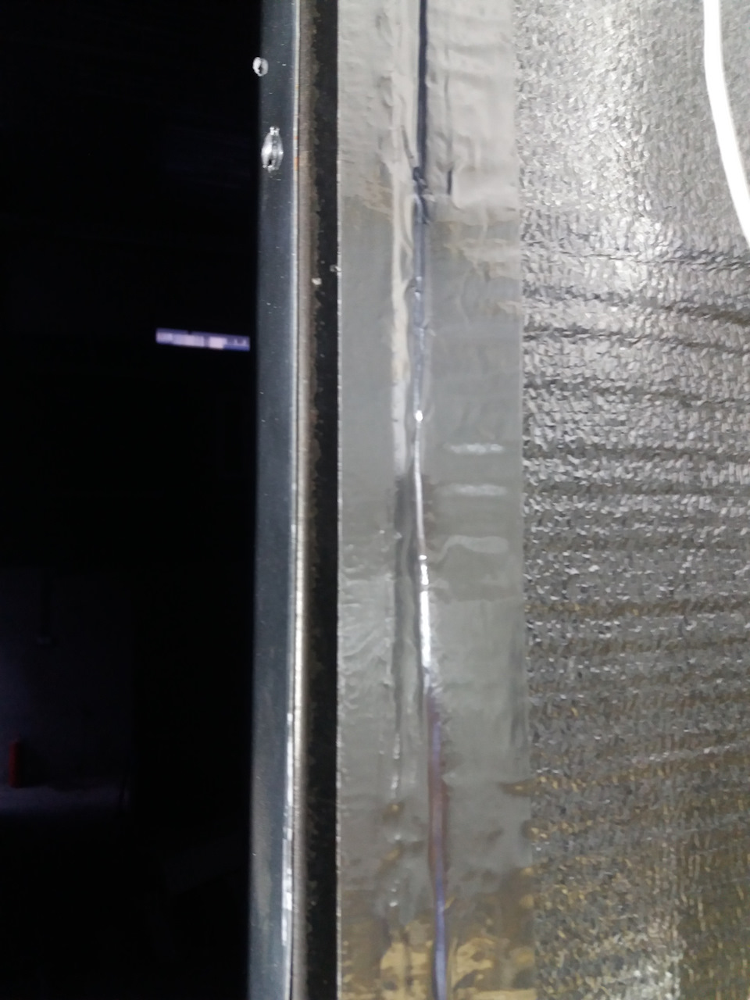

# Утепление фургона зимой — материалы и технология

> Применимость: все двигатели
> Модели: Соболь 2752 (фургон), 2217 (автобус)

## Зачем утеплять

- Конденсат на металле → капает с потолка, мёрзнет груз
- Штатный фургон Соболя — металлический ящик без изоляции
- Отопитель не справляется при −20°C в неутеплённом кузове
- Утеплённый фургон держит тепло дольше и требует меньше топлива на прогрев

## Материалы — сравнение

| Материал | Толщина | Плюсы | Минусы |
|---|---|---|---|
| **Пенополистирол (пенопласт)** | 30–50 мм | Дёшево, доступно везде | Хрупкий, крошится |
| **Экструдированный пенополистирол (Пеноплекс)** | 30–50 мм | Прочнее пенопласта, меньше впитывает влагу | Дороже |
| **Пенофол (ППЭ с фольгой)** | 5–10 мм | Тонкий, отражает ИК-излучение | Сам по себе слабый утеплитель |
| **Изолон 500** | 10–20 мм | Самозатухающий, гибкий | Средний по цене |
| **Минеральная вата** | 50–100 мм | Хорошая теплоизоляция | Тяжёлая, боится влаги, колется |

**Оптимальный бюджетный вариант:**
1 слой Пенополистирол 30–50 мм + сверху Пенофол 5 мм + обшивка фанерой или Алюкобондом.

**Правильный вариант:**
Пеноплекс 50 мм + Пенофол 5 мм + влагостойкая фанера 10 мм.

## Технология монтажа

### Шаг 1 — Подготовка кузова
1. Вымыть кузов изнутри, высушить
2. Нанести антикор на все металлические поверхности (это обязательно — под утеплителем металл не проветривается)
3. Загерметизировать все щели и технологические отверстия монтажной пеной

### Шаг 2 — Обрешётка (если нужна)
- Прикрутить деревянные бруски 30×30 мм к металлу через резиновые прокладки (иначе мостики холода)
- Шаг брусков — по ширине плиты утеплителя
- Альтернатива: клеить пенополистирол прямо на металл на монтажную пену (без обрешётки)

### Шаг 3 — Укладка утеплителя
**Пол:**
- Пенополистирол 50 мм, поверх — влагостойкая фанера 18–22 мм или доска 25 мм
- Фанера крепится саморезами к брускам (или к металлическому полу через утеплитель)
- Пол должен выдерживать нагрузку: фанера не менее 18 мм

**Стены:**
- Вложить плиты пенополистирола между брусками
- Щели между плитами запенить монтажной пеной
- Все стыки проклеить алюминиевым скотчем

**Крыша (сложнее всего):**
- Использовать Пенофол на самоклейке или приклеивать на монтажный клей
- Пенополистирол на крышу — держать клиньями до схватывания клея
- Потолок: Алюкобонд, оцинковка или фанера с лакокрасочным покрытием

### Шаг 4 — Обшивка
Поверх утеплителя — финишная обшивка:
- **Алюкобонд** (алюминий + пластик) — прочно, не гниёт, красиво
- **Влагостойкая фанера** + краска — дёшево
- **Вагонка ПВХ** — легко монтировать, но хрупкая при ударе

Крепить к обрешётке саморезами. Торцы обрабатывать герметиком.

## Стоимость ориентировочно

| Вариант | Площадь ~20 м² | Стоимость материалов |
|---|---|---|
| Бюджетный (пенопласт + Пенофол + фанера) | | 7 000–12 000 руб. |
| Средний (Пеноплекс + Пенофол + Алюкобонд) | | 20 000–35 000 руб. |

Работа в сервисе: +15 000–30 000 руб.

## Дополнительное отопление

Штатный отопитель от двигателя в кузов (автономные шланги) — стандартное решение для фургона, но требует двигатель работать. Для ночёвки или длительной стоянки:

- **Вебасто / Эберспехер** (дизельный автономный обогреватель): 30 000–80 000 руб., надёжно, профессиональное решение
- **Китайские аналоги** (Alhonga, Планар и аналоги): 5 000–15 000 руб., менее надёжны, но приемлемы
- **Газовый обогреватель на баллоне** — только при вентиляции, угарный газ

## Нюансы Соболя

- Фургон 2752: металлическая будка — утеплять стоит только если реально нужно работать с грузом в мороз
- Автобус 2217: штатная теплоизоляция минимальная — Пенофол на пол под ковёр даст ощутимый результат без переделок
- Мостики холода: деревянные бруски обрешётки проводят холод — класть резиновые прокладки под каждый брусок
- Антикор под утеплителем обязателен — иначе скрытая коррозия под изоляцией за 3–5 лет

## Типичные ошибки

**Не нанести антикор перед укладкой утеплителя** — через 3–5 лет металл сгниёт под изоляцией незаметно.

**Пенофол без основного утеплителя** — 5 мм пенофола даёт минимальный эффект в сильный мороз.

**Закрыть дренажные отверстия** — вода не сможет вытечь, начнётся гниение.

## Источники

- [Утепление фургона Газель — drive2.ru](https://www.drive2.ru/l/546495488107479075/)
- [Как сделать термофургон — busvud.com.ua](https://busvud.com.ua/blog/kak-pravilno-sdelat-termofurgon/)
- [Как обеспечить отопление фургона — daizen.ru](https://daizen.ru/stati/kak-obespechit-otoplenie-furgona/)

---
*Собрано: 2026-05-26*
