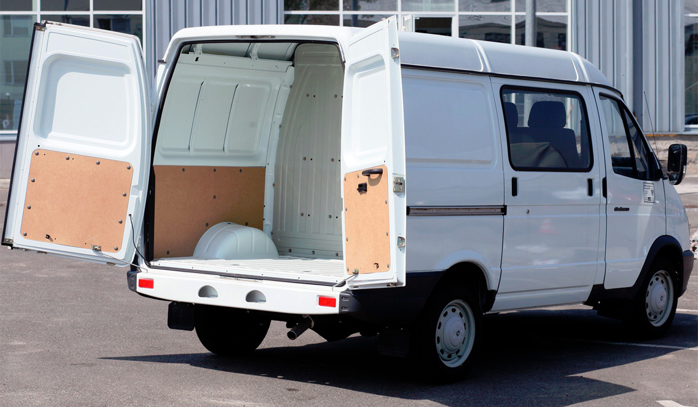

# Задняя распашная дверь — регулировка, петли, уплотнение

> Применимость: все двигатели
> Модели: Соболь 2752 (фургон) — основное применение

## Конструкция

Задние двери Соболя-фургона (2752) — распашные, открываются на 270° (до упора вдоль кузова). Каждая дверь держится на двух петлях. Замок: штырь на двери + защёлка на кузове.

Петля задней двери: арт. **22176306010** (или 2217-6306010).

Удерживаются в открытом положении газовыми упорами (лифтами), которые на полном открытии — дают дверям лечь вдоль кузова.

## Симптомы и причины проблем

| Симптом | Причина |
|---|---|
| Дверь не закрывается плотно, поддувает | Сместился штырь замка, просела петля |
| Дверь открывается сама на кочках | Штырь замка вкручен слишком мало |
| Дверь провисла, трёт об проём | Износ или поломка петли |
| Скрипит при открытии/закрытии | Сухие петли |
| Не закрывается снаружи | Гнилая/заклинившая тяга замка |
| Дует по всему периметру | Деформирован уплотнитель или дверь перекошена |
| Петля ржавеет, разбивается | Вода между петлёй и кузовом/дверью |

## Регулировка замка

Замок регулируется положением **ответной части** (шипа на двери):

1. Ослабить болт крепления шипа
2. Сдвинуть шип в сторону кузова до упора — потом отвести на 3–4 мм назад
3. Затянуть болт и проверить закрытие: дверь должна прижиматься с усилием, но не требовать удара
4. Если дверь открывается на кочках → шип вкручен слишком мало → добавить 1–2 мм

**Клинья-фиксаторы** (пластиковые, вверху и внизу): удерживают дверь в закрытом положении, изнашиваются. При появлении стука — заменить. Продаются в комплекте.

## Регулировка петель

Петли Соболя не имеют регулировки по плоскости — только замена или проставки:

1. Если дверь провисает → проставки (шайбы 0.5–1 мм) под петлю со стороны кузова
2. Если дверь перекошена → ослабить все болты крепления одновременно, выровнять, затянуть

**Болты петель:** 4 болта на каждой петле (ключ 13 мм). Болты закисают — WD-40 за сутки до работы.

## Замена петли

Артикул: **22176306010** (~1000–1500 руб.)

1. Открыть дверь полностью (под 90°)
2. Подпереть дверь снизу (домкрат + деревянный брусок) — иначе упадёт при откручивании
3. Открутить 4 болта петли со стороны двери (изнутри)
4. Открутить 4 болта петли со стороны кузова
5. Вынуть петлю
6. При установке: под петлю со стороны кузова подложить паронитовую прокладку 1–2 мм (защита от ржавчины под петлёй)
7. Затянуть болты
8. Проверить положение двери, при необходимости откорректировать проставками

**Важно:** газовые лифты мешают при замене — если лифт держит дверь в открытом положении, подпереть дверь дополнительно.

## Уплотнитель задних дверей

Уплотнитель надевается на отбортовку проёма двери. Стандартный артикул: **3302-6107126** (или аналог).

**Признаки износа:**
- Дверь начинает поддувать (слышен сквозняк при езде)
- Видны трещины или жёсткость резины
- Уплотнитель отслаивается в углах

**Замена:**
1. Снять старый уплотнитель (тянуть руками, без инструмента)
2. Очистить металлическую полку от грязи и ржавчины
3. Нанести антикор на оголившийся металл
4. Надеть новый уплотнитель — начинать с углов проёма
5. Места стыка (где концы уплотнителя сходятся) — промазать клеем-герметиком

**Дополнительная смазка:** раз в год обрабатывать уплотнитель силиконовой смазкой — не даст прилипнуть к двери в мороз.

## Смазка петель

Петли смазывать через шарнир густой смазкой (Литол-24 или аналог):
- Если петля разборная — разобрать, смазать ось
- Если нет — залить жидкой смазкой (WD-40 для очистки, потом Литол)
- Периодичность: раз в 1–2 года или при появлении скрипа

## Нюансы Соболя

- Под петлями скапливается вода → ржавчина между петлёй и металлом кузова → петля «приваривается» ржавчиной. Профилактика: паронитовая прокладка под петлю при установке
- На старых Соболях петли ломались по шарниру — замена только в сборе
- Дверь при полном открытии лежит вдоль кузова: газовые упоры должны держать её в этом положении. Слабые упоры → дверь бьёт по крылу или кузову
- Уплотнитель в зоне нижнего порога двери — самое уязвимое место коррозии (вода туда стекает)

## Типичные ошибки

**Регулировать замок без проставок** — провисшая петля вернёт перекос замка.

**Не обрабатывать металл под снятым уплотнителем** — за резинкой коррозия идёт быстрее всего.

**Затягивать болты петель на весу** — дверь деформирует при затяжке. Всегда под нагрузкой (дверь на опоре).

## Источники

- [Замена петель задней двери Соболь — drive2.ru](https://www.drive2.ru/l/616960164674698242/)
- [Регулировка задней двери Баргузин — drive2.ru](https://www.drive2.ru/l/555238804571553919/)
- [Соболь задние двери — forum.allgaz.ru](https://forum.allgaz.ru/threads/%D1%81%D0%BE%D0%B1%D0%BE%D0%BB%D1%8C-%D0%B7%D0%B0%D0%B4%D0%BD%D0%B8%D0%B5-%D0%B4%D0%B2%D0%B5%D1%80%D0%B8.66400/)
- [Устройство петли задней двери — autoremsakh.ru](https://autoremsakh.ru/ustrojstvo-petli-zadnej-dveri-gazel-sobol/)

---
*Собрано: 2026-05-26*
