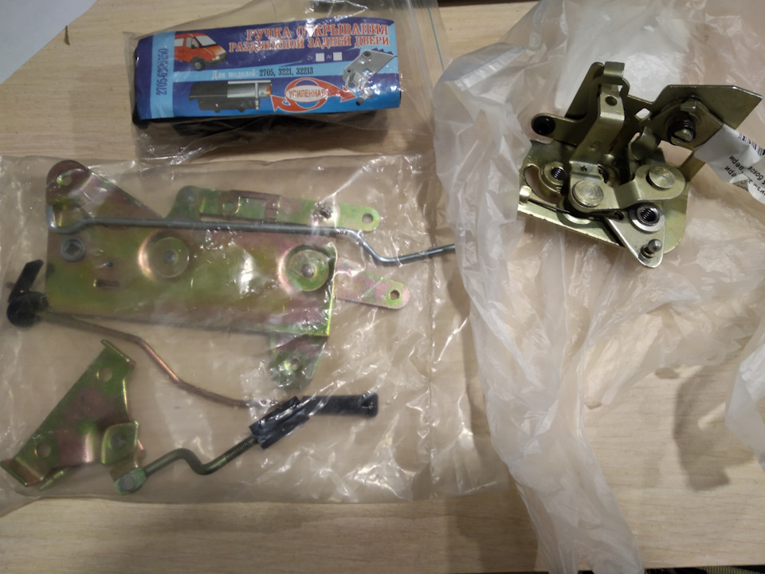
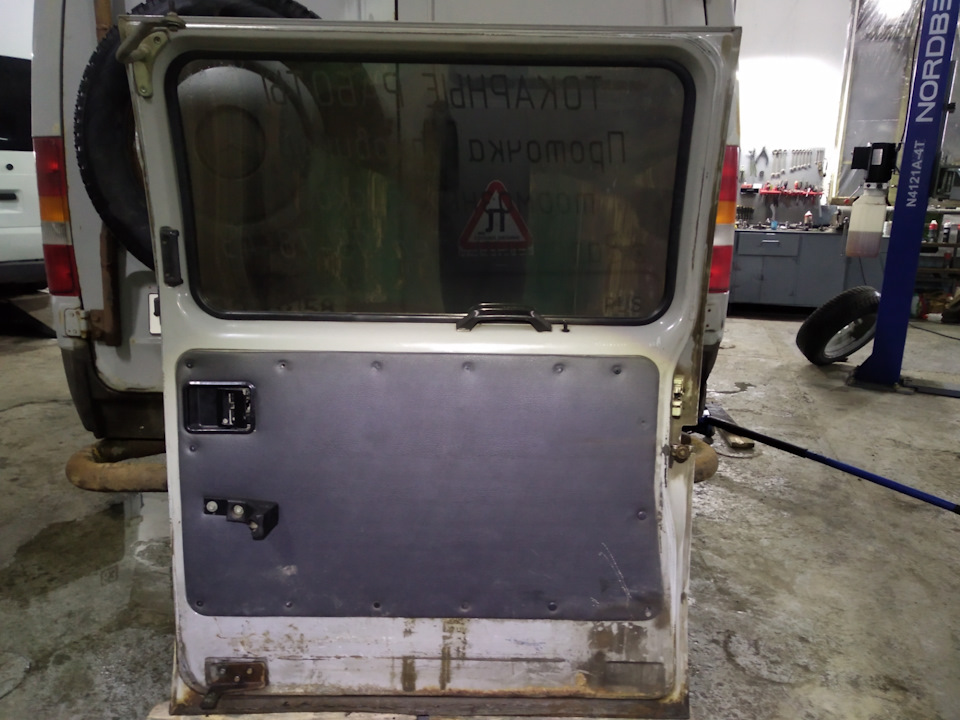

# Сдвижная боковая дверь — ролики, регулировка, замок

> Применимость: все двигатели
> Модели: Соболь 2217 (автобус), 2752 (фургон с боковой дверью)

## Конструкция

Сдвижная дверь движется по трём направляющим:
- **Верхняя** — держит верхний край двери (ролик в профиле над проёмом)
- **Средняя** — основная нагрузка, здесь же шип замка
- **Нижняя** — удерживает нижний край двери

На каждой направляющей — ролик с подшипником. Штатные ролики с металлическими пыльниками изнашиваются от грязи и соли за 3–5 лет.

## Симптомы и причины

| Симптом | Причина |
|---|---|
| Дверь идёт туго, с рывками | Износ роликов, загрязнение направляющих |
| Дверь провисает при открытии | Износ ролика средней направляющей |
| Дверь не закрывается плотно | Неправильное положение шипа замка или роликов |
| Стук при движении двери | Разбитые ролики, ослаблены крепления |
| Дверь сама открывается на ходу | Замок не защёлкивается — изношен фиксатор |
| Задувает по контуру двери | Перекос двери, изношен уплотнитель |

## Регулировка двери — три узла

**Подготовка:**
1. Снять обшивку двери (изнутри — клипсы + 2–3 болта)
2. Открыть дверь полностью
3. Ослабить болты крепления всех трёх роликовых узлов

**Узел А (верхняя направляющая):**
- Регулирует верхний правый угол: внутрь/наружу и вверх/вниз
- Ослабить гайку ролика, переместить, затянуть

**Узел В (нижняя направляющая):**
- Регулирует нижний правый угол: наружу/внутрь
- Ослабить болт, сдвинуть кронштейн

**Узел С (средняя направляющая):**
- Основной: регулирует горизонтальное положение всей двери
- Здесь же шип замка — регулируется отдельно

**Порядок:**
1. Выставить зазоры по периметру проёма (штангенциркуль): правый зазор на 2–3 мм меньше левого (дверь при эксплуатации немного смещается)
2. Поочерёдно регулировать все три узла, добиваясь равномерности зазоров
3. Затянуть болты
4. Закрыть дверь, проверить прилегание уплотнителя по периметру
5. Смазать резиновые фиксаторы силиконовой смазкой
6. Поставить обшивку обратно

**Общее время регулировки: 2–3 часа.**

## Замена роликов

Штатные ролики быстро приходят в негодность. При разборке — сразу менять на подшипники качения (закрытые, с резиновыми пыльниками):

- Подшипники 6202 или 6000ZZ — подбирать по диаметру штатного ролика
- Цена комплекта: 300–500 руб. vs 2000–4000 руб. за оригинал

**Как заменить ролик:**
1. Снять ролик с направляющей (открутить ось)
2. Выпрессовать подшипник из корпуса ролика или заменить ролик в сборе
3. Набить консистентной смазкой (Литол-24)
4. Установить обратно

**Замена с установкой растяжки:** при сильном провисании средней направляющей — установить стальную растяжку от стойки кузова к краю полоза направляющей. Дёшево и решает проблему надолго.

## Регулировка замка

Замок: клавиша снаружи → тяга → защёлка. Шип (ответная часть) — на кузове.

**Дверь не защёлкивается:**
1. Проверить взаимное положение шипа и защёлки: шип должен попадать точно в паз
2. Если шип цепляет буртик → немного подпилить буртик или сдвинуть шип
3. Регулировка шипа: ослабить болт, сдвинуть, затянуть

**Дверь открывается сама:**
- Изношен фиксатор (пружинный зажим защёлки) → замена защёлки

**Внутренняя ручка не открывает:**
- Порвана или заклинила тяга от рукоятки к замку → проверить тягу, смазать шарниры

## Смазка и обслуживание

- **Направляющие** — смазать Литол-24 или густой смазкой (не WD-40): раз в год
- **Ролики** — набить смазкой при замене
- **Шарниры замка и тяги** — WD-40, потом Литол
- **Уплотнитель двери** — силиконовая смазка, не WD-40 (разрушает резину)

## Нюансы Соболя

- Ролики быстро гибнут от соли и грязи — замена на закрытые подшипники радикально продлевает ресурс
- Полоз средней направляющей со временем изгибается (дверь ударяется при закрытии) — выровнять молотком через деревянный брусок
- Кронштейн нижней направляющей на кузове закисает — при обслуживании смазать резьбу болтов
- Соболь-автобус 2217: боковая дверь широкая, вес большой — ролики изнашиваются быстрее, чем на фургоне

## Типичные ошибки

**Регулировать только один узел** — дверь перекошена в другую сторону. Регулировать все три одновременно.

**Смазать направляющие WD-40** — через неделю грязь прилипнет и станет хуже. Только густая смазка.

**Не проверить ролики при регулировке** — перекошенная дверь иногда вызвана разбитым роликом, а не неправильной настройкой.

## Инструмент

- Ключи 10, 13 мм
- Штангенциркуль (для контроля зазоров)
- Молоток + деревянный брусок
- Литол-24 или аналог

## Источники

- [Регулировка боковой двери по правилам — drive2.ru](https://www.drive2.ru/l/10376222/)
- [Регулировка сдвижной двери Соболь — drive2.ru](https://www.drive2.ru/l/468941985198113279/)
- [Ремонт и регулировка сдвижной двери — gazelleclub.ru](https://www.gazelleclub.ru/forum/topic/13134-remont-regulirovka-i-dop-oborudovanie-sdvizhnoi-dveri/)

---
*Собрано: 2026-05-26*
