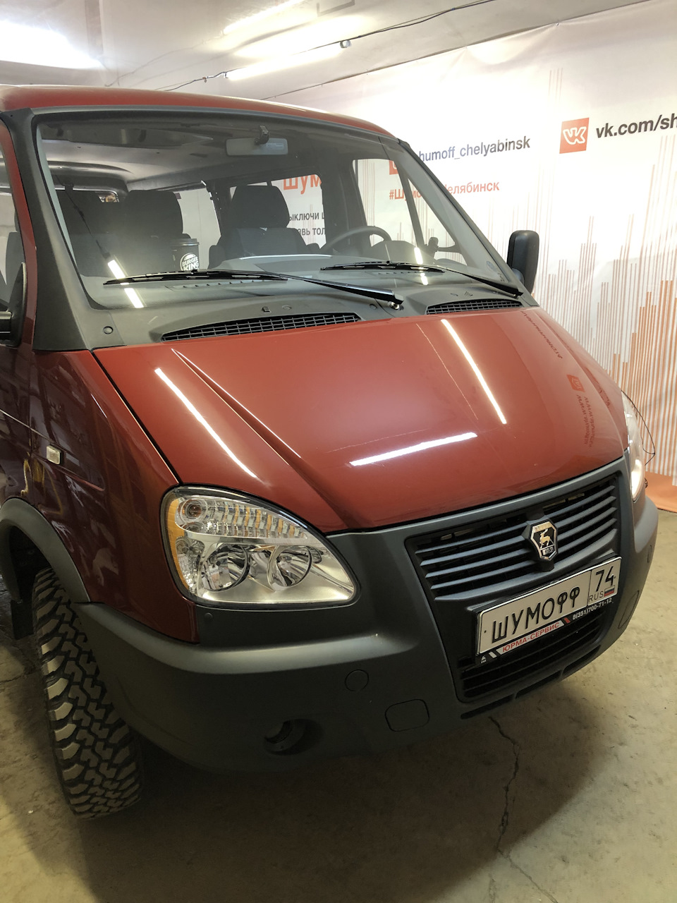

# Шумоизоляция — материалы и технология

> Применимость: все модели Соболь
> Модели: Соболь 2217, 2752, 2310 — все

## Зачем делать шумоизоляцию Соболю

Соболь — коммерческий транспорт, заводская шумоизоляция минимальная. Основные источники шума:
- Кардан (под полом кабины)
- Колёсные арки (грязь, дорога)
- Щит моторного отсека
- Двери (гуляет металл)
- Крыша и стойки

## Слои шумоизоляции

Правильная шумоизоляция — многослойная:

1. **Виброизоляция** (1-й слой) — наклеивается прямо на металл. Гасит резонанс, убирает «бубнение» панелей.
2. **Звукопоглощение** (2-й слой) — пористый материал поверх виброизоляции. Поглощает звуковые волны.

## Материалы

### Виброизоляция (1-й слой)

| Материал | Характеристики |
|---|---|
| **СТП (STP) Бомба** | Толстый, тяжёлый. Максимальный эффект. |
| **СТП Аэро** | Тонкий, лёгкий. Для сложных мест. |
| **Вибропласт** | Бюджетный вариант. |
| **Бимаст** | Хорошая виброизоляция, битумный. |
| **Визомат** | Алюминиевый слой, удобен в монтаже. |

Наносить: разогретый строительным феном → прикатать роликом до плотного прилегания. Покрытие: 40–70% поверхности (не обязательно 100%).

### Звукопоглощение (2-й слой)

| Материал | Характеристики |
|---|---|
| **СТП Барьер** | Поролон с фольгой. Универсальный. |
| **Сплен** | Вспененный полиэтилен. Дёшево, хорошо. |
| **Битумная мастика** | Только как дополнение к виброизоляции. |

## Зоны обработки и приоритеты

### Приоритет 1 — Максимальный эффект

**Пол кабины** — главное место. Снять сиденья и обшивку, наклеить виброизоляцию, затем звукопоглощение. Особенно вокруг карданного тоннеля.

**Щит передка** (между двигателем и кабиной) — много тепла и шума двигателя. Двуслойный «пирог» + термоизоляция (фольгированный сплен).

### Приоритет 2 — Хороший эффект

**Колёсные арки** (изнутри кабины и снаружи под крыльями) — удары гравия. Виброизоляция + звукопоглощение.

**Двери** — разобрать, виброизоляция на металл двери изнутри (30–50% площади).

### Приоритет 3 — Дополнительный комфорт

**Крыша** — виброизоляция на металл, поверх тонкий сплен.  
**Стойки и пороги** — заполнить монтажной пеной изнутри (без разборки, через отверстия).

## Нюансы Соболя

- **Под сиденьями Соболя** нередко находится бензобак или запасное колесо — учесть при съёмке обшивки пола.
- **Микроавтобус 2217** — обшивка салона разборная, доступ к металлу относительно хороший.
- На **фургоне с изотермическим кузовом** — шумоизоляция уже есть в стенах кузова, приоритет — кабина.
- Перед шумоизоляцией — обработать антикором: металл под ШВИ не проверишь годами.

## Стоимость минимального комплекта

| Зона | Материал | Примерный расход |
|---|---|---|
| Пол кабины | СТП Бомба + СТП Барьер | 2–3 листа + 2 м² |
| Щит передка | Виброизоляция + сплен | 1–2 листа |
| Арки | Бимаст или битум | 2–3 листа |
| Итого | | 4000–10000 руб. |

## Типичные ошибки

**Наклеивать без разогрева** — не прилипнет, отвалится при нагреве.

**Не прикатать роликом** — пузыри, отслоение.

**Шумоизолировать только крышу** — шум идёт снизу, не сверху.

**Не антикорить металл перед шумоизоляцией** — под ШВИ ржавчина не видна, но прогрессирует.

## Источники

- [Шумоизоляция — gazelleclub.ru](https://www.gazelleclub.ru/forum/topic/8848-shumoizoliatciia/)
- [Шумоизоляция — gaz-autoclub.ru](http://gaz-autoclub.ru/viewtopic.php?t=1674)
- [СТП технология своими руками — stp-russia.ru](https://stp-russia.ru/handmade/)

---
*Собрано: 2026-05-26*
