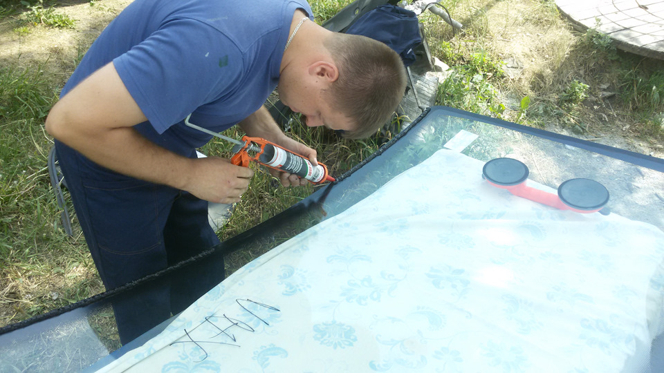

# Замена лобового стекла — Соболь Газель

> Применимость: все модели Соболь
> Модели: Соболь 2217, 2752, 2310 — все

## Когда нужна замена

- Трещина от удара (камень, авария) — трещина растёт при перепадах температур
- Скол в зоне видимости водителя (мешает, не ремонтируется)
- Трещина длиннее 15 см — не восстанавливается
- Расслоение плёнки триплекса

**Мелкий скол** (до 1.5 см) — можно отремонтировать полимерной смолой, не менять.

## Что нужно

- Новое лобовое стекло (подобрать по VIN или году/модели)
- Клей-герметик для автостёкол (полиуретановый): SIKA Ultrafast, Henkel, Bostik
- Праймер (активатор адгезии) — в комплекте с клеем
- Монтажная струна (проволока 0.5–1 мм или нейлон)
- Присоски для стекла
- Ветошь, обезжириватель (изопропиловый спирт)
- Монтажные клинышки (пластиковые)
- Пистолет для клея (картридж или туба)

## Снятие старого стекла

### Метод со струной

1. Найти угол (обычно нижний), протолкнуть зазубренную струну или тонкую проволоку через слой старого клея
2. С двух сторон взять за ручки струны
3. Пилящими движениями резать клей по всему периметру
4. Аккуратно — не задеть кузов и не порезать кабель стеклоочистителей

### После снятия

- Счистить старый клей до ровного слоя (оставить ~1 мм для адгезии)
- Не зачищать металл до «голого» — старый клей служит основой
- Осмотреть раму: ржавчина → зачистить и загрунтовать перед вклейкой

## Подготовка к вклейке

### Подготовка рамы (кузова)

1. Обезжирить изопропиловым спиртом
2. Нанести **праймер** на металл (и на оставшийся слой старого клея)
3. Дать праймеру высохнуть 5–10 мин

### Подготовка стекла

1. Новое стекло обезжирить изопропиловым спиртом
2. Нанести **активатор** на чёрный пояс (frит) по периметру стекла
3. Дать высохнуть 5–10 мин

## Вклейка стекла

1. Подогреть тубу с клеем до 40–60°C (в тёплой воде 30 мин) — улучшает текучесть
2. Срезать носик под 45° буквой «V»
3. Нанести **непрерывный валик клея** по периметру рамы (или стекла), треугольного сечения, высота ~8–10 мм
4. **Время между нанесением праймера и вклейкой: не более 10 мин**
5. С помощью присосок взять стекло, выставить по центру
6. Аккуратно прижать стекло ровным усилием по всему периметру
7. Подложить пластиковые клинышки снизу (чтобы стекло не сползло)

## Время отверждения

- Нельзя ехать: минимум **4 часа** (при 20–22°C)
- Полное отверждение: **24 часа**
- В холод (+5°C и ниже) — время удваивается
- Нельзя мыть машину 24 часа

## Нюансы Соболя

- Лобовое стекло Соболя и Газели разных годов **не взаимозаменяемо** — проверить по VIN или приложить к проёму.
- У Соболя 2217 (микроавтобус) — лобовое стекло свое, не от фургона.
- Резиновый уплотнитель — **не для всех** версий Соболя. Большинство — вклейка без уплотнителя.
- После дождя — проверить стыки. Если подтекает — промазать поверх силиконовым герметиком (временно).

## Типичные ошибки

**Работать в холод без подогрева клея** — плохая адгезия, стекло может выпасть при ударе.

**Сорвать все следы старого клея до металла** — снижает адгезию нового слоя.

**Ехать сразу после вклейки** — стекло выдавится при езде или удержит, но клей не схватится.

**Нанести клей с перерывом** — в месте остановки — слабое место.

## Источники

- [Замена лобового стекла Газель — drive2.ru](https://www.drive2.ru/l/10321376/)
- [Как вклеить лобовое стекло самому — kuzov.info](https://kuzov.info/zamena-lobovogo-stekla-svoimi-rukami/)
- [Вклейка автомобильного стекла — kley-germetik.ru](https://kley-germetik.ru/vklejka-avtomobilnogo-stekla-svoimi-rukami/)

---
*Собрано: 2026-05-26*
