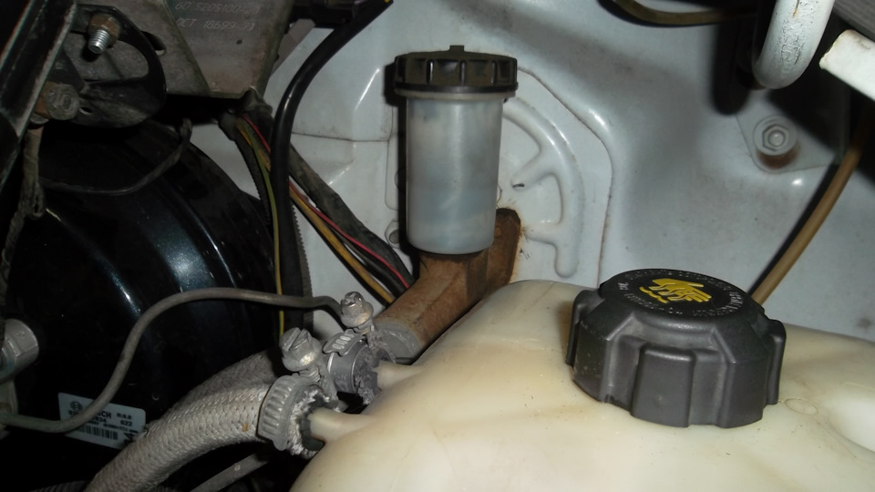
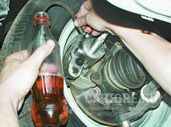

# Прокачка тормозов — Газель Соболь

> Применимость: все модели Соболь
> Модели: Соболь 2217, 2752, 2310 — все

## Когда нужна прокачка

- После любых работ с тормозной системой (замена жидкости, цилиндров, трубок, шлангов)
- Педаль мягкая, «губчатая» → воздух в системе
- После прокачки тормозов → педаль в пол → не туда прокачали

## Ключевые особенности Соболя

**1. Задние колёса должны быть ВЫВЕШЕНЫ.**  
Регулятор давления задних тормозов (колдун) при ненагруженной оси закрывается — жидкость к задним РТЦ не идёт. При вывешенных задних колёсах — колдун открыт.

После прокачки: **опустить машину на колёса**.

**2. Прокачивать с РАБОТАЮЩИМ двигателем.**  
Вакуумный усилитель тормозов (ВУТ) работает только с работающим двигателем. При прокачке с заглушённым двигателем — давление не полное.

## Порядок прокачки (правильный)

Прокачивать по диагонали, начиная с самого дальнего колеса от ГТЦ:

1. Правое заднее
2. Левое переднее
3. Левое заднее
4. Правое переднее

**Расшифровка (для двухконтурной системы):**
- Контур 1: правый перед + левый зад
- Контур 2: левый перед + правый зад

Если меняли только передние тормоза — прокачивать только передние.

## Методы прокачки

### Метод 1 — Классический (два человека)

1. Поднять машину, вывесить задние колёса
2. Долить жидкость в бачок ГТЦ до MAX
3. Завести двигатель
4. Помощник нажимает педаль 3–5 раз и удерживает нажатой
5. Открыть штуцер прокачки на 1/3–1/2 оборота (ключ 8–10 мм)

6. Дождаться пока жидкость перестанет идти (или выйдет пузырь)
7. Закрыть штуцер — помощник отпускает педаль
8. Повторить 3–5 раз до чистой жидкости без пузырей
9. Перейти к следующему колесу

**Доливать жидкость в бачок после каждого колеса** — не допускать осушения бачка (попадёт воздух).

### Метод 2 — Одним человеком (с обратным клапаном)

Использовать устройство прокачки с обратным клапаном (ниппель Шредера + трубка в банку):
1. Подключить устройство к штуцеру
2. Нажимать педаль несколько раз
3. Жидкость с пузырями идёт в банку, воздух не подсасывается обратно

Минус: педаль нужно нажать много раз. Доливать жидкость.

### Метод 3 — Шприцем с давлением (от бачка)

Специальный адаптер на бачок ГТЦ → закачать воздух (0.5–1 атм) → открывать штуцера по очереди. Самый быстрый.

## Прокачка после полного осушения системы

Если жидкость полностью вытекла (меняли ГТЦ):
- Требует больше времени
- Начинать с того же порядка
- Педаль нажимать медленно и чётко
- Возможно, потребуется 10–15 нажатий на каждом колесе

## Как понять, что прокачали правильно

- Педаль твёрдая (не «губчатая»)
- Нажатие педали упирается не доходя до пола (должно оставаться 60–80 мм)
- При удержании педали 30 с — она не «уплывает»
- Из-под штуцеров при нажатии не видно пузырей

## Нюансы Соболя

- **Задние колёса — вывесить обязательно.** Многие забывают про колдун и не могут прокачать задние тормоза.
- Штуцеры прокачки на задних тормозах закисают. Смочить WD-40 заранее. Если стронуть не удаётся — аккуратно, чтобы не сломать (тогда РТЦ придётся менять).
- **Типичная ситуация:** прокачивали с закрытым колдуном → задние тормоза «не прокачались» → педаль мягкая после «полной» прокачки. Ответ: вывесить задние колёса и прокачать снова.
- Жидкость менять **полностью** при каждой прокачке или раз в 2 года.

## Расход жидкости

На полную замену жидкости в системе: **1.5–2 л DOT-4**.  
На прокачку после частичного ремонта: 0.3–0.5 л.

## Типичные ошибки

**Прокачивать с нагруженными задними колёсами** — колдун закрыт, воздух из задних РТЦ не выйдет.

**Допустить осушение бачка ГТЦ** — засосёт воздух, и прокачка начинается заново.

**Не прокачивать с работающим двигателем** — неполное усилие от ВУТ.

**Не затягивать штуцер до отпускания педали помощником** — воздух засасывается обратно.

## Источники

- [Прокачка тормозов Газель ГАЗ-2705 — gazel-rukovodstvo.ru](https://gazel-rukovodstvo.ru/GAZ/9-10-2.html)
- [Прокачка тормозов Соболь — drive2.ru](https://www.drive2.ru/l/574253758662312444/)
- [Как правильно прокачать тормоза — gazelleclub.ru](https://www.gazelleclub.ru/forum/topic/10753-kak-pravilno-prokachat-tormoza/)

---
*Собрано: 2026-05-26*
