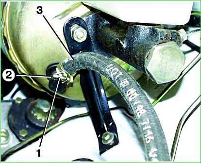

# Вакуумный усилитель тормозов (ВУТ) — диагностика и замена

> Применимость: все модели Соболь с ВУТ
> Модели: Соболь 2217, 2752, 2310

## Как работает ВУТ

ВУТ использует разрежение из впускного коллектора для усиления давления на педаль тормоза. Без ВУТ тормозить можно, но педаль очень тяжёлая.

## Симптомы неисправности

| Признак | Что значит |
|---|---|
| Педаль тормоза очень тяжёлая | ВУТ не создаёт разрежение или диафрагма порвана |
| Двигатель набирает обороты при нажатии педали | Разрыв диафрагмы ВУТ, подсос воздуха |
| Шипение при отпускании педали | Неисправен клапан ВУТ (норма — тихое шипение допустимо) |
| Педаль «деревянная» — нет помощи усилителя | ВУТ не работает |

## Диагностика

### Быстрая проверка

1. При заглушённом двигателе нажать педаль тормоза 5–6 раз (откачать вакуум)
2. Удерживать педаль нажатой
3. Запустить двигатель
4. **Норма:** педаль должна «провалиться» на 5–10 мм — разрежение создалось, ВУТ работает
5. **Неисправность:** педаль не провалилась — ВУТ не создаёт разрежение

### Проверка герметичности

1. Запустить двигатель, дать поработать 1–2 минуты
2. Заглушить
3. Через 30 секунд нажать педаль 2 раза до упора
4. Должно быть слышно характерное шипение
5. Если шипения нет — возможен разрыв диафрагмы или обрыв вакуумного шланга

### Проверка вакуумного шланга

Шланг от впускного коллектора к ВУТ — проверить на целость и плотность соединений. Трещина или плохой хомут → вакуум теряется.

## Частые причины отказа

1. **Обрыв вакуумного шланга** — самая частая и дешёвая причина. Шланг стоит 100–300 руб.
2. **Разрыв диафрагмы ВУТ** — ВУТ придётся менять. Диафрагма не ремонтируется отдельно на большинстве ВУТ.
3. **Износ клапана** — клапан ВУТ (обратный клапан в шланге) — 200–400 руб.

## Замена ВУТ

ВУТ стоит за педалью тормоза в моторном отсеке, соединён с ГТЦ.

1. Снять вакуумный шланг
2. Открутить трубки тормозные от ГТЦ (ключ 10 мм) — будет течь жидкость
3. Отсоединить тягу педали от штока ВУТ (в салоне)
4. Открутить 4 гайки крепления ВУТ к моторному щиту
5. Снять ВУТ вместе с ГТЦ
6. Установить в обратном порядке
7. Прокачать тормоза

## Нюансы Соболя

- На Соболе с ЗМЗ-402 (карбюратор) вакуум поступает от впускного коллектора напрямую. На ЗМЗ-405 (инжектор) — через обратный клапан.
- **Обратный клапан** в вакуумном шланге — часто виновник слабой работы ВУТ. Клапан дешёвый, заменить в первую очередь.
- ВУТ от Газели-3302 совместим с Соболем — уточнять диаметр.

## Типичные ошибки

**Менять ВУТ без проверки шланга** — шланг порвался, а меняют весь усилитель (3–5 тыс. руб. вместо 200 руб.).

**Не прокачать тормоза** после замены ВУТ — педаль будет мягкой.

## Источники

- [Вакуумный усилитель тормозов Газель — autoruk.ru](https://autoruk.ru/gaz-2705/vakuumnyj-usilitel-tormozov-gazel)
- [Как проверить ВУТ — centr-to.ru](https://centr-to.ru/blog/avtoservis/kak-proverit-vakuumnyi-usilitel-tormozov)
- [Ремонт ВУТ — carnovato.ru](https://carnovato.ru/proverit-priznaki-neispravnosti-vakuumnogo-usilitelja-tormozov/)

---
*Собрано: 2026-05-26*
