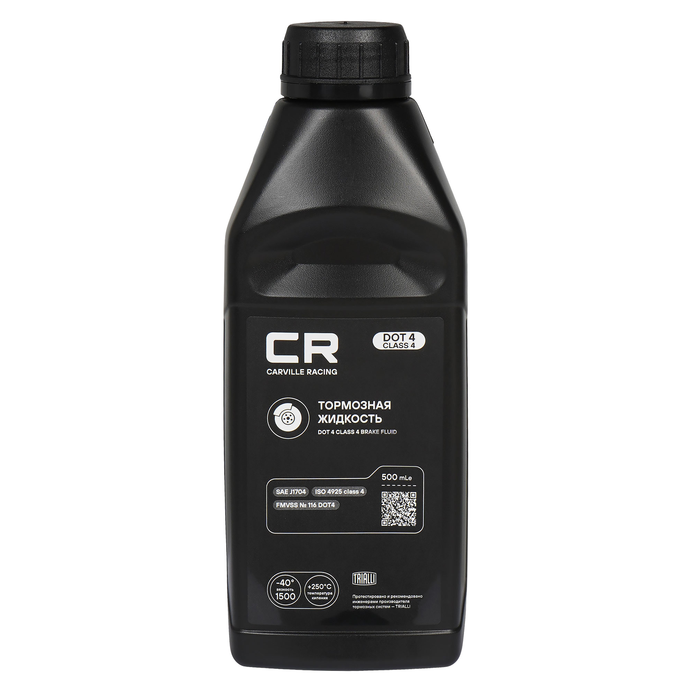

# Тормозная жидкость — замена и прокачка

> Применимость: все модели Соболь
> Система: гидравлическая с вакуумным усилителем

## Когда менять

- Каждые **2 года** — независимо от пробега
- При разгерметизации системы (замена цилиндра, шланга, трубки)
- При замене колодок — заодно проверить цвет жидкости (потемнела — пора)
- Жидкость гигроскопична: поглощает воду из воздуха → температура кипения падает → пар в системе → «провалившаяся» педаль при интенсивном торможении

## Какая жидкость

**DOT-4** — стандарт. Отечественные аналоги: «Роса», «Роса-3», «Томь», «Нева» (не ниже DOT-3).

**Нельзя смешивать** DOT с минеральными жидкостями (для некоторых иномарок). На Газели/Соболе — только гликолевая (DOT-3/4).

Объём для полной замены с прокачкой: **1.5–2 л** (с запасом).

## Порядок прокачки колёс

Строго по порядку — от дальнего к ближнему (к главному цилиндру):
1. Правое заднее
2. Левое переднее
3. Левое заднее
4. Правое переднее

## Замена жидкости

### Что нужно
- Помощник (для нажатия педали)
- Прозрачный шланг диаметром ~6 мм (на штуцер прокачки)
- Ёмкость для слива
- Ключ 10 мм (штуцеры прокачки)
- 2 л тормозной жидкости DOT-4

### Порядок

1. **Долить жидкость** в бачок главного цилиндра до MAX. Следить за уровнем в течение всей работы — если осушить бачок, воздух войдёт в систему.

2. **Завести двигатель** — вакуумный усилитель тормозов должен работать.

3. На первом колесе (правое заднее):
   - Надеть шланг на штуцер прокачки, конец опустить в ёмкость с небольшим количеством тормозной жидкости (чтоб конец шланга был под жидкостью)
   - Попросить помощника резко нажать педаль 4–5 раз и удержать
   - Ключом открутить штуцер на 1/2–3/4 оборота — жидкость пойдёт
   - Когда педаль провалится до упора — закрутить штуцер
   - Помощник отпускает педаль
   - Повторить 5–6 раз до появления **чистой жидкости без пузырей**

4. Переходить к следующему колесу по порядку.

5. Долить жидкость в бачок до MAX.

### Важный нюанс — регулятор давления задних тормозов

На Газели/Соболе стоит регулятор давления задних тормозов (колдун). При прокачке задних колёс, когда машина стоит на колёсах (не на подъёмнике), регулятор в нормальном положении.

Если прокачиваешь **с вывешенными задними колёсами** — регулятор перекроет давление на задние тормоза. Нужно зафиксировать тягу регулятора отвёрткой (вставить между пластиной и поршнем). **Убрать отвёртку после прокачки** — иначе задние тормоза будут работать всегда на полную, машина будет блокировать задние колёса при торможении.

## Нюансы Соболя

- Прокачивать обязательно с заведённым двигателем — вакуумный усилитель должен работать.
- Штуцеры прокачки закисают. Перед откручиванием обработать WD-40. Если сорвал грань — суппорт или цилиндр под замену.
- После замены жидкости проверить уровень через 200–300 км — может понадобиться доливка.

## Типичные ошибки

**Осушить бачок** в процессе — воздух войдёт в главный цилиндр, придётся прокачивать всё заново.

**Прокачивать без заведённого двигателя** — педаль деревянная, прокачка неэффективная.

**Не соблюдать порядок** прокачки — воздух может остаться.

**Не зафиксировать регулятор** при прокачке вывешенных задних колёс — жидкость не пройдёт.

**Не убрать фиксатор регулятора** после работы — аварийная ситуация при торможении.

## Инструмент

| Позиция | Что нужно |
|---|---|
| Ключ штуцеров прокачки | 10 мм |
| Шланг прозрачный | ~6 мм, длина 30–40 см |
| Ёмкость для слива | 2 л |
| Тормозная жидкость | DOT-4, 2 л |
| Помощник | Обязателен |

## Источники

- [Замена ТЖ и прокачка тормозов Газель](https://autoruk.ru/gaz-2705/zamena-tormoznoj-zhidkosti-i-prokachka-tormoznoj-sistemy-avtomobilya-gazel) — официальное руководство
- [Интервалы замены жидкостей Газель](https://www.drive2.ru/l/513299033041666282/) — drive2.ru

---
*Собрано: 2026-05-26*
