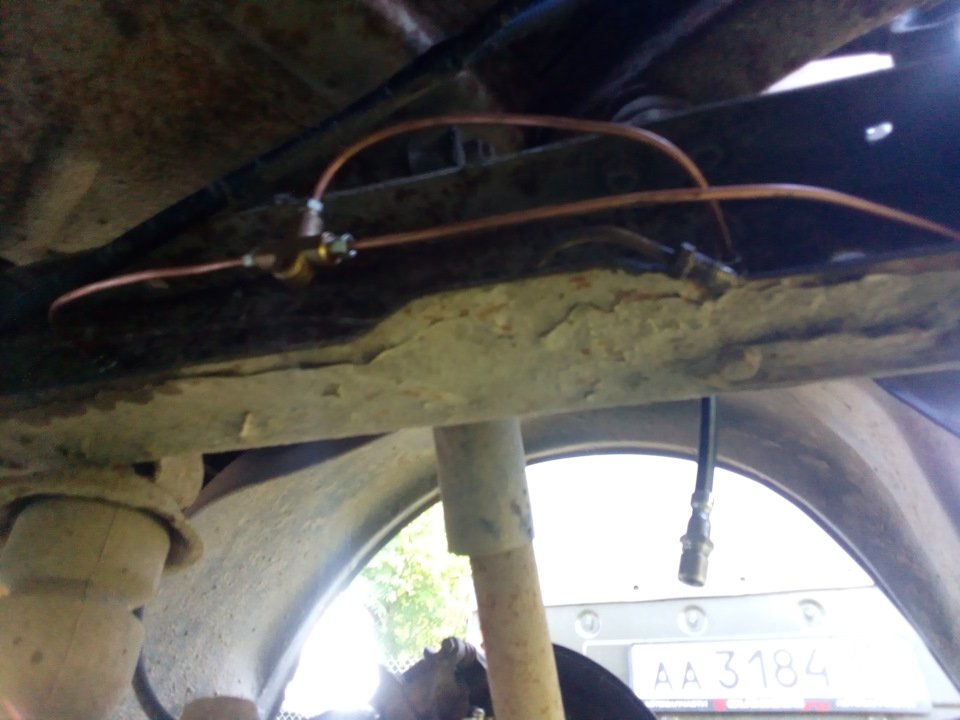

# Тормозные трубки и шланги — замена

> Применимость: все модели Соболь
> Модели: Соболь 2217, 2752, 2310 — все

## Почему тормозные трубки требуют внимания

Соболь — коммерческая машина. Зимой — соль. Стальные заводские трубки гниют снаружи за 7–12 лет. **Отказ тормозной трубки на ходу = полная потеря тормозов** в затронутом контуре.

Проверять трубки нужно при каждом ТО и обязательно при покупке б/у Соболя.

## Конструкция тормозной системы Соболя

Двухконтурная тормозная система:
- **Контур 1:** передние правое + заднее левое
- **Контур 2:** передние левое + заднее правое

При отказе одного контура второй сохраняет торможение (с увеличенным ходом педали).

**Состав:** стальные трубки (вдоль лонжеронов и рамы) + резиновые гибкие шланги (в местах подвижного соединения: колёса, задний мост).

## Диагностика

### Осмотр трубок

Поднять машину или осмотреть снизу:
- **Ржавчина снаружи** — трубка сгнивает изнутри чуть позже
- **Вздутие, пузыри в металле** — критично, замена немедленно
- **Мокрая трубка** — течь тормозной жидкости
- **Белёсый налёт** — следы прошлой течи

### Осмотр шлангов

- **Трещины в резине** — замена обязательна (внутри трубка может расслаиваться)
- **Шланг вздулся** — расслоение внутри → неравномерное торможение
- **Примета:** при нажатии педали шланг раздувается заметно → замена

### Тест педали

Педаль мягкая, пружинистая или «провалы» без видимых причин → воздух в системе или скрытая течь.

## Материалы трубок — что лучше

| Материал | Плюсы | Минусы |
|---|---|---|
| Сталь (заводская) | Дёшево, прочно | Ржавеет за 7–12 лет |
| Нержавейка | Не ржавеет | Дороже, труднее гнуть |
| Медь | Легко гнуть, не ржавеет | Нельзя с DOT 4 (разрушает медь!)** |
| Cunifer (медь+никель+железо) | Лучший вариант: не ржавеет + совместим с DOT | Дорого |

**Важно про медь:** чистая медь несовместима с тормозной жидкостью DOT-3 и DOT-4 (полиэфирная основа постепенно разрушает медь). Для Соболя с DOT-4 — только **cunifer** или нержавейка. Если всё-таки медь — использовать только со специальным смазочным составом и проверять ежегодно.

**Практика:** многие ставят медные трубки и не имеют проблем 10+ лет, но официально — cunifer надёжнее.

## Замена трубки своими руками

### Инструмент

- Ключи для тормозных трубок (накидные 10 и 11 мм — «штуцерные»)
- Гибочный инструмент для трубок (ручной или роликовый)
- Развальцовщик (для нарезки конусного уплотнения)
- Труборез
- Шприц для прокачки
- Ёмкость для тормозной жидкости

### Диаметры трубок Соболя

- Основная магистраль: **4.75 мм** (стандарт)
- Соединения: М10×1 (конус 45° или конус двойной)

**Купить готовую трубку** нужной длины с готовыми наконечниками — проще, чем вальцевать самому (в специализированных магазинах нарежут по образцу).

### Порядок замены

1. Слить жидкость из заменяемого контура (открыть штуцер прокачки на колесе)
2. Отвернуть оба штуцера трубки (штуцерные ключи — не повредить грани)
3. Снять трубку (расстегнуть клипсы крепления)
4. Установить новую трубку по тому же маршруту
5. Завернуть штуцеры (не перетягивать! — момент 15 Нм, конус мягкий)
6. Прокачать тормоза полностью
7. Проверить герметичность под нагрузкой

### Замена резиновых шлангов

Шланги — 3 штуки:
- 2 передних (один на каждое колесо)
- 1 задний (на балке заднего моста, к обоим задним цилиндрам)

Шланги крепятся кронштейнами с фиксирующими скобами. При замене:
- Зажать шланг струбциной (чтобы не вытекала жидкость)
- Отвернуть трубку и шланг с кронштейна
- Установить новый шланг
- Прокачать тормоза

## Нюансы Соболя

- На Соболе трубки часто проложены за задними рессорами — в зоне активного попадания грязи и соли. Особенно внимательно осматривать именно эти участки.
- При полной замене трубок (как профилактика на старой машине) — заказать нарезку по длине в магазине тормозной системы или сервисе.
- Штуцеры закисают. Залить проникающую смазку заранее, дать постоять ночь — иначе сорвёте грани ключом.
- После любых работ с тормозными трубками — **обязательная прокачка** и тест-торможение до 60 км/ч на безопасном участке.

## Типичные ошибки

**Не прокачать тормоза после замены** — воздух в системе, педаль мягкая, эффективность нулевая.

**Перетянуть штуцер** — деформация конуса, течь.

**Срезать грани на штуцере** из-за ржавчины — использовать специальный ключ и проникающую смазку заранее.

**Поставить медь под DOT-4** без учёта совместимости.

**Не проверить маршрут прокладки** — трубка при движении подвески трётся о кузов или рычаги.

## Источники

- [Замена всех тормозных трубок Газель — drive2.ru](https://www.drive2.ru/l/565297411820356384/)
- [Медь или сталь для тормозных трубок — drive2.ru](https://www.drive2.ru/c/498626050368995461/)
- [Загиб стальных тормозных трубок — drive2.ru](https://www.drive2.ru/c/525918677749466252/)

---
*Собрано: 2026-05-26*
