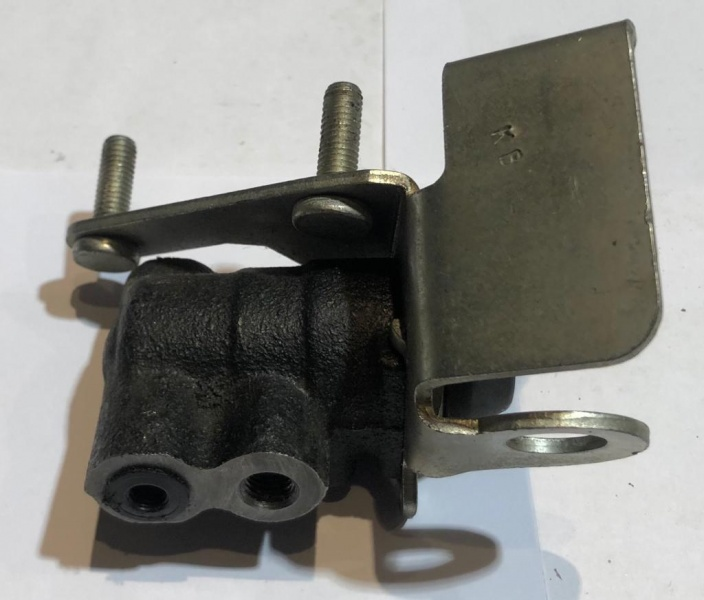

# Регулятор давления тормозов (колдун) — регулировка и замена

> Применимость: все модели Соболь (задние тормоза)
> Модели: Соболь 2217, 2752, 2310

## Что такое колдун и зачем он нужен

**Регулятор давления тормозов (РДТ, «колдун»)** — механическое устройство, снижающее давление тормозной жидкости в контуре задних колёс в зависимости от загрузки автомобиля. При торможении масса переносится вперёд, задняя ось «облегчается» — колдун снижает тормозное усилие сзади, предотвращая блокировку и занос.

**При неправильной регулировке:**
- Слишком мало давления сзади → слабое задние торможение
- Слишком много давления сзади → занос при торможении

## Симптомы неправильной регулировки или неисправности

| Симптом | Причина |
|---|---|
| Задние колёса блокируются и машина уводит при торможении | Колдун пропускает слишком много давления |
| Слабое торможение, нужно давить педаль сильнее | Колдун зажат или неправильно отрегулирован |
| Течь жидкости в районе колдуна | Разрушен резиновый уплотнитель |

## Регулировка колдуна

**Когда регулировать:** при замене задних рессор, после деформации кронштейна, при жалобах на поведение при торможении.

### Размер «С» — ключевой параметр

Регулировочный болт на колдуне устанавливает расстояние от нижней точки рычага до оси крепления стойки.

| Модель | Расстояние «С» |
|---|---|
| Соболь (микроавтобус) | **26–36 мм** |
| Соболь (другие версии) | **52–60 мм** |
| ГАЗ-2705 (Газель фургон) | **13–17 мм** |

### Порядок регулировки

1. Поднять машину (задние колёса в воздухе — снятая нагрузка)
2. Отсоединить нижний конец стойки регулятора от кронштейна заднего моста
3. Ослабить контргайку регулировочного болта
4. Вращением болта установить нужный размер «С»
5. Затянуть контргайку
6. Присоединить стойку к мосту

### Проверка правильности регулировки

На сухой ровной дороге при скорости **50–60 км/ч** резко тормозить (но не до полной блокировки):
- **Норма:** передние колёса блокируются чуть раньше задних
- **Неправильно:** задние блокируются раньше → занос → крутить болт в сторону уменьшения давления (отвернуть на пол-оборота)
- **Тоже неправильно:** передние сильно опережают → завернуть болт на пол-оборота

## Важно при прокачке тормозов

При прокачке тормозов задние колёса должны быть **вывешены** (нагрузка снята). Иначе колдун закрыт и жидкость в задние РТЦ не поступает — задние тормоза не прокачаются.

**После прокачки** — снять домкраты и опустить машину.

## Замена колдуна

При разрушении уплотнений или заклинивании — замена в сборе.

Артикул: уточнять по каталогу по году выпуска (РДТ менялся по годам). Для ГАЗ-2705 и Соболя — разные устройства.

## Нюансы Соболя

- Колдун регулируется **при каждой замене задних рессор** — жёсткость рессор меняется, нагрузка на ось другая.
- Часто при покупке б/у Соболя колдун **не отрегулирован годами** — одна из первых проверок при покупке.
- Некоторые владельцы **блокируют колдун** (жёстко фиксируют рычаг) — это опасно: задние колёса блокируются при торможении.

## Типичные ошибки

**Прокачивать задние тормоза с нагруженной машиной** — колдун перекрыт, жидкость не идёт, воздух не выходит.

**Не регулировать после замены рессор** — поведение при торможении изменится.

## Источники

- [Регулировка колдуна Газель — gazel-rukovodstvo.ru](https://gazel-rukovodstvo.ru/GAZ/9-10-5.html)
- [Колдун Газель — форум gazelleclub.ru](http://www.gazelleclub.ru/forum/topic/1626-reguliator-davleniia-koldun/)
- zr.ru — «Колдун несёт богатыря» — статья За Рулём

---
*Собрано: 2026-05-26*
