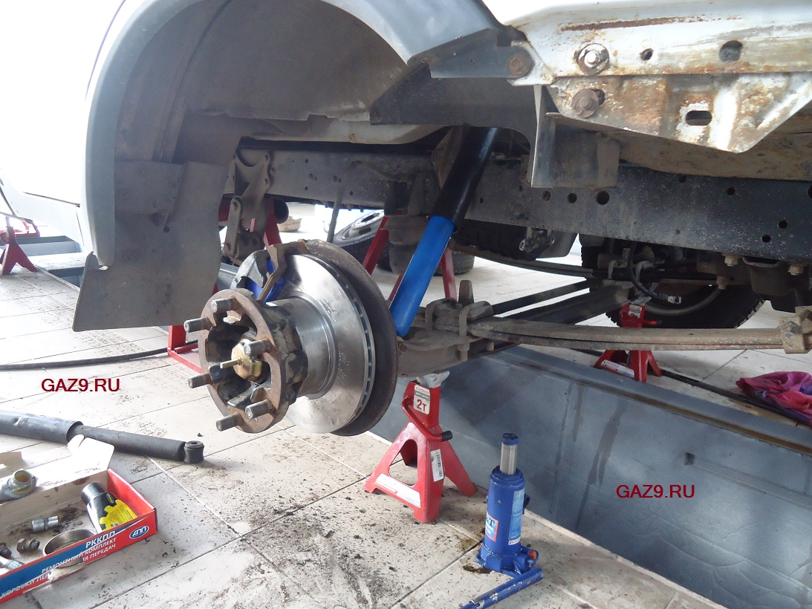
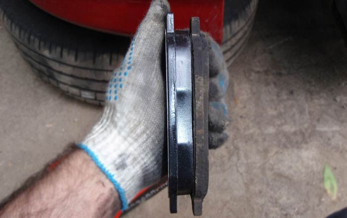

# Передние тормоза — колодки и диски

> Применимость: все (дисковые передние тормоза — стандарт для Соболя)
> Модели: Соболь 2217, 2752, 2310 и др.

## Когда менять

**Колодки:** когда фрикционный слой стёрт до 2–3 мм (металлический скрип при торможении — уже слишком поздно, диск поцарапан).

**Диски:** минимальная толщина **21 мм**. Меньше — замена. Также менять при глубоких бороздах, трещинах, биении диска (вибрация педали при торможении).

**Суппорт:** если колодки неравномерно изношены (одна сторона больше), греется колесо без торможения, или педаль мягкая — суппорт закис.

## Артикулы деталей

| Деталь | Оригинал ГАЗ | Аналоги |
|---|---|---|
| Колодки передние (4 шт.) | 3302-3501800-02 / 3302-3501170 | PEKAR 3302-3501170, redBTR керамика |
| Диск тормозной передний Соболь 2217 | 2217-3501078 | Trialli DF-117, HOLA HD008 |
| Суппорт левый с колодками | 00001673А | — |

**Важно:** колодки Соболь и Газель **одинаковые** (взаимозаменяемы). На Газель NEXT — другие, не путать.

## Замена колодок

1. Поднять машину, снять колесо
2. Обработать WD-40 болты суппорта — дать пропитаться 15–20 минут
3. Открутить болты крепления суппорта (ключ 17 мм, нижний и верхний)
4. Снять суппорт, повесить на проволоке — не тянуть тормозной шланг
5. Утопить поршень суппорта обратно: деревянной ручкой или монтажкой через старую колодку (не повредить пыльник)
   — Перед этим открыть крышку бачка тормозной жидкости
6. Выкинуть старые колодки, почистить посадочные места от ржавчины
7. Смазать направляющие суппорта специальной смазкой (только пальцы-направляющие, не фрикционный материал!)
8. Установить новые колодки
9. Поставить суппорт, затянуть болты: **момент 30–40 Н·м**
10. **Прокачать тормоза перед поездкой** — нажать педаль 10–15 раз до упора, убедиться что она твёрдая

## Замена дисков

Дополнительно к замене колодок:
1. Открутить болты крепления диска к ступице (ключ 12 мм, обычно 4–5 болтов)
2. Диск нередко закисает к ступице — молоток помогает (бить по ободу, не по рабочей поверхности)
3. Новый диск: протереть ацетоном (заводская консервация), установить

## Обкатка новых колодок

Первые **100–150 км** тормозить плавно и заранее. Не делать резких экстренных торможений. Колодки должны притереться к диску — только тогда будет полная эффективность.

## Нюансы Соболя

- Суппорты на Соболе закисают чаще чем на иномарках — из-за реагентов на дорогах и редкой езды. При каждой замене колодок чистить и смазывать направляющие.
- Диски на 4x4 Соболе могут отличаться — уточнять при покупке по VIN или модели.
- Оригинальные колодки ГАЗ дороже аналогов, но совместимость гарантирована. Китайские аналоги — лотерея по качеству.

## Типичные ошибки

**Не прокачать педаль после замены** — поршень утоплен, педаль провалится до пола при первом нажатии. Опасно.

**Смазать фрикционный материал колодки** — тормоза исчезнут. Смазывать только торцы колодок и направляющие.

**Поставить диск без протирки ацетоном** — заводской грунт ухудшает приработку, появляется скрип.

**Не заменить диск при замене колодок** (если диск изношен) — новые колодки быстро сотрутся по неровной поверхности.

## Инструмент

| Позиция | Что нужно |
|---|---|
| Ключ для болтов суппорта | 17 мм |
| Ключ для болтов диска | 12 мм |
| Монтажная лопатка | Утопить поршень |
| Смазка для направляющих | Специальная (Molykote, Hi-Gear) — не обычная |
| WD-40 | Откисание болтов |
| Ацетон | Обезжирить новый диск |

## Источники

- [Тормозные диски и колодки передние — Соболь 4x4](https://www.drive2.ru/l/502105180037185640/) — drive2.ru
- [Замена тормозного диска Соболь](https://www.drive2.ru/l/481278230783853175/) — drive2.ru
- [Диск Trialli DF-117 для Соболь 2217](https://trialli.ru/catalogue/tormoznaya-sistema/diskovaya-tormoznaya-sistema/diski-tormoznye/df-117/)

---
*Собрано: 2026-05-26*
