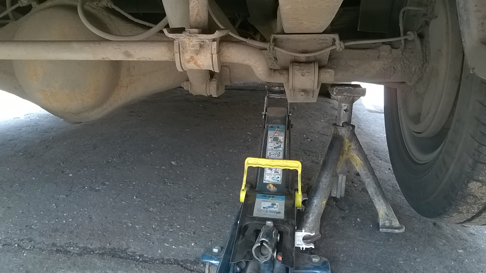

# Ручной тормоз — регулировка и ремонт

> Применимость: все модели Соболь
> Модели: Соболь 2217, 2752, 2310 — все

## Конструкция стояночного тормоза Соболя

Стояночный тормоз механический, тросовый. Рычаг в кабине → центральный трос → уравнитель → два боковых троса → рычаги задних барабанных тормозов.

**Задние тормоза Соболя** — барабанные. Ручник разжимает колодки через рычаг внутри барабана.

## Когда нужна регулировка

- Рычаг поднимается более чем на **8 щелчков** при фиксации на горизонтальной поверхности
- Машина скатывается при включённом ручнике
- После замены тормозных колодок
- После замены тросов ручника
- После регулировки задних тормозов

## Порядок регулировки

### Шаг 1 — Проверить и отрегулировать задние тормоза

Прежде чем регулировать трос, убедиться, что сами задние тормоза отрегулированы правильно (зазор между колодкой и барабаном).

Регулировка через окно в щите: поворачивать эксцентрик до лёгкого торможения колеса, затем отпустить на 1–2 зубца.

### Шаг 2 — Доступ к регулировочной гайке

Регулировочная гайка ручника находится под кабиной, в районе уравнителя тросов:

- Поднять заднюю часть машины на домкрат
- Задние колёса должны быть в воздухе

### Шаг 3 — Регулировка

1. Ослабить контргайку регулировочного болта (ключ «22»)
2. Поднять рычаг ручника на **1 щелчок**
3. Вращать регулировочную гайку до лёгкого торможения задних колёс (прокручиваются с трудом)
4. Затянуть контргайку (удерживая болт от проворота)
5. Опустить рычаг в нижнее положение — колёса должны вращаться свободно

### Шаг 4 — Проверка

- Поднять рычаг на **5–8 щелчков** — машина не должна скатываться на уклоне 16%
- При усилии 392 Н (40 кгс) на рычаге — ход рычага не более 8 щелчков
- Нижнее положение рычага — колёса вращаются свободно

**Инструмент:** два ключа «22», ключ «17», трубчатый ключ «9», плоская отвёртка.

## Замена тросов ручника

### Когда менять

- Трос оборван
- Трос перетёрся о кузов (кожух поврежден)
- Трос «закис» (не отпускает колодки — задние колёса тормозят на ходу)
- Трос вытянулся до предела регулировки

### Симптомы закисшего троса

Задние тормоза нагреваются после поездки (горячие барабаны), машина тяжело катится. При опущенном ручнике тормоза всё равно подтормаживают.

**Диагностика:** опустить ручник, поднять заднее колесо. Колесо не вращается — трос закис.

### Как открыть закисший трос

1. Залить WD-40 или похожий растворитель в оплётку с обеих сторон
2. Многократно потянуть-отпустить рычаг
3. Если не помогло — менять трос

### Замена центрального троса

1. Опустить рычаг полностью
2. Ослабить регулировочную гайку до упора (полностью ослабить трос)
3. Отсоединить наконечники боковых тросов от уравнителя
4. Снять наконечник центрального троса с рычага ручника в кабине
5. Протянуть новый трос по тому же маршруту
6. Установить в обратном порядке
7. Отрегулировать

### Замена боковых тросов

1. Ослабить центральный трос
2. Отсоединить наконечник бокового троса от рычага внутри барабана (снять барабан)
3. Вывести трос из направляющих
4. Установить новый, отрегулировать

**Артикулы тросов:** уточнять по году выпуска. Центральный и боковые — разные позиции.

## Зимние проблемы с ручником

**Ручник примёрз.** Не тянуть рывком — оборвёт трос. Залить растворитель льда в механизм барабана, прогреть тормоза (проехать несколько метров с лёгким торможением).

**Не оставлять машину на ручнике в мороз.** Если стоянка долгая — поставить под колёса упоры, рычаг не затягивать. Колодки примерзают к барабану.

## Нюансы Соболя

- Тросы ручника гниют от соли, особенно у оплётки. При покупке б/у — проверить тросы в первую очередь.
- После регулировки задних колодок **всегда** перерегулировать ручник.
- Уравнитель тросов должен быть симметрично расположен — иначе одна сторона тянет сильнее другой.
- На 4x4 тросы прокладываются по другому маршруту — не перепутать при замене.

## Типичные ошибки

**Регулировать трос, не отрегулировав колодки** — через 2–3 недели снова потребуется регулировка.

**Оставлять на ручнике в мороз** — колодки примерзают к барабану, при трогании — срыв накладок.

**Тянуть рычаг через силу** при закисшем тросе — обрыв.

**Не затянуть контргайку после регулировки** — гайка откручивается, ручник снова «не держит».

## Источники

- [Регулировка ручника Газели — gazel-rukovodstvo.ru](https://gazel-rukovodstvo.ru/GAZ/9-10-6.html)
- [Регулировка ручного тормоза — gazelleclub.ru](https://www.gazelleclub.ru/forum/topic/31926-regulirovka-ruchnogo-tormoza/)
- [Регулировка задних тормозных колодок Соболь — drive2.ru](https://www.drive2.ru/l/479801311789842768/)

---
*Собрано: 2026-05-26*
