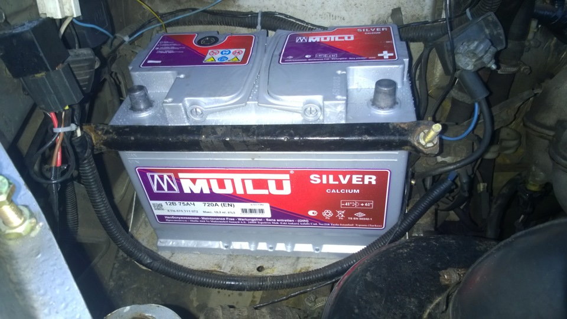

# Аккумулятор — выбор и обслуживание

> Применимость: все модели Соболь
> Модели: Соболь 2217, 2752, 2310 — все

## Параметры АКБ для Соболя

| Параметр | Значение |
|---|---|
| Штатная ёмкость | 75 Ач (6СТ-75) |
| Минимальная рабочая | 60 Ач |
| Пусковой ток | ≥ 550–650 А (EN) |
| Полярность | **Обратная** (минус слева если смотреть спереди) |
| Размер | 278×175×190 мм |

**Внимание:** полярность обратная — не перепутать при замене на доноре с прямой полярностью.

## Как выбрать АКБ

**Ёмкость:** 60 Ач — минимум, 75–80 Ач — оптимально. Чем больше нагрузка (дополнительная электроника, дизель) — тем выше ёмкость.

**Пусковой ток:** не менее 550 А по EN (европейский стандарт). Для суровых зим — 600–700 А. Чем выше ток — тем лучше пуск в мороз.

**Технология:**
- AGM — необслуживаемая, дороже, не боится глубокого разряда. Рекомендуется при дополнительной электронике.
- Кальций/Ca-Ca — необслуживаемые, хорошо держат заряд. Популярный выбор.
- Обслуживаемые — можно долить дистиллят, дешевле, подходят для б/у машин.

**Проверенные марки:** Varta, Bosch, Exide, Аком (российская), Tyumen Battery.

## Диагностика АКБ

| Напряжение в покое | Состояние |
|---|---|
| ≥ 12.6 В | Заряд 100% — норма |
| 12.4 В | Заряд ~75% — подзарядить |
| 12.0 В | Заряд ~50% — срочно зарядить |
| < 11.8 В | Глубокий разряд — возможна необратимая сульфатация |

**Нагрузочная вилка:** при нагрузке 150 А напряжение не должно падать ниже 9.5 В в течение 5 секунд.

**АКБ старше 4 лет** — менять превентивно перед зимой, даже если «ещё нормальный».

## Обслуживание

- **Клеммы:** раз в год зачищать от окисла, смазывать Литол-24 или специальной смазкой
- **Крепление:** АКБ должен быть зафиксирован — вибрация разрушает пластины
- **Зарядка:** при длинных стоянках (неделя и более) — зарядить стационарным зарядником
- **Уровень электролита** (обслуживаемые): контролировать, при необходимости доливать дистиллированную воду
- **Чистота корпуса:** нейтрализовать кислотный налёт раствором соды (1 ст.л. на стакан воды)

## Нюансы Соболя

- На Соболях с дополнительным оборудованием (рефрижератор, надстройки) — генератор перегружен. Контролировать зарядку мультиметром (норма 13.5–14.8 В при работающем двигателе).
- **Второй аккумулятор** устанавливают владельцы Соболей с тяжёлым спецоборудованием. Подключение через реле приоритета.
- Если двигатель часто работает на холостых (городские пробки) — АКБ хронически недозаряжен. Периодически «прогонять» по трассе 30–40 мин.
- Зимой при -20°C АКБ теряет до 40% ёмкости. 60 Ач летом → 36 Ач зимой. Поэтому зимой нужна ёмкость с запасом.

## Типичные ошибки

**Перепутать полярность** — при обратной полярности Соболя установить АКБ с прямой полярностью → сгорит проводка.

**Не чистить клеммы** — окисел на клеммах = падение напряжения → стартер крутит слабо, машина плохо запускается.

**Подзаряжать АКБ токами > 10% ёмкости** — максимум для 75 Ач = 7,5 А. Быстрый заряд 30–50 А убивает пластины.

## Источники

- [Как выбрать АКБ для Газели — akb-moscow.ru](https://akb-moscow.ru/kakoj-akkumulyator-ustanovit-na-gazel/)
- [Аккумулятор Соболь — drive2.ru](https://www.drive2.ru/l/470220992099123224/)
- [Обслуживание АКБ Соболь — gazavtomir.ru](https://gazavtomir.ru/info/teh/exploitation/sobol/9/)

---
*Собрано: 2026-05-26*
