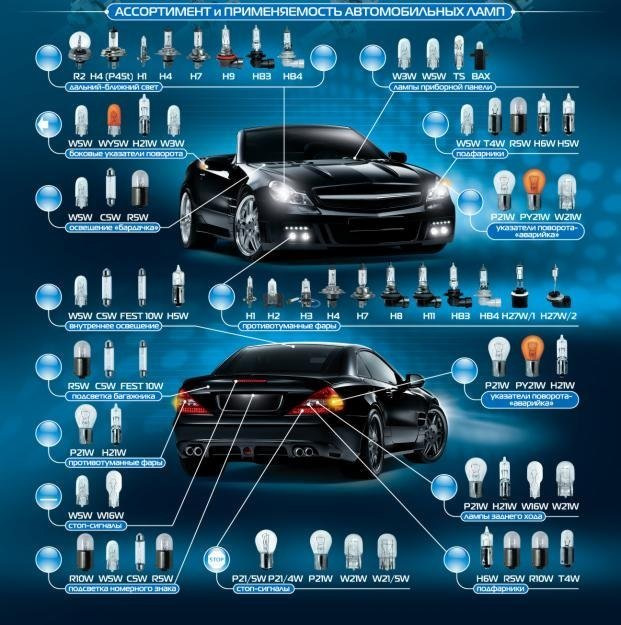

# Лампочки — таблица и замена

> Применимость: все двигатели
> Модели: Соболь 2217, 2752, 2310 — все (с поправками по годам)

## Таблица ламп

| Позиция | Тип лампы | Цоколь | Мощность | Примечание |
|---|---|---|---|---|
| Фара — ближний + дальний | **H4** | P43t | 60/55 Вт | Одна двухнитьевая лампа на обе функции |
| Передний указатель поворота | **PY21W** | BAU15s | 21 Вт | Оранжевый цоколь! Не путать с P21W |
| Габаритный огонь передний | **W5W** | W2.1×9.5d | 5 Вт | Или T4W (BA9s) — зависит от фары |
| Задний фонарь: стоп + габарит | **P21/5W** | BAY15d | 21/5 Вт | Двухконтактный, два смещённых штифта |
| Задний указатель поворота | **P21W** | BA15s | 21 Вт | Одноконтактный |
| Задний ход | **P21W** | BA15s | 21 Вт | Одноконтактный |
| Освещение номерного знака | **W5W** | W2.1×9.5d | 5 Вт | Или C5W (Sofitte) 36 мм |
| Плафон салона | **C5W** (Sofitte) | SV8.5 | 5 Вт | 36 мм или 41 мм — замерить |
| Подсветка приборной панели | **W1.2W** | W2×4.6d | 1.2 Вт | T5 / пластиковый патрон — много штук |
| Лампы-индикаторы в панели | **W1.2W** | W2×4.6d | 1.2 Вт | Красные/зелёные — цвет колпачка |

> Соболь Бизнес (2010+) и разные комплектации могут отличаться. Перед заказом — проверить по VIN или вынуть старую.

## Как добраться — по узлам

### Фара (H4)
Доступ — из подкапотного пространства:
1. Снять пластиковый кожух сзади фары (поворот или клипсы)
2. Отсоединить разъём
3. Снять пружинный держатель — отогнуть усики в стороны
4. Вынуть лампу, не касаясь стекла руками

**Важно:** H4 — галоген, жир с рук оставляет пятно → перегрев → трещина. Держать за основание или через ткань.

### Передний поворотник
Доступ — из подкапотного пространства:
1. Рукой нащупать патрон за корпусом фонаря
2. Повернуть патрон против часовой стрелки, вынуть
3. Заменить лампу — **только PY21W** (с оранжевым цоколем BAU15s)

**Ошибка:** поставить P21W вместо PY21W — лампа встанет, но поворотник будет белым (нарушение ПДД).

### Задние фонари
Доступ — изнутри кузова или через лючок:
- Фургон (2752): открыть задние двери, снять накладку или лючок сбоку
- Автобус (2217): снять обивку задней стенки
- Открутить 2–3 гайки крепления фонаря на 10 мм или снять патрон поворотом

Порядок ламп в корпусе зависит от года — сверить с кожухом (маркировка цветом или буквой).

### Приборная панель
Доступ — снять панель приборов:
1. Снять накладку вокруг панели (держится на клипсах и 2–4 болтах)
2. Открутить 2–4 болта крепления панели (Phillips или Torx)
3. Вытащить панель на себя, отсоединить разъёмы
4. Лампочки подсветки — W1.2W, вытащить вместе с пластиковым патроном, повернуть и вынуть лампу

**Лайфхак:** Сразу заменить все лампы подсветки на LED — не перегорают, ярче, не нагревают панель.

### Плафон салона
Снять плафон — поддеть плоской отвёрткой (через ткань, чтобы не оцарапать). Лампа C5W (Sofitte) вынимается из контактов без патрона.

## Светодиодные замены

| Позиция | LED-аналог | Примечание |
|---|---|---|
| H4 | LED H4 двухрежимный | Требует проверки нагрева и ближнего пучка |
| P21W / P21/5W | LED BA15s / BAY15d | Может вызвать ускоренное мигание (гипер-флэш) поворотников — нужно реле |
| W5W / W1.2W | LED T10 / T5 | Просто вставляются, без переделок |
| C5W | LED Sofitte | Подходит напрямую |

**Поворотники на LED:** если мигает вдвое быстрее обычного — нужно поменять реле поворотов на электронное (не термобиметаллическое).

## Нюансы Соболя

- **Передний поворотник PY21W** — многие магазины путают с P21W. Разница в цоколе: BAU15s (смещённый штифт) vs BA15s (прямой)
- **Задний фонарь P21/5W** — два штифта на разных высотах. Лампа вставляется в одном положении, повернуть на 45° и нажать
- **Гипер-флэш при LED:** штатное реле поворотов термобиметаллическое → реагирует на ток → LED ток мал → частое мигание
- **Панель приборов деградирует:** при замене одной лампы — менять весь комплект сразу, остальные скоро догорят
- **Ксенон в H4:** юридически требует омывателей фар и корректора — у Соболя нет ни того ни другого

## Типичные ошибки

**Вставить P21W в гнездо поворотника** — не та маркировка цоколя. Проверить по штифтам.

**Схватиться за стекло H4 голыми руками** — через 2–3 недели стекло треснет от перегрева.

**Не проверить направление LED-лампы** — в патроне два положения, в одном LED светит назад. Если свет слабый — повернуть на 180°.

## Источники

- [Замена ламп подсветки панели Соболь — drive2.ru](https://www.drive2.ru/l/4964930/)
- [Замена лампы переднего поворотника — gaz3110.ru](http://www.gaz3110.ru/sobol/13_38.htm)
- [Таблица ламп Соболь — dled.ru](https://dled.ru/cars/%D0%B3%D0%B0%D0%B7-%D1%81%D0%BE%D0%B1%D0%BE%D0%BB%D1%8C/blizhnij-svet)

---
*Собрано: 2026-05-26*
