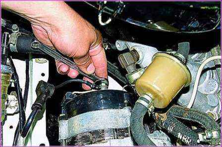

# Генератор — диагностика и ремонт

> Применимость: все двигатели / все модели Соболь
> Генераторы: 9422.3701, 5122.3771 и аналоги

## Симптомы проблем

| Симптом | Вероятная причина |
|---|---|
| Лампа зарядки горит постоянно | Нет зарядки: щётки, реле-регулятор, диодный мост |
| Зарядка есть только на высоких оборотах | Изношены щётки или проблема в диодном мосту |
| АКБ кипит, перегревается | Реле-регулятор вышел из строя (перезаряд) |
| Напряжение скачет или ниже 13.5 В | Плохой контакт, изношенные щётки, реле |
| Генератор воет или скрипит | Изношены подшипники |

Норма напряжения при заведённом двигателе: **13.5–14.8 В**. Проверить мультиметром на клеммах АКБ.

## Диагностика — пошагово

### Шаг 1: Проверь простое
- Натяжение ремня генератора (должен прогибаться на 8–10 мм при нажатии с усилием 4 кг)
- Надёжность клемм на АКБ и проводов к генератору
- Предохранители около АКБ (на Соболе есть силовые предохранители 60–80 А)

### Шаг 2: Измерь напряжение
На заведённом двигателе (1000–1500 об/мин) мультиметр на клеммы АКБ:
- **13.5–14.8 В** — норма
- **< 13.5 В** — недозаряд (щётки, реле, обмотка)
- **> 15 В** — перезаряд (реле-регулятор пробит)
- **12.5–12.7 В** — генератор вообще не работает

### Шаг 3: Проверь щётки
Снять реле-регулятор с щёткодержателем (2 винта), осмотреть щётки:
- Выступание щётки **< 5 мм** → замена
- Щётки застряли в держателе → промыть, прочистить

### Шаг 4: Если щётки нормальные
Проблема в диодном мосту или обмотке ротора/статора → ремонт или замена генератора целиком.

## Замена щёток и реле-регулятора

На Соболе (генераторы 9422.3701 / 5122.3771) реле-регулятор совмещён со щёткодержателем в одном корпусе — меняется **в сборе**:

1. Снять минусовую клемму АКБ
2. Снять разъём с реле-регулятора
3. Открутить 2 винта крепления (шлицевая отвёртка)
4. Вытащить блок реле со щётками
5. Поставить новый, затянуть винты
6. Подключить разъём, подключить АКБ
7. Завести, проверить напряжение мультиметром

Стоимость: 300–600 руб. Работа: 15 минут.

## Снятие генератора

Если нужен полный ремонт или замена:
1. Снять ремень (ослабить натяжной болт)
2. Отсоединить все провода (пометить)
3. Открутить болты крепления (верхний и нижний)
4. Вытащить генератор

## Нюансы Соболя

- Генератор на Газели и Соболе — одинаковый. Взаимозаменяемы полностью.
- Б/у генераторы с разборки — рабочий вариант. Перед установкой обязательно проверить щётки и напряжение.
- При замене щёток проверить кольца ротора: если изношены канавками — шлифовать или менять ротор.
- Реле-регулятор с регулировкой напряжения (многорежимный) — полезная доработка при дополнительной нагрузке (фаркоп, мощная акустика).

## Типичные ошибки

**Сразу менять генератор** при потере зарядки — часто достаточно щёток за 200 руб. Диагностируй последовательно.

**Не проверить реле-регулятор при перезаряде** — закипевший АКБ, а потом новый АКБ снова закипит если не заменить регулятор.

**Плохой контакт «масса» двигателя** — генератор показывает нормальное напряжение, но АКБ не заряжается. Проверить провод массы от двигателя на кузов.

## Инструмент

| Позиция | Что нужно |
|---|---|
| Мультиметр | Обязательно для диагностики |
| Отвёртка шлицевая | 2 винта реле-регулятора |
| Ключи | 13 мм и 17 мм (болты крепления генератора) |

## Источники

- [Генератор и проблемы с зарядкой — форум Газелистов](https://www.gazelleclub.ru/forum/topic/2950-generator-i-ego-problemy-zariadka/)
- [Замена щёток генератора Газель](https://adx-motors.ru/elektrosistemy/zamena-shchetok-generatora-gazel-2.html)
- [Ремонт генераторов Газель, Соболь](https://xn--3302-94dx3a.xn--p1ai/stati/remont-generatorov-gazel-sobol/)

---
*Собрано: 2026-05-26*
