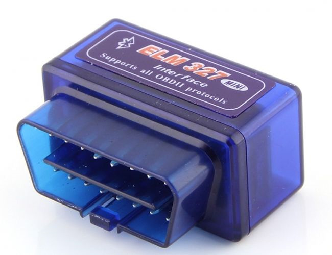

# Диагностика ЭБУ и ошибки — ЗМЗ-405/406

> Применимость: ЗМЗ-405, ЗМЗ-406 инжектор (Евро-2, Евро-3, Евро-4)
> Модели: Соболь 2217, 2752, 2310 с инжекторным двигателем

## ЭБУ ЗМЗ-405 — типы

| Версия | ЭБУ | Протокол | Совместимость ELM327 |
|---|---|---|---|
| ЗМЗ-40522 Евро-2 | МИКАС 11, МИКАС 7.1 | K-Line | ELM327 v1.5 |
| ЗМЗ-40524 Евро-3 | МИКАС 11.3 | K-Line | ELM327 v1.5 |
| ЗМЗ-405 Евро-4 | Январь 7.2, МИКАС | CAN | ELM327 + CanBus |

**ЗМЗ-405 НЕ использует стандартный OBD-II.** Протокол — **K-Line** (ISO 9141-2 или KWP2000). Обычный OBD-II сканер (например, от ВАЗ) может не работать.

## Что нужно для диагностики

### Адаптер

- **ELM327 v1.5** — подходит для K-Line протокола. **Версия 2.1 не работает** (убрана поддержка K-Line).
- Адаптер USB/K-Line 409.1 ККЛ (на чипе FT232) — надёжный вариант для ЗМЗ-405.
- Bluetooth ELM327 v1.5 — для смартфона.

Как проверить версию: v1.5 подключается к ЭБУ Газели, v2.1 — не подключается.

### Программное обеспечение

| ПО | Платформа | Особенности |
|---|---|---|
| **ScanMasterELM** | Windows | Стандарт для K-Line |
| **MotorData OBD** | Android | Хорошо для Евро-3/4 |
| **OpenDiag** | Android | Бесплатное, для МИКАС |
| **KWP-D** | Windows | Расширенная диагностика МИКАС |

### Разъём диагностики

Расположение: **под торпедо**, со стороны водителя или по центру. Колодка 16-контактная (OBD-II форм-фактор, но K-Line протокол).

На более старых машинах — специфический разъём ГАЗ (не OBD-II).

## Чтение ошибок

### Самодиагностика (без адаптера)

На ЗМЗ-405.22 (МИКАС 11):
1. Включить зажигание
2. Трижды быстро нажать на педаль газа до упора
3. Контрольная лампа (ЭФУ или Check Engine) начнёт мигать: количество миганий = код ошибки

**Формат кода:** длинная серия миганий (десятки) + пауза + короткая серия (единицы).  
Пример: 5 длинных + 2 коротких = ошибка 52.

### Через OBD-адаптер

1. Подключить адаптер к разъёму
2. Включить зажигание (не заводить)
3. Запустить ПО, выбрать протокол K-Line
4. Считать коды неисправностей (DTC)
5. Просмотреть данные в реальном времени

### Основные коды ошибок ЗМЗ-405

| Код | Неисправность |
|---|---|
| P0100–P0104 | ДМРВ (расход воздуха) |
| P0130–P0141 | Лямбда-зонд |
| P0200–P0204 | Форсунки |
| P0300–P0304 | Пропуски зажигания в цилиндрах |
| P0335 | ДПКВ (датчик положения коленвала) |
| P0500 | Датчик скорости |
| P0603 | ЭБУ — потеря памяти |

## Датчик положения коленвала (ДПКВ)

Важный датчик — без него двигатель не запускается. Симптом отказа: двигатель крутит стартером, но не запускается совсем.

- Расположен у маховика
- Зазор между датчиком и задающим диском: **0.5–1.5 мм**
- Проверка: мультиметр, сопротивление обмотки 550–750 Ом

## Нюансы Соболя

- Если ELM327 не видит ЭБУ — проверить версию адаптера (v1.5 нужна). Китайский v2.1 не работает с K-Line.
- На Евро-2 Газелях часто нет лямбды вообще — ошибки по лямбда-зонду не будет.
- После ремонта стереть ошибки через адаптер — иначе Check Engine горит долго.
- Некоторые ошибки «мигающие» (не постоянные) — появляются при определённых условиях и не сохраняются. Нужна диагностика в реальном времени при езде.

## Типичные ошибки

**Купить ELM327 v2.1** — не подходит для ЗМЗ-405.

**Стереть ошибки без ремонта** — через 50–100 км появятся снова.

**Не проверять данные в реальном времени** — статические ошибки не показывают периодические проблемы.

## Источники

- [Диагностика ЗМЗ и УМЗ — выбор адаптера — drive2.ru](https://www.drive2.ru/l/578618544946675719/)
- [Диагностика ЗМЗ-405.22 МИКАС 11 ELM327 — drive2.ru](https://www.drive2.ru/l/596132390787620282/)
- [Самодиагностика ЗМЗ-405.22 и 405.24 — gazelleclub.ru](https://www.gazelleclub.ru/forum/topic/34211-samodiagnostika-zmz-40522-i-40524/)

---
*Собрано: 2026-05-26*
