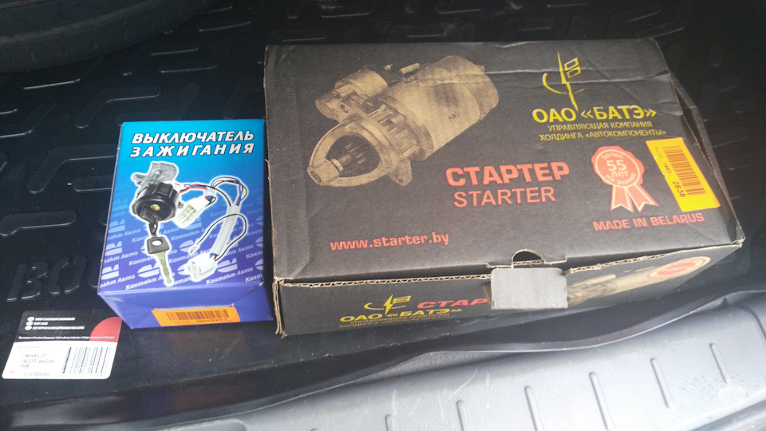

# Стартер — диагностика и замена

> Применимость: ЗМЗ-402 / ЗМЗ-405 / ЗМЗ-406 — все
> Модели: Соболь 2217, 2752, 2310 — все

## Симптомы неисправности

| Симптом | Вероятная причина |
|---|---|
| Щелчок реле, якорь не крутит | Окисленные контакты реле, слабая АКБ |
| Стартер крутит, двигатель не схватывает | Износ бендикса (не входит в зацепление) |
| Скрежет, шум при запуске | Стёртые зубья бендикса или венца маховика |
| Стартер не отключается | Залипло реле, неисправен выключатель зажигания |
| Стартер вращается медленно | Разряженная АКБ, окисленные клеммы, слабые провода |

## Быстрая диагностика

**1. Проверить АКБ:** напряжение в покое ≥ 12.4 В. При пуске — не должно падать ниже 9.5–10 В.

**2. Проверить клеммы и провода:** окисленные клеммы дают падение напряжения. Провода к стартеру — минимум 16–25 мм², без окисления.

**3. Проверить реле:** подать 12В напрямую на клемму «50» стартера (управляющий контакт). Якорь должен начать вращаться.

**4. Проверить бендикс:** снять стартер, вручную провернуть бендикс — должен свободно вращаться в одну сторону и не вращаться в другую.

**Статистика поломок:**
- Электрика (окисление клемм, пробой реле): 50%
- Бендикс, подшипники, зубья: 30%
- АКБ и проводка: 15%

## Диагностика симптома «щелчки без вращения»

Щелчки при попытке пуска — это срабатывает тяговое реле, но тока не хватает для вращения якоря. Алгоритм:

### Шаг 1 — Проверить «массу»
Взять толстый провод с крокодилами и соединить минус АКБ напрямую с корпусом стартера, минуя штатный провод «массы». Если стартер заработал нормально — проблема в цепи «масса»:
- Окисление под оплёткой отрицательного провода
- Плохой контакт клеммы АКБ
- Блок предохранителей у АКБ — алюминиевые вставки трескаются, сопротивление растёт

### Шаг 2 — Проверить напряжение на клемме «50»
Мультиметром на управляющей клемме стартера при попытке пуска — должно быть 10.5–12 В. Если ниже 10 В — проблема в реле включения стартера или замке зажигания.

### Шаг 3 — Проверить блок предохранителей
Блок у АКБ (с моторного отсека) — алюминиевые вставки в предохранительном блоке Газели/Соболя с возрастом трескаются. Визуально целые, но ток не проходит. Заменить или зачистить.

### Шаг 4 — Проверить провода к стартеру
Окисление под изоляцией положительного и отрицательного провода не видно снаружи. Проверить падение напряжения: мультиметр между плюсом АКБ и клеммой стартера при пуске — более 0.5 В = плохой провод.

## Артикулы стартеров

| Двигатель | Артикул | Примечание |
|---|---|---|
| ЗМЗ-405/406 | СТ230-А3 | Оригинал |
| ЗМЗ-402 | СТ221 | Карбюраторный |

Аналоги: БАТЭ, СОАТЭ (отечественные). Бюджетный ремонт — заменить только **бендикс** (3312.3708600-01) — 500–1000 руб.

## Ремонт или замена?

**Ремонтировать** (замена бендикса, щёток, реле): если стартер в целом исправен, проблема локальная. Экономия.

**Заменить в сборе**: если стартер старый (150+ тыс. км), есть механический износ. Новый стартер 2–4 тыс. руб.

## Замена стартера

Доступ снизу двигателя, стандартный.

1. Отключить минус АКБ
2. Снять защиту картера (если есть)
3. Отключить провода от стартера (болт 12 мм на «плюсе» и клемма «50»)
4. Открутить 2–3 болта крепления стартера (ключ 14–17 мм)
5. Вынуть стартер снизу

**Момент затяжки болтов крепления:** 40–60 Нм.

**Время работы:** 1–2 часа.

## Нюансы Соболя

- **Бендикс** — самая частая поломка. Скрежет при пуске = изношен бендикс. Замена бендикса дешевле замены стартера.
- На морозе зимой стартер работает в 3–4 раза тяжелее. Если АКБ слабая + стартер изношен — на морозе не запустить. Решение: менять превентивно при пробеге 100+ тыс.
- Провода к стартеру окисляются → стартер «еле крутит». Почистить клеммы перед покупкой нового.
- Если стартер «клинит» (не отключается) — проверить реле включения стартера в блоке предохранителей (слипшиеся контакты). Не менять стартер.

## Типичные ошибки

**Менять стартер при окисленных клеммах** — новый стартер будет работать так же плохо.

**Не снять минус АКБ** — при касании «плюсового» провода к кузову — КЗ.

**Не проверить бендикс и зубья венца маховика** — если маховик тоже стёрт, новый стартер сотрётся быстро.

## Источники

- [Диагностика и замена стартера на Газели — mteh74.ru](https://mteh74.ru/articles/diagnostika-neispravnostey-i-poryadok-zameny-startera-na-gazeli)
- [Замена стартера ЗМЗ-402/406 — drive2.ru](https://www.drive2.ru/l/488187561852797492/)
- stolakon.ru — диагностика ЗМЗ-405

---
*Собрано: 2026-05-26*
