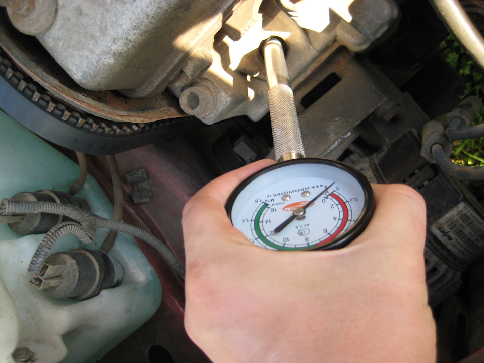

# Компрессия двигателя — проверка и диагностика ЗМЗ-405

> Применимость: ЗМЗ-402, ЗМЗ-405, ЗМЗ-406
> Модели: Соболь 2217, 2752, 2310 — все

## Зачем проверять компрессию

Компрессия — давление в цилиндре в конце такта сжатия. Характеризует состояние колец, клапанов и прокладки ГБЦ. Низкая компрессия → двигатель не развивает мощность, повышенный расход масла и топлива.

## Нормы компрессии ЗМЗ-405/406

| Параметр | Норма |
|---|---|
| Минимальная компрессия | **≥ 6.65 кгс/см² (≥ 660 кПа)** |
| Нормальная (новый двигатель) | **8–10 кгс/см²** |
| Разница между цилиндрами | **не более 1 кгс/см²** |

**ЗМЗ-402:** норма 7.0–8.0 кгс/см², минимум 6.0.

Важнее не абсолютное значение, а **равномерность по цилиндрам**. Разница >1 атм — уже проблема.

## Метод проверки

### Инструмент

Компрессометр — манометр с гибким шлангом и наконечником под свечное отверстие.

### Подготовка

1. Прогреть двигатель до рабочей температуры (~90°C)
2. Вывернуть все 4 свечи зажигания
3. Полностью открыть дроссельную заслонку (нажать педаль газа до пола и удерживать, или попросить помощника)
4. Отключить систему зажигания (снять разъём с катушек или предохранитель насоса)

### Измерение

1. Вставить компрессометр в свечное отверстие 1-го цилиндра
2. Прокрутить стартером 5–7 секунд
3. Записать показание
4. Сбросить компрессометр (кнопка или клапан)
5. Повторить для всех цилиндров

### Интерпретация результатов

| Ситуация | Диагноз |
|---|---|
| Равномерная компрессия 8–10 атм | Норма |
| Один цилиндр ниже на 2+ атм | Проблема в этом цилиндре |
| Два соседних цилиндра низкие | Пробой прокладки ГБЦ между ними |
| Все цилиндры ниже нормы | Износ колец (общий) |
| Компрессия растёт при добавлении масла | Кольца изношены |
| Компрессия не меняется с маслом | Клапаны или прокладка ГБЦ |

## Метод «с маслом»

При низкой компрессии в цилиндре — залить 5–10 мл моторного масла через свечное отверстие и сразу измерить компрессию:

- **Компрессия выросла** → кольца изношены (масло уплотнило зазор)
- **Компрессия не изменилась** → клапаны не садятся или пробита прокладка ГБЦ

## Диагностика по симптомам

| Симптом | Возможная причина |
|---|---|
| Синий дым постоянно | Изношены кольца |
| Синий дым только на холодную | Маслосъёмные колпачки |
| Белый дым, потеря ОЖ | Пробой прокладки ГБЦ |
| Черный дым | Богатая смесь (форсунки, ДМРВ) |
| Мощность упала, не дымит | Клапаны (прогар, нагар) |

## Что делать при низкой компрессии

### Кольца изношены (компрессия с маслом растёт)

- Раскоксовка (химическая промывка колец): Lavr ML202, HG2037. Залить в цилиндры, дать постоять 12–24 часа, слить, проверить
- Если после раскоксовки компрессия не восстановилась → капитальный ремонт

### Клапаны (компрессия с маслом не меняется)

- Притирка клапанов (при неплотном прилегании к сёдлам)
- Регулировка зазоров на ЗМЗ-402

### Прокладка ГБЦ (два соседних цилиндра)

- Замена прокладки ГБЦ

## Нюансы Соболя

- Компрессию проверять на **прогретом** двигателе — на холодном значения занижены на 1–2 атм.
- Зазор клапанов ЗМЗ-402 влияет на компрессию: маленький зазор → клапан не закрывается → компрессия ниже нормы.
- На ЗМЗ-405 с пробегом 200+ тыс. — компрессия 7–8 атм при равномерности — норма для такого пробега.

## Источники

- [Нормальная компрессия ЗМЗ-405 — gazelleclub.ru](https://www.gazelleclub.ru/forum/topic/34025-skolko-eto-normalnaia-kompressiia/)
- [Проверка компрессии ЗМЗ-406 — autoruk.ru](http://autoruk.ru/sistemi/dvigateli/dvigatel-zmz-405-406/proverka-kompressii-dvigatelya-zmz-406)

---
*Собрано: 2026-05-26*
