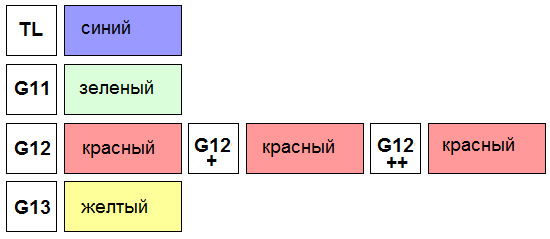

# Антифриз — замена охлаждающей жидкости

> Применимость: ЗМЗ-405 / ЗМЗ-406 / ЗМЗ-402
> Модели: все Соболь

## Когда менять

- Каждые **2 года или 60 тыс. км** — что наступит раньше
- Немедленно если жидкость стала рыжей/ржавой — ингибиторы выработались, жидкость начинает есть систему

Признаки проблем: перегрев, течи из под шлангов, ржавые разводы на патрубках, пена в расширительном бачке (признак пробоя прокладки ГБЦ — это уже серьёзно).

## Объём системы

| Двигатель | Объём |
|---|---|
| ЗМЗ-406 | **10.5 л** |
| ЗМЗ-405 | **10.5 л** |
| ЗМЗ-402 | ~10 л |

Соболь с отопителем — плюс 0.5–1 л. Покупай с запасом 12 л (остаток пойдёт на доливку).

## Какой антифриз

- **G11 (синий/зелёный)** — традиционный, замена каждые 2 года. Совместим со старой резиной патрубков.
- **G12 (красный)** — органический, срок до 3–5 лет. Не смешивать с G11.
- **Тосол** — старый советский стандарт, работает но срок службы меньше. Не смешивать с импортными антифризами.

Главное правило: **не смешивать разные классы** — выпадает осадок, забивает мелкие каналы радиатора.

## Порядок замены

### Слив

1. Холодный двигатель — обязательно
2. Открыть крышку расширительного бачка (сбросить давление)
3. Открыть кран отопителя в салоне на максимум (тепло) — жидкость сольётся и из печки
4. Подставить ёмкость минимум 12 л
5. Открыть сливной краник на нижнем патрубке радиатора (повернуть отвёрткой)
6. Открыть сливную пробку на блоке цилиндров (левая сторона, ключ 17 мм) — сливает жидкость из блока
7. Дать стечь полностью — 10–15 минут

### Промывка (если жидкость старая/ржавая)

Залить обычную воду, запустить двигатель на 5–10 минут, слить. Повторить 2 раза. Можно использовать специальный промыватель системы охлаждения.

### Заправка

1. Закрыть сливные краники и пробку блока
2. Медленно заливать антифриз через расширительный бачок
3. После 5–6 л: запустить двигатель, дать поработать 3 минуты — жидкость прокачается через печку
4. Заглушить, долить до нормы
5. Повторить 2–3 раза — из системы выходит воздух

### Нюансы Соболя — воздушные пробки

**Главная проблема** — при заправке в систему может войти только 5–6 л, хотя влезает 10.5. Остальное — воздушная пробка. Признак: двигатель быстро перегревается, из под крышки бачка идёт воздух.

Как победить воздушную пробку:
- Поставить переднюю часть выше (заехать на горку или на эстакаду передом)
- Периодически сжимать руками верхний патрубок радиатора — помогает прогнать воздух
- Цикл «залил → завёл → погрел 3 мин → заглушил → долил» повторить 3–4 раза

## Типичные ошибки

**Смешать разные антифризы** — G11 + G12 = осадок. Лучше полностью слить и залить один тип.

**Залить холодный антифриз в горячий двигатель** — тепловой удар по головке блока, возможен микротрещины.

**Не открыть кран печки при сливе** — сольётся только часть жидкости, из печки старая останется.

**Забыть закрыть пробку блока** — антифриз польётся на землю при заправке. Легко пропустить, т.к. неудобное место.

## Инструмент и расходники

| Позиция | Что нужно |
|---|---|
| Антифриз | 12 л (с запасом на доливку) |
| Ключ для пробки блока | 17 мм |
| Ёмкость для слива | 12+ л |
| Воронка | Широкая, для расширительного бачка |

## Источники

- [Замена ОЖ ЗМЗ-406, Соболь](https://avtomechanic.ru/sobol/zamena-okhlazhdayushchej-zhidkosti-dvigatelya-zmz-406-avtomobilya-sobol) — avtomechanic.ru
- [Форум: проблема с заправкой 406](https://forum.allgaz.ru/threads/30313/) — allgaz.ru, реальный опыт
- [Система охлаждения ЗМЗ-406, наблюдения](https://www.drive2.ru/b/551937/) — drive2.ru

---
*Собрано: 2026-05-26*
