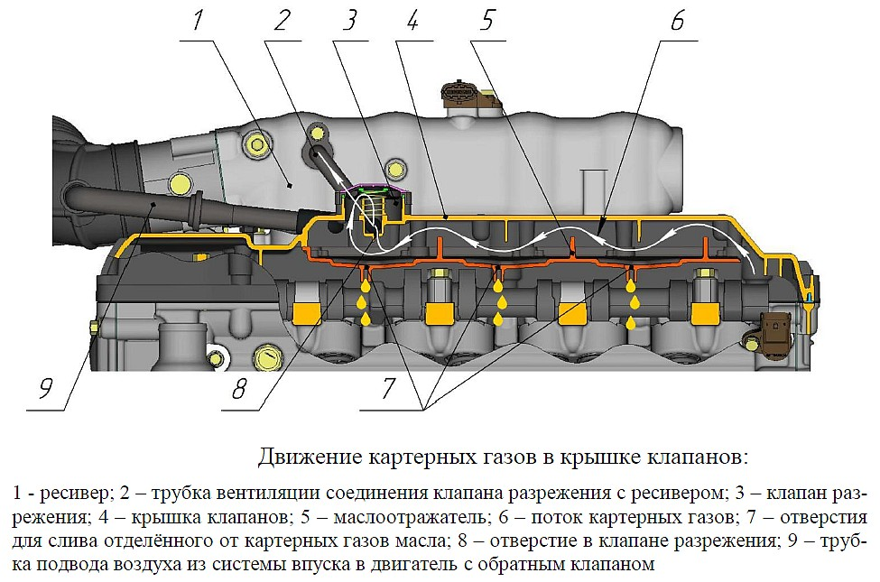

# Маслоотделитель и вентиляция картера — ЗМЗ-405/406

> Применимость: ЗМЗ-405, ЗМЗ-406 (инжектор)
> Модели: Соболь 2217, 2752, 2310 с инжекторным двигателем

## Назначение системы вентиляции картера

При работе двигателя часть газов прорывается из цилиндров в картер (через кольца). Эти **картерные газы** содержат масляный туман. Без вентиляции — давление в картере растёт → течи через сальники и прокладки.

**Система вентиляции** (ПКГ — принудительная вентиляция картера) отводит картерные газы через маслоотделитель обратно во впуск (дроссель/коллектор) для дожигания.

## Конструкция ЗМЗ-405

Маслоотделитель встроен в клапанную крышку. Лабиринтный принцип: газы проходят через перегородки, масляные капли осаждаются и стекают обратно.

**Схема:**  
Картер → маслоотделитель (в крышке) → шланг → дроссель (на холостом ходу) → впуск

## Симптомы засорения

- **Масло по всему двигателю снаружи** (через сальники и прокладки — картер под давлением)
- **Масло в воздушном фильтре** (масляный туман попадает во впуск)
- **Засорённый ДМРВ** (масляный туман на чувствительной нити)
- **Масло в шланге вентиляции** (в виде белой или тёмной эмульсии)
- **Повышенный расход масла** без видимых причин
- **Шланги вентиляции вздулись или лопнули** (давление в картере)

## Диагностика

### Проверка шланга вентиляции

Снять шланг, идущий от маслоотделителя к дросселю:
- Чистый/сухой — норма
- Чёрное масло → маслоотделитель пропускает много масла
- Белая эмульсия («сифа») → вода в масле (короткие поездки зимой, не прогревается) + масляные пары

### Проверка давления в картере

Снять крышку маслозаливной горловины при работающем двигателе. Газы не должны выходить с давлением. Если «выдавливает» крышку или сильный поток газов — кольца изношены или маслоотделитель забит.

## Обслуживание маслоотделителя

### Промывка шлангов

Каждые 40–60 тыс. км или при симптомах:

1. Снять шланги вентиляции (от крышки к дросселю)
2. Промыть бензином или керосином
3. Продуть сжатым воздухом
4. Просушить
5. Установить обратно

### Промывка маслоотделителя (в клапанной крышке)

При снятии клапанной крышки (при замене прокладки или клапанов):
1. Промыть клапанную крышку изнутри растворителем или керосином
2. Прочистить каналы маслоотделителя проволокой или сжатым воздухом
3. Промыть бензином, высушить

**На ЗМЗ-405 Евро-3** — маслоотделитель пластиковый, встроенный. Если забит наглухо — менять крышку в сборе или прочистить аккуратно.

## Зимняя проблема — замерзание

При коротких поездках зимой:
- Двигатель не прогревается до рабочей температуры
- Пары воды не выходят → конденсируются в масло + образуют белую эмульсию («майонез») в маслоотделителе и шлангах
- Шланги вентиляции могут замёрзнуть → давление в картере → течи

**Решение:** добавить утепление моторного отсека (шторка радиатора зимой), ездить дольше для прогрева.

## Доработка — внешний маслоотделитель

На Соболях с большим пробегом и изношенными кольцами — много картерных газов. Встроенный маслоотделитель не справляется, масло попадает в ДМРВ.

Решение: установить дополнительный **внешний маслоотделитель** (масляный сепаратор) в разрыв шланга вентиляции. Масло собирается в банке и не попадает в впуск.

Варианты: готовые маслоуловители (200–500 руб.) или самодельные из банки.

## Нюансы Соболя

- Частая болячка ЗМЗ-405: засоренный маслоотделитель → масло через сальник клапанной крышки и вокруг. **Прежде чем менять прокладки — промыть маслоотделитель**.
- Масло в воздушном фильтре + быстро засоряющийся ДМРВ = первый признак проблемы с маслоотделителем.
- На двигателях с большим пробегом (200+ тыс.) — кольца изношены, картерных газов много, маслоотделитель перегружен. Нужен внешний сепаратор.

## Типичные ошибки

**Заменить все прокладки и сальники**, не промыв маслоотделитель — течи снова появятся через 10–20 тыс. км.

**Игнорировать забитый маслоотделитель** → ДМРВ в масле → нестабильная работа двигателя.

**Снять шланг вентиляции и заткнуть** — картерные газы идут в атмосферу (неэкологично), или давление в картере растёт.

## Источники

- [Система вентиляции картера ЗМЗ-40524 — auto.kombat.com.ua](https://auto.kombat.com.ua/sistema-ventilyatsii-kartera-dvigatelya-zmz-40524-evro-3-evro-4-ustroystvo-rezhimyi-rabotyi/)
- [Маслоотделитель на вентиляцию картера — forum.allgaz.ru](http://forum.allgaz.ru/showthread.php?t=96290)
- [Система вентиляции картера ЗМЗ-406 — autoruk.ru](http://autoruk.ru/marka-avto2/gaz-2705/dvigatel-zmz-405/sistema-ventilyatsii-kartera-zmz-406-gaz-2705)

---
*Собрано: 2026-05-26*
