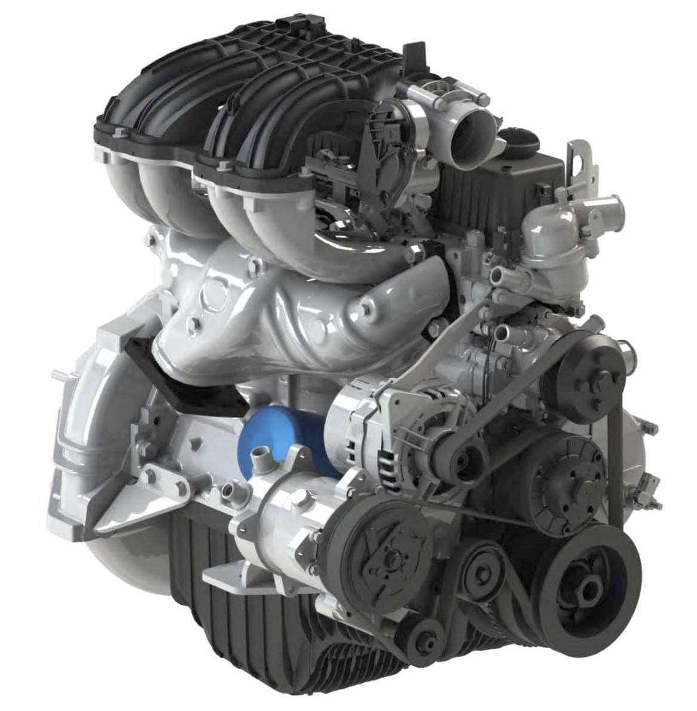

# Двигатель УМЗ-2.7 (EvoTech) — особенности обслуживания

> Применимость: УМЗ-2.7 (EvoTech)
> Модели: Соболь и Газель с двигателем УМЗ-А274/А275 EvoTech 2.7

## Что за двигатель

УМЗ-2.7 EvoTech — **бензиновый** двигатель Ульяновского моторного завода (УМЗ). Не путать с дизелем. Объём 2.7 л, инжекторный, 4-цилиндровый, 16-клапанный.

Модификации:
- **УМЗ-А274** — для Газели
- **УМЗ-А275-100** — Соболь, Газель (современная версия EvoTech)

Устанавливался с 2010-х как альтернатива ЗМЗ-405 (Заволжского завода).

## Ключевые отличия от ЗМЗ-405

| Параметр | УМЗ-2.7 EvoTech | ЗМЗ-405 |
|---|---|---|
| Объём масла | **4.5 л** (норма) | 6 л |
| Интервал замены масла | **15 000 км** | 8–10 000 км |
| Клапаны | 16 (4 на цилиндр) | 8 (2 на цилиндр) |
| Привод ГРМ | **Цепь** | Цепь (2 цепи) |
| Гидрокомпенсаторы | Есть | Есть |
| ЭБУ | Собственный (УМЗ) | МИКАС / СОАТЭ |

## Масло

- **Объём:** 4.5 л при замене с фильтром (официально), 5.2 л при сухой заправке
- **Вязкость:** 5W-40 (официально — весь год), 10W-40 допустимо при +5°C и выше
- **API:** не ниже SL
- **Рекомендованное:** Лукойл Люкс 5W-40, Лукойл Супер 10W-40 (масло «ГАЗ 5W-40» = Лукойл в другой упаковке)

**Интервал замены:** **15 000 км** (производитель) или каждые 12 месяцев.

> Это отличает УМЗ от ЗМЗ-405, где интервал 8–10 000 км.

## Масляный фильтр

- КОЛАН 2101С или Невский NF 1004-02
- Менять при каждой замене масла

## Сливная пробка поддона

Штатная пробка часто прикисает. Рекомендуется заменить на пробку «под ключ» (с гранями для накидного ключа) — упростит дальнейшие замены.

## Масляный радиатор

На УМЗ-А274/А275 есть масляный радиатор с краном:
- При температуре воздуха **выше +5°C** — открыть краник масляного радиатора
- При температуре **ниже +5°C** — закрыть

Забытый открытый краник зимой = масло охлаждается слишком сильно → повышенный износ.

## Система охлаждения

- Объём ОЖ: уточнять по конкретной версии (~8–10 л)
- Антифриз G11 или G12 (G11 и G12 не смешивать!)
- Термостат: заменить при первых признаках нестабильного прогрева

## ГРМ — цепь

На УМЗ EvoTech цепной ГРМ. Замена по симптомам (стрекот, растяжение) — аналогично ЗМЗ, но конструктивно другой двигатель. Запчасти: уточнять по артикулам УМЗ (не взаимозаменяемы с ЗМЗ).

## Воздушный фильтр

Менять каждые 15–20 000 км. Артикул: уточнять по конкретной версии (А274/А275).

## Свечи зажигания

- Рекомендуемые: БОШ, NGK, DENSO — по рекомендации завода (зазор уточнять в РЭ)
- Интервал: 15–30 000 км в зависимости от типа свечей

## Диагностика

УМЗ EvoTech имеет **собственный ЭБУ** и собственный протокол диагностики. ELM327 может не поддерживать — нужно уточнять совместимость сканера.

## Типичные проблемы

| Проблема | Причина |
|---|---|
| Масло уходит быстро | Маслосъёмные колпачки (симптом аналогичен ЗМЗ) |
| Нестабильный ХХ | ДМРВ, форсунки, дроссельный узел |
| Перегрев | Термостат, помпа, засорён радиатор |
| Стук при запуске | Гидрокомпенсаторы (аналог ЗМЗ) |

## Нюансы

- Запчасти не взаимозаменяемы с ЗМЗ-405 — разные производители, разные артикулы
- Масляный радиатор — специфика УМЗ: не забывать переключать сезонно
- ЭБУ-диагностика: уточнить совместимость адаптера ELM327 с конкретной прошивкой
- Интервал 15 000 км при городской эксплуатации рекомендуется сократить до 10 000 км

## Источники

- [Замена масла УМЗ EvoTech 2.7 — drive2.ru](https://www.drive2.ru/l/557734695966605688/)
- [Система смазки УМЗ-А275 — auto.kombat.com.ua](https://auto.kombat.com.ua/sistema-smazki-dvigatelya-umz-a275-100-evotech-2-7-gazel-sobol-princzip-dejstviya-konstrukczii-shema-obsluzhivanie/)
- [ТО двигателей УМЗ — gazavtomir.ru](https://gazavtomir.ru/info/teh/exploitation/sobol/9/)

---
*Собрано: 2026-05-26*
