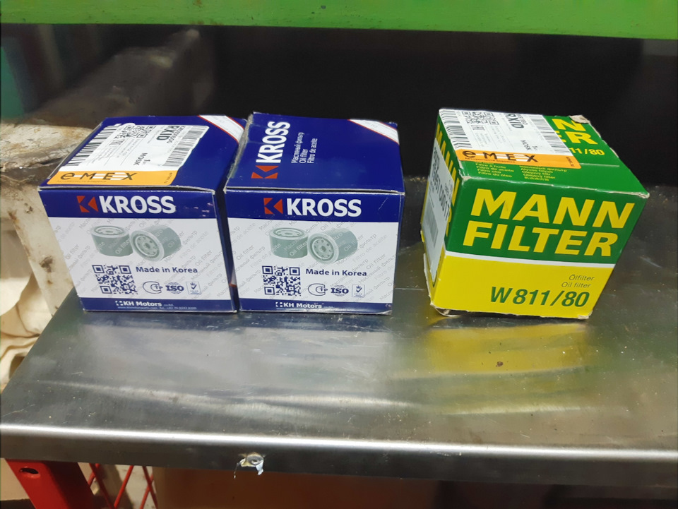

# Промывка двигателя перед заменой масла — ЗМЗ-405/406

> Применимость: ЗМЗ-402, ЗМЗ-405, ЗМЗ-406
> Модели: Соболь 2217, 2752, 2310 — все

## Когда промывка нужна

- При смене марки или производителя масла
- При смене вязкости (например, с минералки на синтетику)
- История обслуживания машины неизвестна (купили б/у)
- Долили «не то» масло в дороге — при первой плановой замене промыть

## Когда промывка НЕ нужна

- Меняете то же масло той же марки и вязкости в срок
- Современные масла содержат моющие присадки — при регулярной замене мотор остаётся чистым без дополнительной промывки

## Типы промывки

### «Пятиминутка» (агрессивная)
Специальный состав заливается на 5–10 минут работы на ХХ.

**На ЗМЗ-405 — не рекомендуется.** Агрессивная химия отрывает отложения со стенок картера, которые затем могут забить сетку маслозаборника. Для относительно ухоженного инжекторного мотора вреда больше, чем пользы.

### Мягкая промывка (промывочное масло)
По заводской инструкции ЗМЗ-405:

1. Слить горячее отработавшее масло из картера
2. Залить промывочное масло выше метки «MAX» на 2–4 мм
3. Запустить двигатель, дать поработать на холостых **не менее 10 минут**
4. Слить промывочное масло полностью
5. Сменить масляный фильтр
6. Залить свежее масло до нормы

В качестве промывочного — дешёвое минеральное масло той же вязкости или специальное промывочное без присадок.

### Промывка с раскоксовкой
При высоком расходе масла (колпачки или кольца) — Lavr ML202, HG2037. Залить в цилиндры через свечные отверстия, отдельно залить раскоксовку в картер. Ждать 12–24 часа. Подробнее — в теме по расходу масла.

## Особенности ЗМЗ-402

На карбюраторном ЗМЗ-402 с пробегом 150+ тыс. и большим расходом масла — агрессивная пятиминутка **иногда оправдана**: мотор настолько засален, что терять нечего. Но сразу после — контролировать давление масла.

## Нюансы Соболя

- Мотор прогреть перед сменой масла: горячее масло стекает полностью, холодное остаётся в каналах
- Если при замене обнаружили белую эмульсию в масле — промывка не поможет: искать причину (охлаждающая жидкость в масле = прокладка ГБЦ или трещина блока)
- После промывки обязательно менять фильтр — вся грязь ушла туда
- Промывку не проводят при течах масла: жидкая промывочная смесь вытечет быстрее обычного масла

## Типичные ошибки

**Лить пятиминутку в ЗМЗ-405** — сетка маслозаборника забивается отложениями, давление масла падает.

**Проводить промывку при низком уровне масла** — маслонасос захватит воздух, гидрокомпенсаторы стукнут.

**Не менять фильтр после промывки** — вся грязь возвращается обратно с новым маслом.

## Источники

- [Обслуживание системы смазки ЗМЗ-40524 — auto.kombat.com.ua](https://auto.kombat.com.ua/obsluzhivanie-sistemyi-smazki-zmz-40524-proverka-zamena-masla-filtra-promyivka-sistemyi/)
- [Промывка двигателя при замене масла — lavr.ru](https://lavr.ru/information/promyvka-dvigatelya-pri-zamene-masla/)
- [Промывочное масло — нужно ли — std-shell.ru](https://www.std-shell.ru/blog/article/nuzhno-li-promyvochnoe-maslo/)

---
*Собрано: 2026-05-26*
