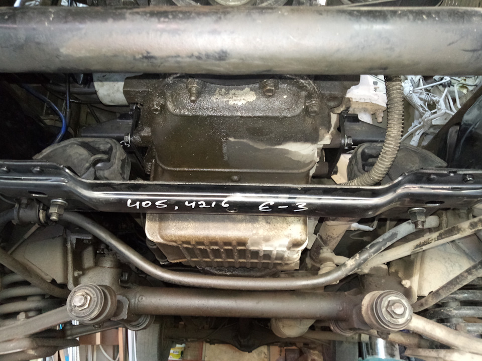

# Подушки (опоры) двигателя — замена

> Применимость: ЗМЗ-402, ЗМЗ-405, ЗМЗ-406
> Модели: Соболь 2217, 2752, 2310 — все

## Конструкция

Двигатель крепится к раме через **три опоры**:
- **Две передние** — под картером двигателя, слева и справа
- **Одна задняя** — под картером КПП

Опоры — резинометаллические. Со временем резина твердеет, трескается или отслаивается от металла.

## Симптомы износа

- Сильная вибрация в кабине на ХХ и при разгоне
- «Клацает» при резком нажатии и сбросе газа (двигатель дёргается)
- Стуки при переключении передач
- Двигатель «гуляет» — видно при осмотре снизу на ХХ
- Корпус двигателя задевает за шланги или проводку

### Диагностика

1. Открыть капот, заглушить двигатель
2. Попробовать покачать двигатель рукой — люфт = подушка разрушена
3. Или: попросить помощника нажать и резко сбросить газ — наблюдать снизу, как двигатель «прыгает»

## Артикулы

| Деталь | Артикул |
|---|---|
| Передняя подушка (ЗМЗ-402/406) | **3102-1001020** |
| Передняя подушка Газель Бизнес / Next | **0315743А / 3302.1001020** |
| Усиленная (НИРТИ, Резинотехника) | Arт. 3102-1001020 с маркировкой «усиленная» |

**Покупать:** 2 передних + 1 задний (под КПП).

**Варианты жёсткости:**
- Мягкие — меньше вибрации, ресурс 60–80 тыс. км
- Жёсткие/усиленные — дольше (100–150 тыс. км), но чуть больше вибрации в кабине

## Замена передних подушек

**Инструмент:** домкрат, деревянная прокладка (под поддон), ключи 13, 17, 19 мм.

1. Поднять автомобиль, подставить под раму
2. Подложить деревянную прокладку на домкрат — аккуратно подпереть снизу поддон двигателя (не саму подушку)
3. Открутить верхние болты крепления подушки (ключ 17 мм, сверху)
4. Открутить нижние гайки (ключ 17–19 мм, снизу через отверстие в раме)
5. Приподнять домкратом двигатель на 2–3 см — чтобы освободить посадочное место
6. Вынуть старую подушку
7. Установить новую — болты не затягивать полностью
8. Запустить двигатель, дать поработать на ХХ 1–2 минуты — двигатель «осядет» в штатное положение
9. Заглушить, затянуть болты окончательно

**Момент затяжки:** 40–60 Нм (болты крепления кронштейна к раме).

## Замена задней подушки (КПП)

Задняя подушка крепит КПП к поперечине рамы. Порядок аналогичный, но:
- Подпирать домкратом снизу КПП (через деревянную прокладку)
- Ослабить соединение кардана от КПП — чтобы дать КПП приподняться

## Нюансы Соболя

- Не путать подушки «старой Газели» и «Газель Бизнес» — у Бизнеса другой кронштейн
- После замены на жёсткие подушки первые дни ощущается «чужая» вибрация — норма, резина приработается
- Если вибрация не прошла после замены подушек — проверить дисбаланс карданного вала или крестовины
- Перед заменой осмотреть кронштейны подушек на раме — если треснуты → варить, иначе опора сразу разрушит новую подушку

## Типичные ошибки

**Затягивать болты без опущенной машины** — двигатель не «осел» на подушку, резина при опускании скручивается → ресурс 10–20 тыс. км.

**Менять только одну подушку** — парные передние нужно менять вместе.

**Подпирать домкратом картер без прокладки** — пробивает картер поддона двигателя.

## Источники

- [Замена подушек ЗМЗ-406 Волга — drive2.ru](https://www.drive2.ru/l/472099232837272177/)
- [Замена подушек ЗМЗ-405 Евро-3 Газель — youtube.com](https://www.youtube.com/watch?v=p5NvYGjctxU)
- [Подушки двигателя Газель 3302 Соболь — metalpart.ru](https://metalpart.ru/catalog/opory_dvigatelya/podushka_dvigatelya_gazel_3302_3321_sobol_2208_2752_volga_perednyaya_komplekt_2_sht_/)

---
*Собрано: 2026-05-26*
