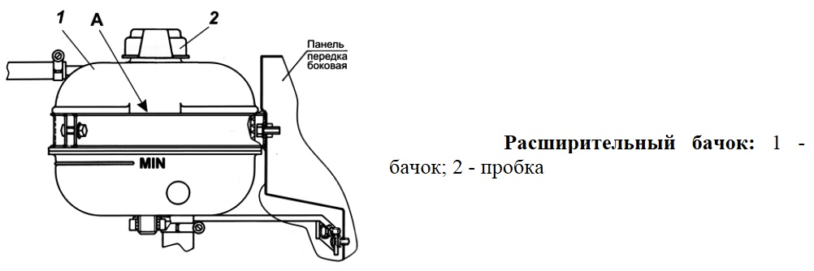

# Расширительный бачок — диагностика и замена

> Применимость: ЗМЗ-402, ЗМЗ-405, ЗМЗ-406 — все
> Модели: Соболь 2217, 2752, 2310 — все

## Назначение расширительного бачка

Компенсирует тепловое расширение охлаждающей жидкости. При нагреве жидкость расширяется → излишек уходит в бачок. При остывании — всасывается обратно. Без бачка система работает некорректно.

Также в бачке — подпитка системы при медленных потерях ОЖ.

## Симптомы неисправности

| Симптом | Причина |
|---|---|
| Уровень ОЖ постоянно падает | Трещина бачка (мелкая течь) |
| Лужа антифриза под машиной (сзади слева) | Трещина в бачке или патрубке |
| Бачок весь в белёсых разводах | Застарелые течи |
| Выдавливает ОЖ из бачка при прогреве | Неисправен клапан крышки |
| Двигатель перегревается | Бачок треснул → система не держит давление |

## Диагностика

### Проверка бачка

Осмотреть бачок на трещины (особенно у основания, у патрубков). Мелкие трещины видны по белёсым следам кристаллизованного антифриза.

На холодном двигателе: уровень ОЖ должен быть между метками MIN и MAX.

### Проверка крышки

Крышка расширительного бачка — **клапанная**. Поддерживает избыточное давление в системе. Неисправная крышка → жидкость кипит при более низкой температуре.

Проверка: при снятии крышки на прогретом двигателе — из-под крышки должно быть давление (осторожно — ожог!). Если давления нет → крышка неисправна.

Клапан открывается при **0.9–1.1 кгс/см²**.

## Замена бачка

Склеить треснувший бачок **нельзя** — пластик не реагирует с обычными клеями. Только замена.

### Артикулы

| Автомобиль | Артикул | Примечание |
|---|---|---|
| Газель Бизнес | 2705-1311010-10 | Без датчика уровня |
| Соболь Бизнес | аналогичный | Уточнять по году |
| Газель старая (до рестайл.) | уточнять | Другая форма |

**Крышку бачка** менять при каждой замене бачка (дёшево, часто она и есть причина проблемы).

### Порядок замены

1. Дать двигателю остыть полностью
2. Снять крышку бачка (осторожно — остаточное давление)
3. Снять шланг из бачка (нижний — в систему)
4. Снять крепёжный болт/хомут бачка
5. Слить остатки жидкости из бачка в ёмкость
6. Установить новый бачок
7. Подключить шланг (хомут)
8. Залить ОЖ до метки MAX
9. Завинтить крышку
10. Прогреть двигатель, проверить герметичность и уровень

## Нюансы Соболя

- Бачок расположен в правой части моторного отсека (ЗМЗ-405). Крепится к брызговику болтом или в кронштейне.
- На ранних Соболях — **стеклянный бачок** (редкость). На большинстве — пластиковый.
- Пластиковый бачок трескается чаще у **основания нижнего патрубка** — место наибольших нагрузок.
- Выкидывает антифриз при перегреве — первым делом проверить бачок и крышку, не торопиться разбирать двигатель.
- Бачок без датчика уровня — норма. Датчик уровня — дополнительная опция.

## Типичные ошибки

**Снимать крышку с горячего бачка** — выброс кипящего антифриза.

**Склеивать бачок** — не держится на пластике при рабочем давлении.

**Не менять крышку бачка** — старая крышка не держит давление → кипит антифриз → перегрев.

**Заливать антифриз выше метки MAX** — при нагреве выдавит.

## Источники

- [Выдавливает антифриз из бачка — sinteclubricants.ru](https://sinteclubricants.ru/articles/vydavlivaet_antifriz_iz_bachka/)
- [Расширительный бачок Газель Бизнес — drive2.ru](https://www.drive2.ru/l/687600488224391451/)
- [Бачки расширительные Газель — gazelist52.ru](https://gazelist52.ru/catalog/sistema_okhlazhdeniya_1/bachok_rasshiritelnyy/)

---
*Собрано: 2026-05-26*
