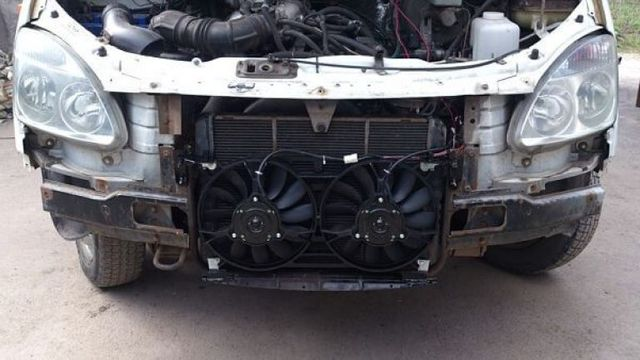

# Муфта вентилятора охлаждения — ЗМЗ-405/406

> Применимость: ЗМЗ-405, ЗМЗ-406 (инжектор)
> Модели: Соболь 2217, 2752, 2310 — инжекторные

## Типы муфт на ЗМЗ-405

На ЗМЗ-405 с завода установлена **электромуфта** — вентилятор включается по команде ЭБУ при достижении заданной температуры ОЖ. Это не вискомуфта с биметаллическими пластинами.

На ЗМЗ-406 **карбюраторном** (4061, 4063) — постоянный привод вентилятора через помпу, без муфты.

## Симптомы неисправности электромуфты

| Симптом | Причина |
|---|---|
| Перегрев в пробке на ХХ, на ходу нормально | Электромуфта не включается при низких оборотах |
| Антифриз «выкидывает» из расширительного бачка | Сильный перегрев — вентилятор не работал |
| Вентилятор не вращается даже при +100°C | Сгорела электромуфта или её реле |
| Вентилятор не отключается — постоянно крутится | Муфта заклинила в замкнутом состоянии |

### Диагностика

1. Прогреть двигатель до 95–100°C
2. Посмотреть/послушать — вентилятор должен заметно ускориться при включении муфты
3. Если не включается — проверить реле и предохранитель электромуфты (блок в моторном отсеке)
4. Если реле и предохранитель исправны — муфта сгорела → замена

## Замена электромуфты

**Артикул штатной электромуфты:** уточнять по году и типу ЭБУ в каталоге (меняется по модификациям).

1. Снять ремень привода агрегатов
2. Открутить крепёжный болт муфты на помпе (резьба левая! — откручивать по часовой стрелке)
3. Снять муфту с вентилятором в сборе
4. Установить новую муфту, затянуть болт (левая резьба — по часовой)
5. Надеть ремень

**Внимание:** болт крепления муфты имеет **левую резьбу** — стандартное откручивание («против часовой стрелки») будет его затягивать.

## Замена на вискомуфту (модернизация)

Популярное решение среди владельцев — замена ненадёжной электромуфты на вискомуфту от BMW E36/E39. Резьба совместима.

**Артикулы:**
- Вискомуфта: **STELLOX 3000433 SX** (BMW E36)
- Крыльчатка: **SAT ST 11521723363**

**Дополнительно потребуется:**
- Помпа от ЗМЗ-406 карбюраторного (4063) — с постоянным приводом вентилятора через шкив
- Переходной патрубок (для ЗМЗ-405 Евро-3)
- 4 болта М6×15 с внутренним шестигранником

**Преимущества вискомуфты:**
- Не зависит от электрики и ЭБУ
- Автоматически включается при нагреве воздуха от радиатора
- Ресурс 10+ лет без обслуживания

**Недостаток:** зимой двигатель дольше прогревается (вентилятор крутится постоянно).

## Нюансы Соболя

- Перегрев ЗМЗ-405 в пробке без очевидных причин (термостат и помпа исправны) — в 60% случаев электромуфта
- При отказе электромуфты в дороге: чаще ехать на умеренной скорости (встречный поток воздуха охлаждает), избегать долгих стоянок с работающим двигателем
- Летом в жару проверить муфту профилактически: прогреть, постоять на ХХ 10 мин — температура должна держаться в норме
- Муфта от Газель Бизнес и от «старой» Газели — могут отличаться по разъёму и параметрам управления

## Типичные ошибки

**Менять термостат и помпу при неработающей муфте** — температура всё равно растёт в пробке.

**Откручивать болт муфты по часовой стрелке** — левая резьба, завинтится ещё туже.

**Не проверить предохранитель и реле** перед заменой муфты — 30% случаев неработающий вентилятор = неисправное реле (100 руб.).

## Источники

- [Вискомуфта взамен электромуфты Газель 406/405 — drive2.ru](https://www.drive2.ru/l/656544507419962199/)
- [Электромуфта вентилятора 405 двигателя — allgaz.ru](https://forum.allgaz.ru/threads/78314/)
- [Перегрев Газель ЗМЗ-405/406 — vinmotors.ru](https://vinmotors.ru/greetsja-gazel-dvigatel-zmz-prichiny-i-reshenie/)

---
*Собрано: 2026-05-26*
