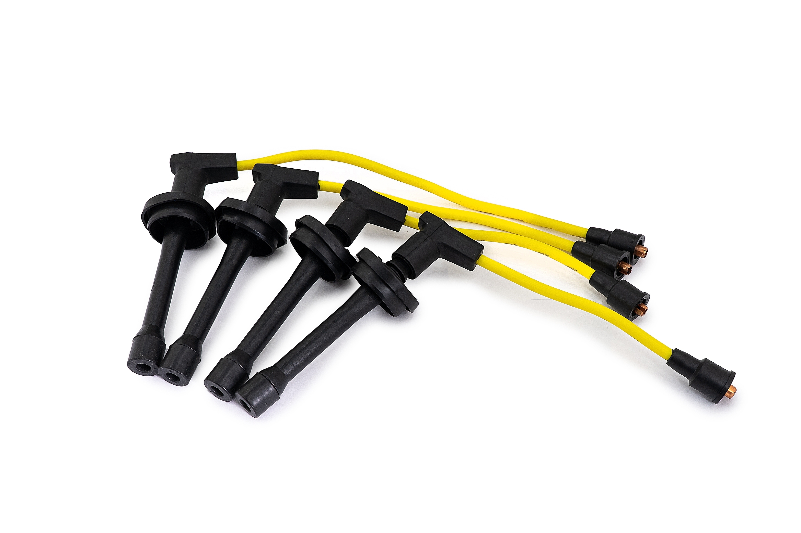

# Высоковольтные провода — замена ЗМЗ-405/406

> Применимость: ЗМЗ-405 / ЗМЗ-406 (инжектор, две катушки)
> Модели: Соболь 2217, 2752, 2310 с инжектором

## Система зажигания ЗМЗ-405/406

На ЗМЗ-405/406 стоит система **DIS** — две катушки зажигания, каждая обслуживает пару цилиндров:
- **Катушка 1** → цилиндры 1 и 4 (ближе к впускному коллектору)
- **Катушка 2** → цилиндры 2 и 3 (ближе к выпускному коллектору)

Итого **4 провода**. Порядок зажигания ЗМЗ-405: **1–2–4–3**.

## Симптомы пробитых проводов

- Двигатель троит (один или два цилиндра не работают)
- Перебои при разгоне под нагрузкой
- Потеря мощности, рывки
- В темноте видны голубые искры на проводах (пробой на массу)
- Запах горящей изоляции

**Провалы при нагрузке и сырости** — классический признак пробитых проводов.

## Как проверить

**Метод 1 — визуально в темноте:** ночью при работающем двигателе под капотом видны голубые искры там где провод пробит.

**Метод 2 — мокрый двигатель:** на холодном влажном двигателе пробои проявляются сильнее. Полить провода водой из пульверизатора — если появились перебои, провода виноваты.

**Метод 3 — мультиметром:** сопротивление одного провода должно быть **6–10 кОм**. Выше — провод разорван внутри или окислён наконечник.

## Артикулы

| Производитель | Артикул | Примечание |
|---|---|---|
| ЗМЗ оригинал | 4062.3707244-10 | Базовый |
| SLON | 4062.3707244-10 | Доступный вариант |
| CARGEN | — | Комплект для ЗМЗ-405/406 |
| Силиконовые Metalpart | — | Лучшая изоляция |

Брать **силиконовые** — держат температуру до 240°C, не трескаются на морозе. Обычные резиновые деградируют через 2–3 зимы.

## Замена

1. Заменять по одному (чтобы не перепутать подключение)
2. Снять провод со свечи и катушки
3. Надеть новый по тому же маршруту
4. Провода не должны касаться выпускного коллектора (расплавятся)
5. Не натягивать и не перегибать

### Порядок подключения

- Полярность в паре (1–4 или 2–3) **не важна** — катушка работает в обе стороны
- Важно не перепутать **пары**: 1–4 к одной катушке, 2–3 к другой
- Провода прокладывать по штатным скобам, не рядом с горячими деталями

## Нюансы Соболя

- Провода на ЗМЗ-405 идут **через горячую зону** двигателя. Штатные ЗМЗ-провода служат 3–5 лет. Силиконовые — 7–10 лет.
- **Наконечники окисляются** — особенно у свечей. При снятии проверить, нет ли зелёного налёта. Зачистить, смазать токопроводящей смазкой или Литол-24.
- Если двигатель троит — сначала проверить провода и свечи (дёшево), потом катушки зажигания (дорого).

## Периодичность

- Резиновые провода: **30–40 тыс. км** или при симптомах
- Силиконовые: **60–80 тыс. км**

## Типичные ошибки

**Перепутать пары катушек** — двигатель будет троить или не запустится.

**Провод касается выпускного коллектора** — расплавится за несколько часов.

**Не проверить наконечники** — новый провод с окисленным наконечником даёт нестабильный контакт.

## Источники

- [Порядок подключения ВВ проводов ЗМЗ-405/406 — a116.ru](https://a116.ru/site/stati/vysokovoltnye-provoda-i-svechi/poryadok-podklyucheniya-vv-provodov-zmz-405-406/)
- cargen.ru — комплект ВВ проводов ЗМЗ-405/406
- metalpart.ru — силиконовые провода ЗМЗ

---
*Собрано: 2026-05-26*
