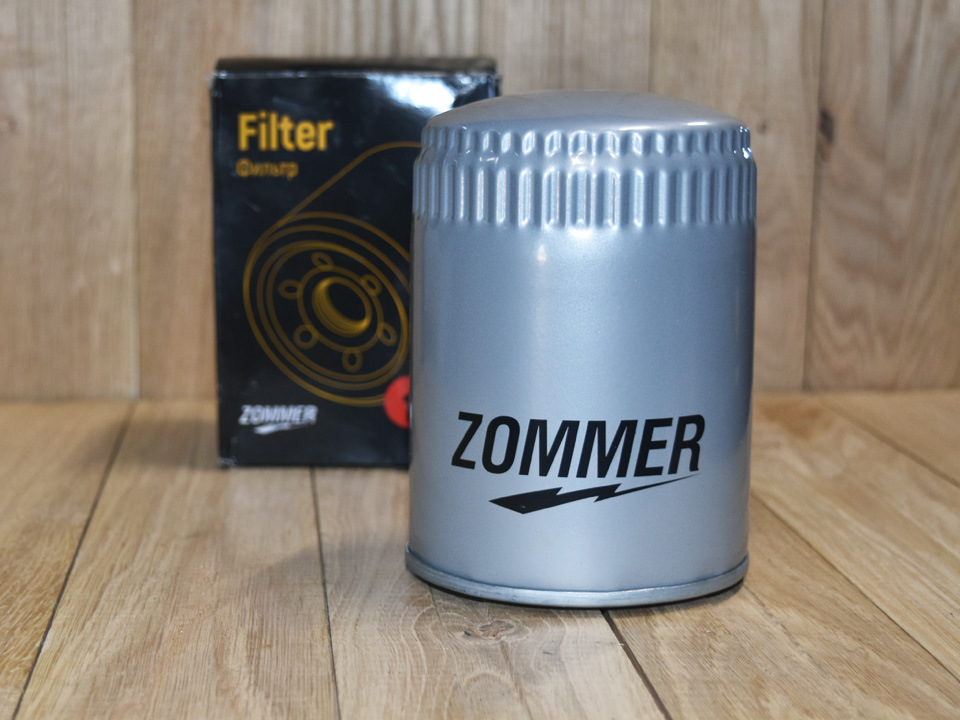
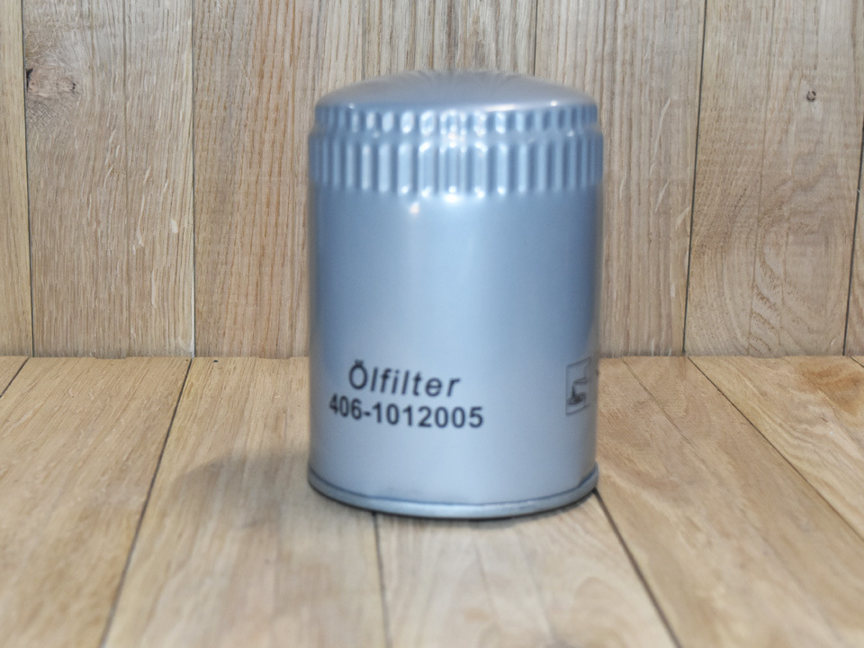

# Замена масла в двигателе

> Применимость: ЗМЗ-402 / ЗМЗ-405 / ЗМЗ-406 / УМЗ-2.7
> Модели: все Соболь

## Когда менять

По пробегу или по времени — что наступит раньше:
- Нормальные условия: каждые 8–10 тыс. км или раз в год
- Город, короткие поездки: каждые 6–7 тыс. км
- Грунтовки, тяжёлые условия: каждые 5–6 тыс. км

Признаки что пора досрочно: масло почернело и густое, падает давление масла на горячем, запах горелого при работе двигателя.

## Объём и вязкость по двигателям

### ЗМЗ-405 / ЗМЗ-406 (инжектор, 2.4–2.9 л)
- **Объём:** 6 л (включая фильтр)
- **Всесезонно:** 10W-40 или 5W-40
- **Зима ниже −25°C:** 5W-30 или 0W-40
- **Тип:** полусинтетика или синтетика
- **Допуск:** API SJ / SL / SM

### ЗМЗ-402 (карбюратор, 2.4–2.5 л)
- **Объём:** 5.8 л (включая фильтр)
- **Всесезонно:** 10W-40
- **Лето:** 20W-40
- **Зима:** 5W-30
- **Тип:** минералка или полусинтетика (синтетика — осторожно, см. ниже)
- **Допуск:** API SG (старые), SJ/SL (после 2000 г.)

### УМЗ-2.7 (устанавливался на часть Соболей)
- **Объём:** ~4 л (значительно меньше — не перепутать!)
- **Вязкость:** аналогично ЗМЗ-405

## Порядок замены

1. Прогреть двигатель до рабочей температуры — масло стекает полностью
2. Слить масло через пробку поддона (ключ **24 мм**)
3. Снять масляный фильтр (съёмник под 3/8" или цепной)
4. Новый фильтр: смазать уплотнительное кольцо свежим маслом, затянуть от руки + 3/4 оборота
5. Завернуть пробку слива, залить масло через горловину
6. Запустить двигатель, дать поработать 2–3 минуты, проверить на течи
7. Заглушить, подождать 5 минут, проверить уровень по щупу — долить до MAX

## Нюансы Соболя

- Пробка поддона на ЗМЗ закисает — при первой замене может понадобиться рычаг. После каждой замены смазывать резьбу медной пастой.
- Удобнее менять на эстакаде или яме — снизу места немного меньше чем на Газели.
- Фильтр расположен сбоку блока, может накрениться при съёме — держать тряпку.

## Типичные ошибки

**Синтетика на изношенном двигателе** — главная ловушка. Синтетика обладает высокой моющей способностью и текучестью: на двигателе с пробегом 150–200+ тыс. км она вымывает отложения, которые «закупоривали» изношенные сальники и прокладки. Результат — течи везде. Если раньше лили минералку — переходи на полусинтетику постепенно, не сразу на полную синтетику.

**Перепутать объём ЗМЗ и УМЗ** — УМЗ-2.7 берёт ~4 л, не 6. Перелив вызывает вспенивание и выброс масла.

**Не прогреть перед сливом** — холодное масло густое, стекает не полностью, остаток смешивается со свежим.

**Залить больше MAX** — на ЗМЗ перелив 0.5+ л ведёт к пенению и течи через сапун.

## Инструмент и расходники

| Позиция | Что нужно |
|---|---|
| Ключ для пробки | 24 мм накидной или торцевой |
| Съёмник фильтра | Цепной или ленточный (лапчатый не подходит — узко) |
| Ёмкость для слива | Минимум 7 л |
| Масляный фильтр | NEVSKY NF-1011 (ЗМЗ-405/406), FRAM PH2849 — оба подходят |
| Прокладка пробки | Медная 14×18 (менять каждые 2–3 замены) |
| Масло | 6 л для ЗМЗ, 4 л для УМЗ |

Марки масел с хорошими отзывами на форумах: Лукойл Люкс 10W-40, ТНК Magnum 10W-40, ZIC X5 10W-40, Castrol Magnatec 10W-40.

## Источники

- [Замена масла в двигателе Газель 405](https://atlib.info/report/1414-zamena-masla-v-dvigatele-gazel-405) — пошаговая инструкция с фото
- [Моторное масло для двигателя ЗМЗ 405](https://maslocar.com/motornoe-maslo-dlya-dvigatelya-zmz-405.html) — характеристики и допуски
- [Замена масла в ДВС — ГАЗ Соболь 4х4, 2015](https://www.drive2.ru/l/489453649492181923/) — drive2.ru, реальный опыт
- [замена масла в ДВС — ГАЗ Соболь 2006](https://www.drive2.ru/l/3937370) — drive2.ru
- ЗМЗ-402: масло и вязкость — [maslohelp.ru](https://maslohelp.ru/zmz-402-maslo-dlya-dvigatelya-2-5-skolko-i-kakogo-trebuetsya/)

---
*Собрано: 2026-05-26*
