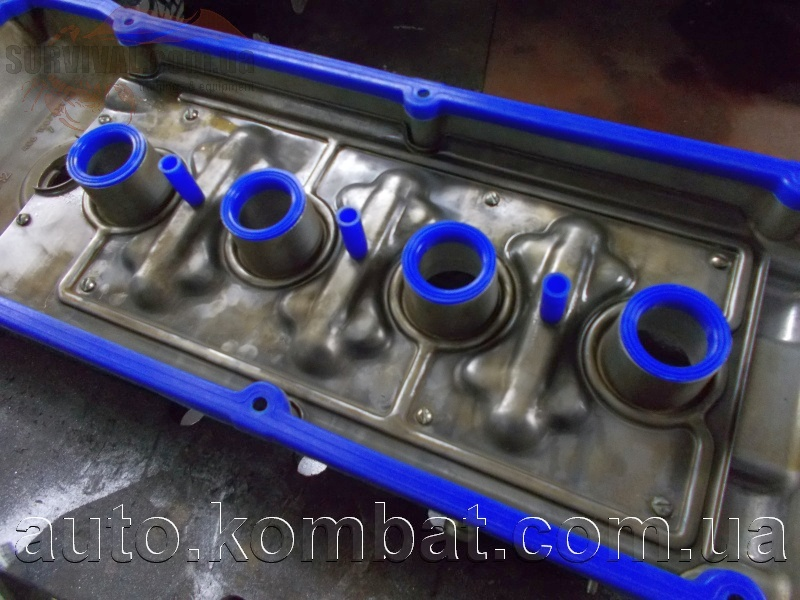

# Расход масла — причины и диагностика ЗМЗ-405/406

> Применимость: ЗМЗ-405 / ЗМЗ-406
> Модели: Соболь 2217, 2752, 2310



## Норма расхода масла

- **Допустимо:** до 100–150 г на 1000 км (0,1–0,15 л/1000 км)
- **Повышенный:** 0,5 л и более на 1000 км — нужна диагностика
- **Критично:** более 1 л на 1000 км — немедленная диагностика

## Три основные причины

### 1. Маслосъёмные колпачки (сальники клапанов)

**Симптом:** синий дым из выхлопа при запуске, исчезающий после прогрева. При резком газе — облако синего дыма, которое затем пропадает.

**Ресурс:** 100–180 тыс. км.

**Диагностика:** после ночной стоянки завести холодный двигатель — синий дым в первые секунды. Или резко нажать газ после длительного ХХ.

**Лечение:** замена маслосъёмных колпачков (14 штук на ЗМЗ-405). Работа несложная — ГБЦ снимать не нужно, только клапанную крышку. Специальный инструмент: компрессор для удержания клапанов.

### 2. Маслосъёмные кольца (цилиндропоршневая группа, ЦПГ)

**Симптом:** постоянный синий дым из выхлопа при любом режиме (не только на холодную). Расход масла 1–2 л/1000 км и выше.

**Ресурс ЦПГ ЗМЗ-405:** 200–300 тыс. км при нормальном обслуживании.

**Диагностика:**
- Компрессия: норма ЗМЗ-405 — **10–12 атм** на каждом цилиндре. Разница между цилиндрами — не более 1 атм.
- Тест с маслом: залить 10 мл масла в цилиндр через свечное отверстие. Если компрессия выросла — кольца.

**Лечение:** расточка/хонинговка и замена колец. Серьёзная работа, дорого. Иногда промывка ЦПГ специальными промывками помогает при закоксовывании колец.

### 3. Течи через сальники и прокладки

**Симптом:** масло снаружи двигателя. Видно визуально. Запах горящего масла.

Основные точки течи:
- Задний сальник коленвала (самая частая)
- Прокладка клапанной крышки
- Прокладка ГБЦ (тогда масло в ОЖ или ОЖ в масле)
- Сальники распредвала
- Прокладка поддона картера

## Алгоритм диагностики

```
1. Осмотреть двигатель снаружи — есть ли потёки?
   Да → течь через сальники/прокладки
   
2. Смотреть выхлоп при холодном пуске
   Синий дым → маслосъёмные колпачки (наиболее вероятно)
   
3. Смотреть выхлоп постоянно
   Постоянный синий дым → кольца (ЦПГ)
   
4. Проверить компрессию
   Ниже 10 атм → ЦПГ
```

## Промывка — когда помогает

При закоксовывании маслосъёмных колец (кольца залипли, не работают) — промывка ЦПГ:
- **Лавр Митра** (ML202) или **Hi-Gear Piston Cleaner**
- Залить в цилиндры через свечные отверстия, выдержать 12–24 ч
- Прокрутить стартером без свечей (вытолкнуть излишки)
- Поставить свечи, завести

Если кольца залипли (не физически изношены) — помогает. Если реальный износ — нет.

## Нюансы Соболя

- **ЗМЗ-405** конструктивно имеет повышенный расход масла по сравнению с японскими аналогами. 200–400 г/1000 км считается нормой для пробега 150+ тыс. при исправном двигателе.
- Синтетическое масло на изношенном ЗМЗ-405 → течи и рост расхода (вымывает отложения с сальников). Переходить через полусинтетику.
- Использование масла низкого качества ускоряет закоксовывание колец.

## Инструмент для замены колпачков

| Позиция | Что нужно |
|---|---|
| Приспособление для сжатия пружин | Специальный съёмник клапанных пружин |
| Компрессор клапанов | Удерживает клапан при снятом колпаке |
| Оправка для запрессовки колпачков | Трубка нужного диаметра |

## Источники

- [Повышенный расход масла ЗМЗ-405/406 — gazelleclub.ru](https://www.gazelleclub.ru/index.php?ind=reviews&op=entry_view&iden=13)
- [Двигатели ЗМЗ-405/406 — проблемы — detali15.ru](https://detali15.ru/articles/dvigateli-zmz-405-i-zmz-406-osobennosti-ekspluatatsii-rasprostranyonnye-problemy-i-metody-ikh-ustraneniya/)
- drive2.ru — практика владельцев

---
*Собрано: 2026-05-26*
