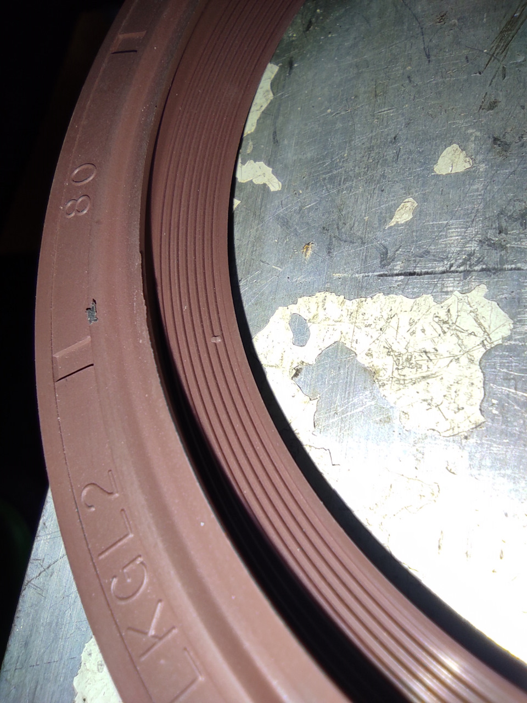

# Задний сальник коленвала — замена ЗМЗ-405/406

> Применимость: ЗМЗ-405 / ЗМЗ-406 / ЗМЗ-409
> Модели: Соболь 2217, 2752, 2310 — все

## Симптомы течи заднего сальника

- **Масло на картере сцепления** — масло с маховика разбрызгивается внутри корпуса сцепления
- **Масло на диске сцепления** — пробуксовка сцепления, запах гари при трогании
- **Масляные подтёки** снизу двигателя сзади, между блоком и КПП
- **Расход масла растёт** без видимых внешних утечек

**Критично:** если масло попало на диск сцепления — диск менять обязательно. Промасленный диск не восстанавливается.

## Размер и артикулы

**Задний сальник коленвала ЗМЗ-405/406/409:**
- Размер: **80×100×10 мм**
- Артикул ЗМЗ: **406.1005160** (он же 4062.1005160-01)

| Производитель | Артикул | Примечание |
|---|---|---|
| ЗМЗ (оригинал) | 406.1005160 | Базовый |
| Rubena (Чехия) | 4062.1005160-01 | Рекомендуется форумчанами |
| Victor Reinz (Германия) | 81-51127-20 | Качественный |
| CORTECO (Италия) | — | Надёжный вариант |

Импортные сальники предпочтительнее — оригинальные ЗМЗ текут через 30–50 тыс. км.

## Порядок замены

Для замены заднего сальника нужно снять **КПП и сцепление**. Это трудоёмкая работа (~3–4 часа).

### Что снять

1. Слить масло из КПП
2. Снять карданный вал (4 болта заднего фланца + 4 болта переднего)
3. Снять рычаг КПП
4. Снять тягу сцепления / рабочий цилиндр сцепления
5. Открутить КПП от двигателя (болты по периметру колокола)
6. Снять КПП (тяжёлая, нужен помощник или домкрат)
7. Снять корзину сцепления и диск
8. Открутить маховик (болты момент 70–80 Нм)
9. Снять маховик

### Замена сальника

Сальник запрессован в гнездо в блоке цилиндров сзади.

1. Поддеть старый сальник отвёрткой — аккуратно, не царапать гнездо
2. Осмотреть шейку коленвала — если есть выработка, сдвинуть сальник на 1–2 мм в глубину при установке
3. Залить рабочую кромку нового сальника Литол-24 (заполнить полость между губой и пыльником на 2/3)
4. Запрессовать сальник ровно (через старый сальник как оправку или пластиковую трубу нужного диаметра)
5. Запрессовывать равномерно — перекос уничтожит сальник немедленно

**Лайфхак:** как направляющую для запрессовки использовать пластиковую бутылку подходящего диаметра.

### Сборка

После установки сальника — собрать в обратном порядке. При установке маховика применить новые болты или нанести фиксатор резьбы (Локтайт 243).

## Нюансы Соболя

- 95% повторных течей нового сальника — **слетевшая пружинка-браслет** при неаккуратной запрессовке. Проверить перед установкой, что пружинка на месте.
- При снятой КПП — обязательно заменить диск сцепления, корзину и выжимной подшипник (одна разборка — три детали). Экономия не оправдана.
- Одновременно проверить задний сальник цилиндра (если течёт — туда же).
- Если выработка на шейке коленвала — сальник можно поставить чуть глубже или заказать сальник увеличенной ширины (14 мм вместо 10 мм).

## Типичные ошибки

**Заменить только диск сцепления без замены сальника** — новый диск сгорит за 10–20 тыс. км.

**Перекос при запрессовке** — сальник начнёт течь сразу.

**Не смазать Литолом** — сальник «пустит» при первом пуске.

**Не проверить маховик** на трещины и биение — при его замене в сервисе это проверяют, самостоятельно часто пропускают.

## Инструмент

| Позиция | Что нужно |
|---|---|
| Домкрат или подставка для КПП | КПП тяжёлая |
| Ключ для маховика | 17 мм, удлинитель |
| Отвёртка | Поддеть старый сальник |
| Оправка | Старый сальник или пластиковая бутылка |
| Литол-24 | Смазать рабочую кромку |

## Источники

- [Задний сальник коленвала — форум gazelleclub.ru](https://www.gazelleclub.ru/forum/topic/18949-zadnii-salnik-kolenvala/)
- [Замена сальника коленвала на Газели](https://carmanuals.ru/content/zamena-salnika-kolenvala-na-gazeli) — carmanuals.ru
- bon74.ru — артикулы сальников ЗМЗ-405/406

---
*Собрано: 2026-05-26*
