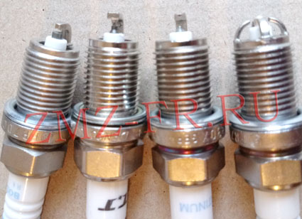
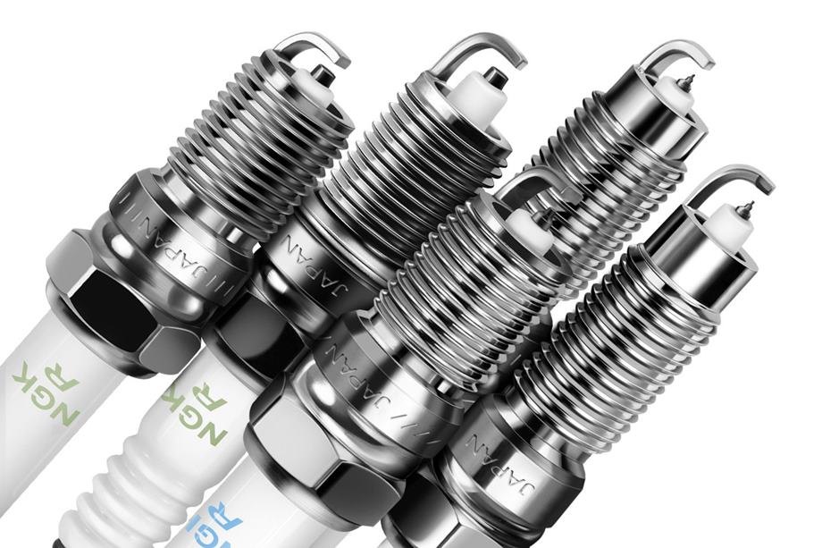

# Замена свечей зажигания — ЗМЗ-405/406

> Применимость: ЗМЗ-405, ЗМЗ-406
> Модели: Соболь 2217, 2752, 2310 — все (инжектор)

## Типы систем зажигания ЗМЗ-405

На ЗМЗ-405 применяются **два конструктивных варианта**:

### Тип 1 — Две катушки + ВВ провода (ранний ЗМЗ-405/406 Евро-2)
- 2 катушки зажигания 405.3705
- Катушка 1 → цилиндры 1 и 4, катушка 2 → цилиндры 2 и 3
- Свечи вкручиваются и соединяются через ВВ провода
- **Ключ под свечи: 21 мм**

### Тип 2 — Индивидуальные катушки (ЗМЗ-405/406 Евро-3)
- 4 катушки — по одной на каждый цилиндр
- Катушка надевается прямо на свечу (нет ВВ проводов)
- **Ключ под свечи: 16 мм**
- Более поздние двигатели (с 2006–2008 г.)

Определить тип легко: если есть ВВ провода → Тип 1. Если провода выходят прямо из «шайб» на крышке — Тип 2.

## Свечи зажигания

| Параметр | Значение |
|---|---|
| Марка свечи | **А14ДВР** (или А14ДВР-А) |
| Зазор | **0.80–0.95 мм** |
| Резистор | 8–10 кОм |
| Резьба | М14×1.25 |
| Интервал замены | Каждые **15–20 тыс. км** |

**Нельзя ставить А17ДВРМ** (ВАЗ-инжектор) — другой тепловой номер и зазор 1.0 мм. Свечи перегреются → детонация.

Аналоги: NGK BPR6ES (зазор 0.8 мм), Bosch WR7DC.

## Порядок зажигания

**1 – 2 – 4 – 3** (на все варианты ЗМЗ-405/406)

## Замена — Тип 1 (две катушки + провода)

1. Дождаться охлаждения двигателя
2. Снять разъёмы с катушек
3. Снять ВВ провода со свечей (тянуть за наконечник, не за провод)
4. Свечным ключом **21 мм** выкрутить все 4 свечи
5. Осмотреть свечи (нагар → диагностика)
6. Закрутить новые свечи **от руки** до касания, затем ключом **на 1/2 оборота** (момент ~25 Нм)
7. Надеть ВВ провода согласно порядку зажигания
8. Подключить разъёмы катушек

### Порядок подключения ВВ проводов
Провода имеют разную длину — ориентироваться по длине и маркировке на катушке (обычно 1-4 / 2-3).

## Замена — Тип 2 (индивидуальные катушки)

1. Снять разъёмы с катушек
2. Открутить болты крепления катушек к крышке клапанов (ключ 12 мм)
3. Вытащить катушки
4. Свечным ключом **16 мм** выкрутить свечи
5. Закрутить новые свечи (момент ~25 Нм)
6. Установить катушки, закрутить болты
7. Подключить разъёмы

## Диагностика по нагару

| Вид свечи | Диагноз |
|---|---|
| Чёрный бархатистый нагар | Богатая смесь (ДМРВ, форсунки) |
| Белый, обгоревший электрод | Бедная смесь или перегрев |
| Маслянистый нагар | Масло в цилиндрах (кольца или колпачки) |
| Ровный светло-коричневый | Норма |
| Оплавленные электроды | Детонация или перегрев |

## Нюансы Соболя

- Свечи на прогретом двигателе выкручиваются легче — меньше риск повредить резьбу в алюминиевой ГБЦ.
- Перед установкой смазать резьбу **графитовой смазкой** — при следующей замене выкрутятся без проблем.
- Не перетягивать — резьба в алюминиевой ГБЦ срывается при 30+ Нм.
- Наконечники ВВ проводов: использовать оригинальные арт. **50.3707200** или **402.37707230** — дешёвые аналоги создают зазор, провод сгорит за 1–2 месяца.
- На Евро-3 (тип 2): катушки зажигания крепятся болтами к крышке — не затягивать сильно (пластиковая крышка трескается).

## Типичные ошибки

**Поставить свечи с зазором 1.0 мм** (от ВАЗ) — детонация, перегрев двигателя.

**Перетянуть свечу** — сорванная резьба в ГБЦ, ремонт на 3–5 тыс. руб.

**Не осмотреть нагар** — теряется возможность диагностики состояния двигателя.

**Поменять свечи без замены ВВ проводов при пробеге 50+ тыс.** — провода убивают новые свечи.

## Источники

- [Подбор и замена свечей Газель — auto.today](https://auto.today/bok/5384-process-podbora-proverki-i-zameny-svechey-zazhiganiya-gazel.html)
- [Свечи и ВВ провода ЗМЗ-405/406 — a116.ru](http://a116.ru/site/stati/vysokovoltnye-provoda-i-svechi/svechi-i-vysokovoltnye-provoda-zmz-405-406/)
- [Порядок подключения ВВ проводов — a116.ru](https://a116.ru/site/stati/vysokovoltnye-provoda-i-svechi/poryadok-podklyucheniya-vv-provodov-zmz-405-406/)

---
*Собрано: 2026-05-26*
