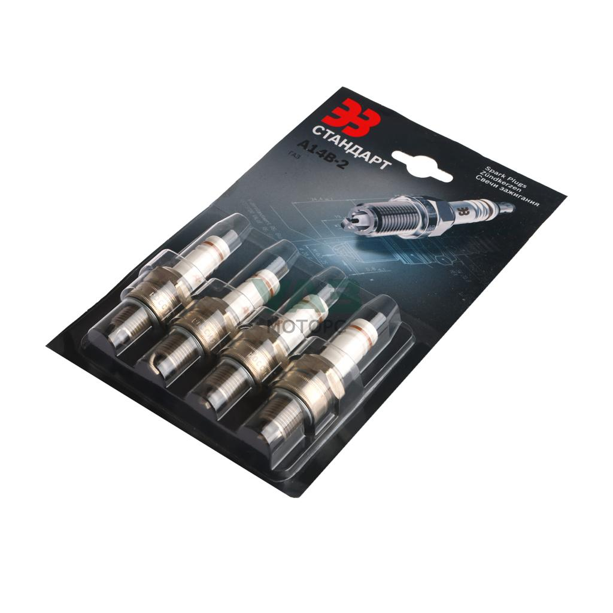

# Свечи зажигания — ЗМЗ-402 (карбюратор)

> Применимость: ЗМЗ-402, ЗМЗ-4025, ЗМЗ-4026
> Модели: Соболь 2217, 2752, 2310 с карбюраторным двигателем

## Рекомендуемые свечи

| Бензин | Свеча | Зазор |
|---|---|---|
| АИ-76 | **А11** | 0.8–0.95 мм |
| АИ-92 | **А14, А14В, А14ВР** | 0.8–0.95 мм |

**Аналоги А14В:**
- Bosch W8BC
- NGK BP5HS
- Denso W14FP / W14FPR-U
- Brisk N17, N17Y, N17YC
- Champion L92YC
- Startvolt VSP 0306 (с резистором)

**Аналоги А11:**
- Bosch W9AC
- NGK B4H
- Denso W14F-U
- Champion L86C
- Brisk N19

**Примечание:** Свечи с резистором (буква «Р» в маркировке) подавляют радиопомехи — рекомендуются при наличии в машине аудиосистемы.

## Основные параметры

- **Зазор:** 0.8–0.95 мм
- **Момент затяжки:** 12–18 Нм (не перетягивать — алюминий головки)
- **Резьба:** М14×1.25, длина 19 мм
- **Ключ:** 21 мм (свечной)
- **Порядок работы цилиндров:** 1–2–4–3

## Интервал замены

- При использовании АИ-76: каждые **15–20 тыс. км**
- При использовании АИ-92: каждые **20 тыс. км**
- При обнаружении нагара или пробития изолятора — незамедлительно

## Диагностика по состоянию нагара

| Нагар | Причина |
|---|---|
| Чёрный бархатистый (сажа) | Богатая смесь — засорён жиклёр или неисправен клапан карбюратора |
| Чёрный жирный (масляный) | Масло горит — изношены колпачки или кольца |
| Белый или светло-серый | Бедная смесь или перегрев — проверить систему охлаждения |
| Рыжеватый (нормальный) | Нормальная работа |

## Замена свечей

1. Снять колпачки ВВ проводов с свечей (тянуть за колпачок, не за провод)
2. Продуть воздухом вокруг свечей (чтобы грязь не попала в цилиндр)
3. Открутить свечи (ключ 21 мм)
4. Проверить/выставить зазор щупом 0.85 мм — должен входить с лёгким трением
5. Вкрутить свечи руками до упора, затем затянуть ключом (12–18 Нм)
6. Надеть колпачки ВВ проводов

## Нюансы ЗМЗ-402

- Тип бензина влияет на тепловой номер: на 76-м бензине А14 греется сильнее → детонация. На А11 — правильно
- Свечи с резистором (А14ДВР): на ЗМЗ-402 без электронного зажигания не обязательны, но не вредят
- Свечи с платиновым напылением (NGK BP5HS-GP) — ресурс 40–60 тыс. км, но на ЗМЗ-402 избыточно дорогое решение
- Перед установкой нанести медную пасту или мыло на резьбу — при следующей замене выкрутится легче
- Убедиться что высоковольтные провода надеваются с «щелчком» — плохой контакт = пропуски зажигания

## Типичные ошибки

**Перепутать марку свечи под тип бензина** — на 76-м бензине с А14 возможна детонация на горячем двигателе.

**Затянуть свечу «до упора» с усилием** — срывает резьбу в головке (алюминий). Момент 12–18 Нм.

**Не проверить зазор** у новых свечей — от партии к партии зазор может отличаться от нормы.

## Источники

- [Правильные свечи для ЗМЗ-402 — drive2.ru](https://www.drive2.ru/c/608573914611739524/)
- [Свечи для 402 двигателя — Startvolt](https://startvolt.com/catalogue/svechi/svechi-zazhiganiya/svecha-zazhiganiya-dlya-avtomobiley-gaz-24-3110-3302-s-dv-zmz-402-zazor-0-8mm-s-rezistorom-vsp-0306/)
- [Моменты затяжки ЗМЗ-402 — drive2.ru](https://www.drive2.ru/b/476530814453022766/)

---
*Собрано: 2026-05-26*
