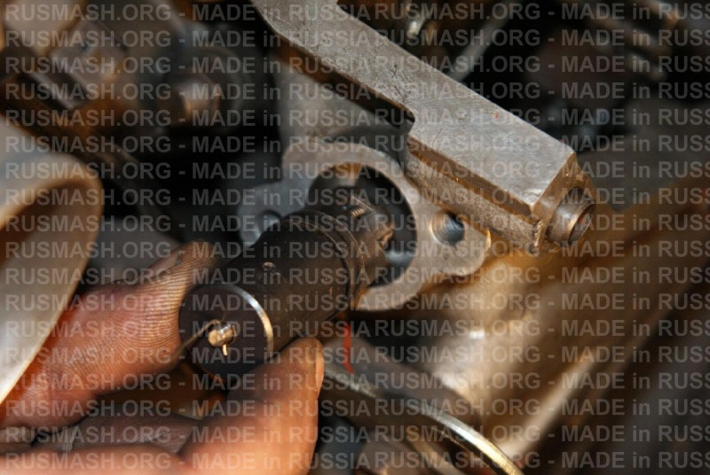

# Натяжитель цепи ГРМ — регулировка и замена

> Применимость: ЗМЗ-402, ЗМЗ-405, ЗМЗ-406
> Модели: Соболь 2217, 2752, 2310 — все

## Конструкция

На ЗМЗ-402/405/406 установлены **два натяжителя** (верхняя и нижняя цепи) — механические или гидромеханические:

- **Механический натяжитель** — плунжер с зубьями (храповой механизм). Подтягивать вручную.
- **Гидромеханический натяжитель** — автоматически поддерживает натяг за счёт масляного давления + пружина.

Башмаки (успокоители) — пластиковые направляющие, по которым ходит цепь.

## Симптомы проблем с натяжителем/цепью

| Симптом | Причина |
|---|---|
| Стрекот на холодном пуске, уходит через 10–30 с | Нормально для гидронатяжителя (масло ещё не подано) |
| Постоянный стрекот на холодном и горячем | Цепь вытянута, натяжитель не справляется |
| Металлический лязг при пуске | Цепь сильно вытянута или лопнул башмак |
| Стук при резком наборе/сбросе газа | Цепь «гуляет» — натяжитель изношен или башмак сломан |
| Двигатель троит, потеря мощности | Перескочила цепь (смещены фазы) — срочная диагностика |

## Диагностика состояния цепи

Цепь изношена (нужна замена), если:
- Стрекот не уходит после прогрева
- Свет масла горит при пуске с задержкой 5+ с (масло в натяжитель подходит медленно)
- Измерение: вытяжка верхней цепи более 4–5 мм на длине 300 мм → менять

## Регулировка механического натяжителя

На ЗМЗ-402 (и части 405/406 Евро-2) — **механический натяжитель** требует периодической ручной подтяжки:

1. Снять крышку клапанов (для доступа к верхнему натяжителю)
2. Нажать на башмак натяжителя рукой — он должен пружинить, не быть жёстким
3. Если стоит жёстко (натяжитель «выбрал» весь ход) → цепь вытянута → менять
4. Для частичной регулировки: отжать плунжер натяжителя через отверстие, провернуть на 1 зуб рукояткой, отпустить

**Практика:** механические натяжители ЗМЗ-402 требуют проверки при каждом снятии крышки клапанов.

## Гидронатяжители ЗМЗ-405/406

Гидронатяжители работают от давления масла и **не требуют ручной регулировки**. Обслуживание:

### Снятие для проверки/замены

1. Слить масло (чтобы не вытекло из масляных каналов)
2. Снять переднюю крышку двигателя (болты по периметру)
3. Снять гидронатяжители (болт крепления)
4. Проверить: плунжер должен двигаться плавно под давлением пальца

### Замена на «Русский Богатырь» (РУСМАШ)

Популярная замена штатным гидронатяжителям. Преимущества:
- Механический (не зависит от давления масла)
- Индикатор износа цепи
- Плунжер с меньшим ходом (1 мм вместо 2 мм)

Артикул: **05-1006100-IND** (с индикатором), **406.1006100-90** (без).

## Башмаки (успокоители)

Пластиковые башмаки служат **80–120 тыс. км**. При замене цепи — менять башмаки обязательно. При сломанном башмаке — цепь «гуляет» и перескакивает.

Признак сломанного башмака: куски пластика в поддоне (при снятии крышки клапанов или при замене масла).

## Важно: замена цепи комплектом

Менять ТОЛЬКО в комплекте:
- Верхняя цепь
- Нижняя цепь (привод распредвалов и балансирного вала)
- Оба натяжителя
- Все башмаки и успокоители

Менять частично — нет смысла: разный ресурс деталей вызовет повторную разборку через 20 тыс. км.

**Марки:** РУСМАШ, Iwis (Германия) — надёжные. Бюджетные китайские — ресурс 30–50 тыс. км.

## Нюансы Соболя

- Стрекот на холодном пуске до 30 секунд — норма для гидронатяжителей. Если прошло 30 с и стрекот остался → проблема.
- При замене масла на более жидкое (5W-20 вместо 10W-40) — стрекот усиливается: гидронатяжитель «протекает» тонким маслом быстрее.
- ЗМЗ-406 Евро-2 — чаще требует замены цепи из-за более нагруженного ГРМ.
- После замены цепи: прокрутить двигатель вручную (за болт шкива) — убедиться что метки совпадают, фазы не сдвинулись.

## Типичные ошибки

**Менять только верхнюю цепь** — нижняя вытянута так же, через 20–30 тыс. км повторный разбор.

**Ставить дешёвую цепь** — вытягивается за 30–50 тыс. км.

**Не проверять метки фаз** после установки — перескочило на 1 зуб → двигатель троит, теряет мощность.

## Источники

- [Стук цепи ГРМ ЗМЗ 405/406 — vinmotors.ru](https://vinmotors.ru/stuchit-cep-grm-na-406-405-409-motore-prichiny-stuka/)
- [Натяжитель «Русский Богатырь» — rusmash.org](https://rusmash.org/zmz/natyazhiteli_cepi_zmz_406_405_409/)
- [Натяжка цепи ЗМЗ-406 — drive2.ru](https://www.drive2.ru/l/2809112/)

---
*Собрано: 2026-05-26*
