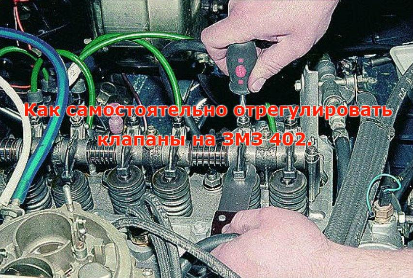

# Клапаны — регулировка и гидрокомпенсаторы

> Применимость: ЗМЗ-402 (регулировка нужна), ЗМЗ-405/406 (гидрокомпенсаторы — регулировка не нужна)
> Модели: все Соболь

---

## ЗМЗ-402 — ручная регулировка клапанов

### Когда регулировать

- Каждые **10–15 тыс. км** (по условиям работы)
- При стуке клапанов на прогретом двигателе
- После переборки головки блока цилиндров

### Зазоры

| Клапан | Зазор по заводу | На практике (форумы) |
|---|---|---|
| Впускной | 0.40 мм | 0.30–0.35 мм |
| Выпускной | 0.40 мм | 0.35–0.40 мм |

Регулируют на **холодном** двигателе. На горячем зазоры изменятся из-за теплового расширения.

### Порядок регулировки (метод «два оборота»)

**Шаг 1.** Снять клапанную крышку.

**Шаг 2.** Установить поршень 1-го цилиндра в ВМТ такта сжатия: повернуть коленвал до совпадения метки на шкиве с меткой «ВМТ» на крышке. Оба клапана 1-го цилиндра должны быть закрыты (коромысла свободны).

**Шаг 3.** В положении ВМТ 1-го цилиндра регулировать (порядок зажигания **1-2-4-3**):
- 1-й цилиндр: впускной и выпускной
- 2-й цилиндр: выпускной
- 3-й цилиндр: впускной

**Шаг 4.** Провернуть коленвал на **один полный оборот** (360°) — снова совместить метки.

**Шаг 5.** Регулировать оставшиеся:
- 2-й цилиндр: впускной
- 3-й цилиндр: выпускной
- 4-й цилиндр: впускной и выпускной

### Как регулировать один клапан

1. Вставить щуп нужного размера между коромыслом и торцом клапана
2. Ослабить контргайку (ключ 14 мм)
3. Вращать регулировочный болт (ключ 12 мм) пока щуп не будет входить с лёгким натягом
4. Удерживая болт — затянуть контргайку
5. Проверить зазор снова после затяжки (он меняется)

### Инструмент для ЗМЗ-402

| Позиция | Что нужно |
|---|---|
| Плоский щуп | 0.35 и 0.40 мм |
| Ключ контргайки | 14 мм |
| Ключ болта регулировки | 12 мм |
| Ветошь | Протереть клапанную крышку |
| Прокладка клапанной крышки | Часто рвётся при снятии — иметь запасную |

---

## ЗМЗ-405/406 — гидрокомпенсаторы (регулировка не нужна)

Двигатели 405 и 406 оснащены **гидрокомпенсаторами** (гидротолкателями). Зазоры в клапанном механизме компенсируются автоматически давлением масла. Ручная регулировка **не предусмотрена и не нужна**.

### Стук компенсаторов — когда норма, когда проблема

**Норма** — кратковременный стук при холодном пуске, который исчезает через 30–60 секунд после прогрева. Компенсаторы заполняются маслом — стук уходит.

**Проблема** — стук на прогретом двигателе или стук конкретного цилиндра, не исчезающий после прогрева.

### Причины постоянного стука компенсаторов

1. **Грязное или старое масло** — засорены масляные каналы компенсатора
2. **Низкий уровень масла** — компенсаторы не получают давление
3. **Изношенный масляный насос** — низкое давление масла
4. **Механический износ компенсатора** — замена

### Что делать при постоянном стуке

**Шаг 1 — смена масла:** если давно не меняли — сменить масло и фильтр, проехать 500 км. Часто помогает.

**Шаг 2 — промывка:** при замене масла использовать промывочное масло (5-минутная промывка). Или добавить Liqui Moly Hydro-Stoß-Öl — специальная добавка для гидрокомпенсаторов.

**Шаг 3 — замена компенсатора:** если конкретный цилиндр стучит и промывка не помогла. Компенсаторы на ЗМЗ-405/406 — 8 штук (по два на цилиндр, два вала). Цена ~200–400 руб./шт.

### Важно перед заменой компенсаторов

Проверить масляный канал к компенсатору — тонкой проволокой убедиться что канал не забит. Новый компенсатор в забитый канал — снова застучит через 5 тыс. км.

---

## Источники

- [Регулировка клапанов ЗМЗ-402](https://vipwash.ru/dvigatel/regulirovka-klapanov-na-402-dvigatele-zmz) — vipwash.ru
- [Всё про гидрокомпенсаторы ЗМЗ-405/406/409](https://vinmotors.ru/vsjo-pro-gidrokompensatory-zmz-dlja-dvigatelja-405-406-409/) — vinmotors.ru
- [ЗМЗ 406: застучали гидрокомпенсаторы](https://www.drive2.ru/c/475593/) — drive2.ru
- [Регулировка клапанов ЗМЗ-402 — AllGAZ форум](https://forum.allgaz.ru/threads/56736/)

---
*Собрано: 2026-05-26*
