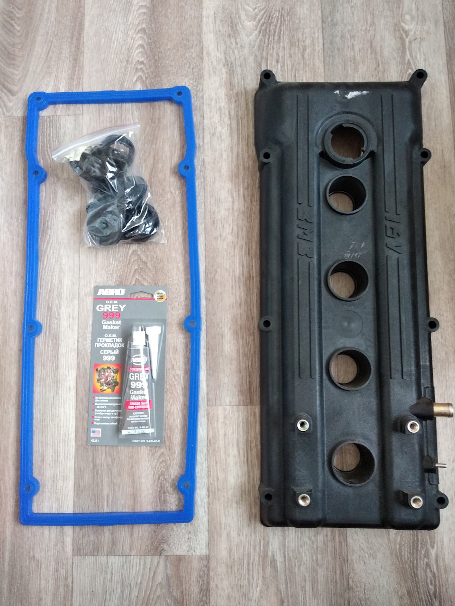

# Прокладка клапанной крышки — замена ЗМЗ-405/406

> Применимость: ЗМЗ-405 / ЗМЗ-406
> Модели: Соболь 2217, 2752, 2310

## Симптомы

- Масло на клапанной крышке или подтёки по стенке двигателя
- Запах горящего масла из-под капота (масло капает на выпускной коллектор)
- Масло в свечных колодцах (протечки через трубчатые уплотнители болтов крышки)

## Корень проблемы на ЗМЗ-405

**Главная причина постоянных течей — пластиковая клапанная крышка.** При нагреве пластик деформируется, создавая зазоры между болтами. Никакая прокладка не даёт постоянного уплотнения на деформированной крышке.

**Радикальное решение — заменить пластиковую крышку на дюралевую (алюминиевую).** Стоимость 400–2000 руб. в зависимости от источника. После установки алюминиевой крышки течь прекращается навсегда.

## Артикулы прокладок

| Вариант | Артикул | Примечание |
|---|---|---|
| ЗМЗ-405 Евро-3 (8 отверстий) | 40624-1007245 | Силикон — лучший материал |
| ЗМЗ-405/406 универсальная | 406.1007245 | Оригинал |
| Комплект (большой) | Metalpart | Включает все уплотнители колодцев свечей |

**Брать силиконовую** — она служит дольше паронита и пробки.

## Замена

### Инструмент

- Ключ 10 мм (болты крышки)
- Прокладка клапанной крышки
- Уплотнители свечных колодцев (если не входят в комплект)
- Герметик (нанести на стыки в 4 углах крышки)

### Порядок

1. Снять разъёмы датчиков на крышке (если есть)
2. Отсоединить трубку вентиляции картера
3. Открутить болты крышки (ключ 10 мм, 8–10 шт.)
4. Снять крышку, убрать старую прокладку
5. Очистить посадочные поверхности (крышку и ГБЦ)
6. Осмотреть уплотнители свечных колодцев — при износе менять
7. В 4 угла (там где есть дуги ГБЦ) нанести каплю герметика
8. Уложить прокладку
9. Установить крышку, затянуть болты **не перетягивая**

**Момент затяжки:** 8–12 Нм — руками плюс чуть-чуть ключом. Перетяжка на пластиковой крышке разрезает прокладку при нагреве.

## Нюансы Соболя

- На пластиковой крышке прокладки хватает в среднем на **15–30 тыс. км**. На алюминиевой — 100+ тыс.
- При снятии крышки — хорошая возможность **проверить клапаны и компенсаторы**. Если стучат — лишнее подтверждение.
- Прокладка **с 4 круглыми уплотнителями болтов** (ЗМЗ-405 Евро-0/2) отличается от прокладки **с 8 отверстиями** (Евро-3). Перепутать — не встанет.
- Если масло течёт в свечные колодцы — менять комплектом с трубчатыми уплотнителями (они входят в «большой комплект»).

## Типичные ошибки

**Перетянуть болты на пластиковой крышке** — прокладка продавится и потечёт через неделю.

**Не заменить уплотнители свечных колодцев** — масло будет заливать свечи → перебои в работе двигателя.

**Ставить прокладку без герметика в углах** — именно в углах прокладка всегда течёт первой.

## Источники

- [Течь из-под прокладки клапанной крышки — gazelleclub.ru](https://www.gazelleclub.ru/forum/topic/16265-tech-masla-iz-pod-prokladki-klapannoi-kryshki/)
- [Замена прокладки клапанной крышки ЗМЗ-406 — drive2.ru](https://www.drive2.ru/l/4744221/)
- metalpart.ru — артикулы прокладок клапанных крышек ЗМЗ

---
*Собрано: 2026-05-26*
