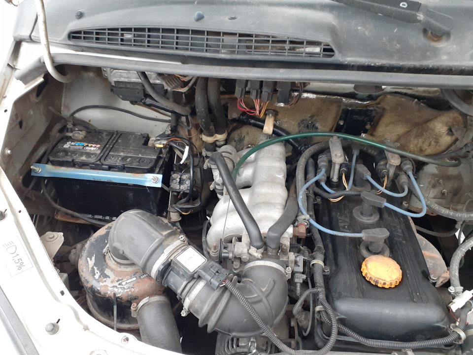

# Покупка б/у Соболя — чек-лист осмотра

> Применимость: все модели Соболь
> Модели: Соболь 2217, 2752, 2310 — все

## Перед осмотром

- Проверить VIN в ГИБДД (ограничения, залог, угон)
- Проверить на сайте реестра залогов (ФНС/РСА)
- Историю ДТП — ГИБДД или сервисы типа Автокод/Автотека
- Попросить сервисную книжку или историю ТО

## Двигатель — самое важное

### Холодный пуск

Приезжать утром — двигатель должен быть холодным. Попросить запустить при вас:

- **Синий дым на холодную** → маслосъёмные колпачки (расходник)
- **Белый дым клубами** → пробита прокладка ГБЦ (дорогой ремонт)
- **Стук цепи ГРМ** на холодную (уходящий при прогреве) → цепь изношена
- **Плавающие обороты** или нестабильный ХХ → форсунки, ДМРВ, дроссель
- **Долго крутит стартером** → бензонасос, свечи или низкая компрессия

### Масло

- Вынуть щуп: масло должно быть чистым или слегка тёмным. **Чёрное** — давно не менялось. **Серое/белёсое** — вода в масле (пробитая ГБЦ).
- Открыть крышку клапанной крышки: лёгкие отложения — норма. Толстый слой шлама — машина не обслуживалась.
- Белая эмульсия под крышкой → вода в масле → серьёзная проблема.

### Антифриз

- Цвет: однородный зелёный/красный/синий. Коричневый/ржавый → не менялся годами.
- Осадок или плавающие частицы → G11+G12 смешали или не промывали.
- Запах горелого у бачка → перегревали.

### Выхлоп

- На прогретом: белый пар — норма в холодную погоду. **Постоянный синий** → масло горит. **Чёрный** → богатая смесь, форсунки.

## Кузов и рама

### Коррозия — главная болячка Соболя

- Пороги: простучать кулаком. Мягко — гниль. Проверить изнутри (если откроется нижняя плоскость).
- Лонжероны: осмотреть снизу — рыжая ржавчина vs структурная коррозия (пузыри, трещины).
- Крепления рессор и амортизаторов к кузову/раме — проверить на коррозию.
- Пол кабины — наступить, не должен прогибаться.

### Кузов фургона/микроавтобуса

- Задние арки изнутри — частое место накопления влаги.
- Швы рамки дверей — часто ржавеют.
- Пол кузова — осмотреть на наличие ржавчины (снять обшивку если возможно).

## Подвеска и рулевое

- Покачать колесо руками (вертикально и горизонтально) → люфт в шаровых и ступичном подшипнике.
- Покрутить руль резко влево-вправо → люфт рулевого редуктора (до 25 мм на ободе — норма).
- Нажать на передний угол кузова → машина должна остановиться за 1 качание (амортизаторы).
- Осмотреть пыльники шаровых и наконечников — не рваные.
- Колёса: нет равномерного или неравномерного износа (развал, схождение).

## Тормоза

- Нажать педаль: должна быть твёрдой. Мягкая/«губчатая» → воздух в системе или ГТЦ.
- Удерживать педаль 30 с — не должна «уплывать» вниз (ГТЦ перепускает).
- Проверить уровень тормозной жидкости: норма между MIN и MAX, цвет светлый (тёмная = давно не менялась).
- На ходу тест: при торможении со 40–50 км/ч машину не должно уводить в сторону.

## Трансмиссия

- Сцепление: плавное включение без рывков. Нет запаха горелого при трогании.
- КПП: переключения чёткие, без хруста и выбивания передач.
- Кардан: стук при трогании → крестовины. Вибрация на скорости → дисбаланс.
- Задний мост: на ходу 50–70 км/ч — нет гула или воя.

## Электрика

- Запустить двигатель → проверить напряжение на АКБ при работе: 13.5–14.8 В (генератор работает).
- Работают все приборы, стоп-сигналы, фары, поворотники.
- Печка греет, вентилятор работает на всех скоростях.
- Нет горящих сигнальных лампочек на панели (или выяснить, что означают).

## Специфические болячки Соболя по годам

| Год | Что проверить дополнительно |
|---|---|
| До 2000 г. (ЗМЗ-402, карб.) | Карбюратор, трамблёр, система зажигания |
| 2000–2005 (ЗМЗ-405 Евро-2) | ДМРВ, форсунки, колдун |
| 2005–2010 (ЗМЗ-405 Евро-3) | Иммобилайзер, бензонасос, маслоотделитель |
| После 2010 | Цепь ГРМ (контрактный двигатель) |

## Что сделать сразу после покупки

Даже если всё хорошо:
1. Масло + фильтр (не знаешь когда меняли)
2. Тормозная жидкость (проверить цвет, при тёмном — менять)
3. Антифриз (ареометром проверить замерзание)
4. Свечи зажигания
5. Воздушный и топливный фильтр
6. Масло в КПП и мостах (если не знаешь)
7. Прокачать тормоза (убедиться в отсутствии воздуха)
8. Отрегулировать колдун

## Нюансы Соболя

- Соболь — коммерческий транспорт. **Пробег накручен почти у всех** коммерческих машин. Ориентироваться на состояние, а не на цифру.
- **Микроавтобус 2217** — проверить все ряды сидений, систему доп. отопления, уплотнители всех дверей.
- **Фургон с изотермой** — осмотреть крепление кузова к раме, не гнилое ли основание кузова.

## Источники

- Форум gazelleclub.ru — разделы по моделям
- forum.allgaz.ru — обсуждения покупки
- Общие чек-листы — dacar-auto.ru, avto-city.ru

---
*Собрано: 2026-05-26*
