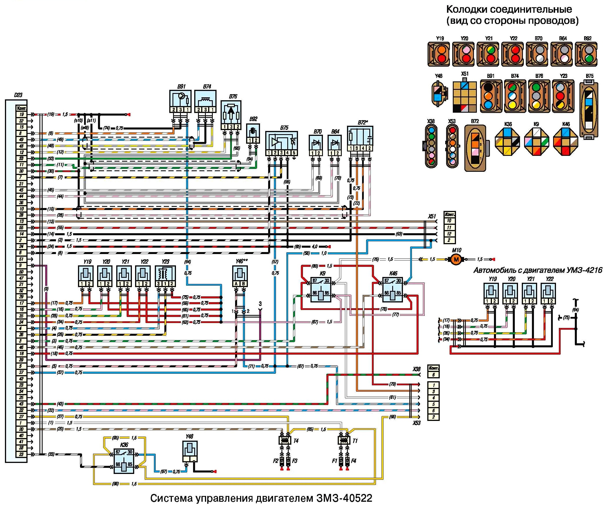

# Евро-2 vs Евро-3 — различия и несовместимость деталей

> Применимость: ЗМЗ-405 (инжектор)
> Модели: Соболь 2217, 2752, 2310 — инжекторные

## Зачем знать

При заказе запчастей на Соболь/Газель с ЗМЗ-405 критично знать стандарт двигателя: многие детали визуально похожи, но **несовместимы**. Ошибка при заказе = деньги на ветер.

## Обозначения двигателей

| Стандарт | Индекс двигателя | Для чего |
|---|---|---|
| Евро-2 | **ЗМЗ-40522** | Газель 3302, Соболь — до ~2006 г. |
| Евро-3 | **ЗМЗ-40524** | Волга — с 2006 г. |
| Евро-3 | **ЗМЗ-40525** | Газель 3302, Соболь — с ~2006–2008 г. |

Переход с Евро-2 на Евро-3 — примерно 2005–2008 г. в зависимости от модели и партии. Точнее — смотреть ПТС или шильдик на двигателе.

## Как определить свой двигатель

**Метод 1 — шильдик на двигателе:**
Найти паспортную табличку на блоке цилиндров — там указан полный индекс (40522 или 40524/40525).

**Метод 2 — по ЭБУ:**
- Евро-2: ЭБУ Motorola/СОАТЭ с тремя разъёмами
- Евро-3: ЭБУ МИКАС-11CR с одним разъёмом (или М7.9.7)

**Метод 3 — по лямбда-зонду:**
- Евро-2: один лямбда-зонд (на выхлопном коллекторе)
- Евро-3: два лямбда-зонда (второй — после катализатора)

**Метод 4 — по блоку цилиндров:**
- Евро-2 (ЗМЗ-406 основа): между цилиндрами — прорези для охлаждения
- Евро-3 (40524/40525): прорезей нет, блок монолитный

## Несовместимые детали — таблица

| Деталь | Евро-2 | Евро-3 | Совместимы? |
|---|---|---|---|
| **ЭБУ** | Motorola 3 разъёма | МИКАС-11 1 разъём | ❌ Нет |
| **ДПКВ** | 406.3847113 / 0261210113 | Bosch 0261210302 | ❌ Нет (разные разъёмы) |
| **Лямбда-зонд** | 1 шт., разъём «папа» KRENZ 012355 | 2 шт., разъём «мама» ДК889 | ❌ Нет |
| **Форсунки** | Siemens Евро-2 | Siemens Евро-3 | ❌ Нет |
| **Регулятор давления топлива** | В рампе | В баке (Евро-3) | ❌ Нет |
| **Дроссельный узел** | Механический тросик | Механический тросик | ✅ Совместим |
| **Прокладка ГБЦ** | Elring для 406 | Elring для 40524 | ⚠️ Уточнять |
| **Свечи зажигания** | А14ДВР | А14ДВР | ✅ Совместимы |
| **Термостат** | Одинаковый | Одинаковый | ✅ Совместим |
| **Помпа** | Совместима | Совместима | ✅ Совместима |
| **Опора двигателя (правая)** | 3 болта | 4 болта | ❌ Нет |

## Конструктивные отличия

**Блок цилиндров:**
- Евро-2 (основа ЗМЗ-406): между цилиндрами — прорези для прохода ОЖ
- Евро-3 (40524/40525): монолитный блок без прорезей, глубже болты ГБЦ (128 мм против 103 мм)
- Евро-3 прочнее — лучше подходит для форсировки

**Топливная система:**
- Евро-2: регулятор давления топлива (РДТ) на рампе форсунок
- Евро-3: РДТ перенесён в топливный бак (в модуль насоса)
- Давление бензина разное → форсунки разные → насосы разные

**Система выпуска:**
- Евро-2: один каталитический нейтрализатор, один лямбда-зонд
- Евро-3: нейтрализатор улучшенный, два лямбда-зонда
- Удаление катализатора на Евро-3: без программного отключения второго лямбда-зонда → постоянная ошибка P0420

## При покупке запчастей — что спрашивать

1. Год выпуска автомобиля
2. Полный индекс двигателя (40522 / 40524 / 40525) — с шильдика
3. Тип ЭБУ (МИКАС-11 или Motorola)
4. Количество лямбда-зондов

**Для ДПКВ:** всегда уточнять Евро-2 или Евро-3 — разные артикулы и разные разъёмы, внешне похожи.

**Для форсунок:** обязательно снять старую форсунку и сравнить разъём и посадочный размер.

## Типичные ошибки при смешении

- Поставить ДПКВ от Евро-3 на Евро-2 → разъём не подойдёт или подойдёт «с переделкой» → нестабильная работа
- Купить бензонасос от Евро-2 на Евро-3 → давление не то → провалы на трассе
- Удалить катализатор на Евро-3 без перепрошивки → лямбда-зонд после катализатора показывает ошибку → машина «тупит»

## Источники

- [Различия Евро-2 и Евро-3 — forum.allgaz.ru](https://forum.allgaz.ru/threads/%D0%A0%D0%B0%D0%B7%D0%BB%D0%B8%D1%87%D0%B8%D1%8F-%D0%95%D0%92%D0%A0%D0%9E-2-%D0%B8-%D0%95%D0%92%D0%A0%D0%9E-3.83576/)
- [Различие ГРМ Евро-3 и Евро-2 — gazelleclub.ru](https://www.gazelleclub.ru/forum/topic/61647-razlichie-grm-evro-3-i-evro-2/)
- [ЗМЗ-405 — Wikipedia](https://ru.wikipedia.org/wiki/%D0%97%D0%9C%D0%97-405)

---
*Собрано: 2026-05-26*
