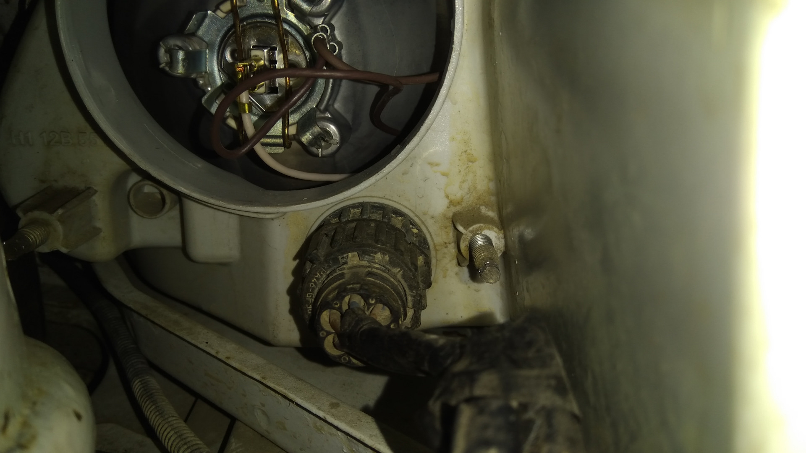

# Регулировка фар — Соболь

> Применимость: все двигатели
> Модели: Соболь 2217, 2752, 2310 — все

## Когда нужна регулировка

- После замены фар или рассеивателей
- После снятия/установки переднего бампера
- Жалобы встречных водителей на ослепление
- Свет бьёт в асфальт (плохо видно дорогу)
- Видимый перекос пучков света

## Подготовка

**Условия:**
- Ровная горизонтальная площадка
- Экран: стена, фанера 1×2 м или ворота
- Расстояние от фар до экрана: **5 метров**
- Автомобиль: **полный бак** + водитель в кресле (или 75 кг груза на месте водителя)
- Давление шин — нормальное

**Разметка на экране:**
1. Провести горизонтальную линию на высоте центров фар от земли (линия «1»)
2. Провести вторую линию на **50 мм ниже** линии «1» (линия «2» — нижняя граница пучка)
3. Провести вертикальные линии через проекцию центров каждой фары на экран

## Правильное положение пучка света

Для ближнего света:
- Горизонтальная граница пучка — по линии «2» (50 мм ниже центра фары)
- Граница наклонного участка (для правой фары) — начинается в точке пересечения вертикальной линии фары с горизонтальной границей
- Правая фара: наклон вправо-вверх; левая фара: строго горизонтальная граница

## Регулировочные винты

На задней стенке корпуса фары — **два регулировочных винта**:
- **Верхний (горизонтальный)** — регулирует наклон пучка вверх/вниз
- **Боковой (вертикальный)** — регулирует пучок влево/вправо

Поворачивать руками или крестовой отвёрткой (зависит от исполнения фары).

## Процедура регулировки

1. Включить ближний свет
2. Закрыть одну фару картоном (регулировать поочерёдно)
3. Вращая верхний винт — совместить горизонтальную границу пучка с линией «2»
4. Вращая боковой винт — совместить начало наклонного участка с вертикальной линией центра фары
5. Открыть вторую фару, повторить

## Нюансы Соболя

- На Соболях-автобусах (2217) с пассажирами высота фар ниже, чем без нагрузки — регулировать с нагрузкой (груз на задних сиденьях)
- Фары «Освар» — частая штатная комплектация; регулировочные винты пластиковые, при износе можно зафиксировать эпоксидкой
- Если фара болтается в корпусе → рассеиватель треснул или лопнули пистоны крепления → заменить до регулировки
- Осколки лобового стекла меняют угол попадания отражённого света — пересчитать регулировку после замены стекла
- Светодиодные лампы в старые фары → пучок рассеивается → регулировка бесполезна. Нужны фары с оптическими элементами под LED

## Быстрая проверка без экрана

На ровной ночной дороге:
- Ближний свет: граница освещения должна быть на **40–60 м** перед машиной
- При движении навстречу — свет не должен слепить водителей (идеальная граница: чуть ниже глаз встречного водителя)

## Типичные ошибки

**Регулировать с пустым баком** — низкая корма → фары задраны вверх → при нормальной нагрузке снова ослепляют.

**Регулировать дальний свет** — регулируется только ближний, дальний регулируется автоматически.

**Не закрывать одну фару** — паразитный свет от второй даёт неверную границу.

## Источники

- [Регулировка фар Газель своими руками — starifaeton.ru](https://starifaeton.ru/info/regulirovka-far-gazel-svoimi-rukami/)
- [Регулировка света фар Освар Газель — drive2.ru](https://www.drive2.ru/l/521123982418641243/)
- [Регулировка фар Соболь — avtoexpert-dv.ru](https://avtoexpert-dv.ru/stati/regulirovka-far-sobol.html)

---
*Собрано: 2026-05-26*
