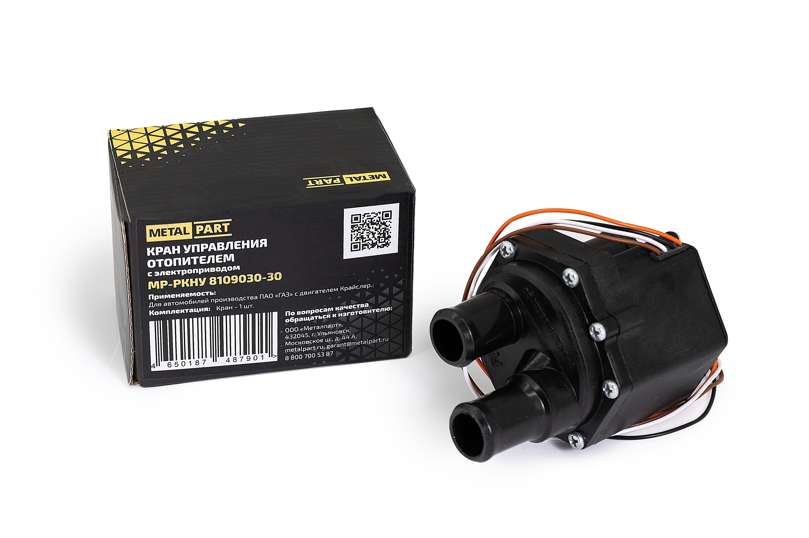

# Кран отопителя (краник печки) — замена

> Применимость: все двигатели
> Модели: Соболь 2217, 2752, 2310 — все

## Типы кранов

### Механический (старый образец, до ~2003 г.)
- Рычажный механический кран — регулируется тросиком от ручки в кабине
- Латунный корпус, ресурс больше
- Артикул: **3307-8120020** (латунный, старого образца)
- При закисании: попробовать расшевелить рычаг, смочить подвижные части

### Электрический (новый образец, с 2003 г.)
- Привод от электромотора, управляется переключателем печки
- **2 патрубка:** РКНУ.8109030 (норм.закрытый)
- **3 патрубка (с байпасом):** РКНУ.8109030-30 или 458121.006-10
- Аналог Luzar: **LVE03063** (3 патрубка, без сальников — надёжнее)
- Аналог Пустынь: КУОТ-ЭП (2 вых.) и КУОТ-2-ЭП (3 вых.)

**Важно:** 2 патрубка ≠ 3 патрубка — при установке не того типа система не работает.

## Симптомы неисправности

| Симптом | Причина |
|---|---|
| Печка не греет — кран в открытом положении | Кран заклинил в закрытом, электромотор сгорел |
| Постоянно горячая кабина — нет регулировки | Кран заклинил в открытом |
| Уходит антифриз без видимой течи | Кран течёт в моторном отсеке |
| Запах антифриза в кабине | Кран течёт на прокладках, ОЖ попадает в испаритель |
| Электрический кран не работает | Сгорел электромотор, нет питания, окислились контакты |

## Диагностика

1. Проверить уровень ОЖ — если падает без видимых причин → вероятно кран
2. Осмотреть кран снизу после поездки — влажность на корпусе или патрубках
3. Электрический: подать 12 В напрямую на разъём — должен слышно гудеть (открывается/закрывается)
4. Если кран не управляется — проверить предохранитель и реле в блоке

## Замена крана

**Перед заменой обязательно слить ОЖ!**

1. Дождаться остывания двигателя
2. Слить охлаждающую жидкость через пробку блока и нижний патрубок радиатора
3. Ослабить хомуты на патрубках крана
4. Снять шланги (потечёт остаток — подставить ёмкость)
5. Отключить электрический разъём (электрокран)
6. Открутить кран от крепления
7. Установить новый кран — соблюдать направление потока (стрелки на патрубках)
8. Затянуть хомуты, подключить разъём
9. Залить ОЖ, прогреть, проверить на течи

**Время:** 20–40 минут.

## Нюансы Соболя

- **3-патрубковый кран с байпасом** (Газель Бизнес и часть Соболей) — при замене нужен точно такой же. 2-патрубковый не подойдёт
- Электрокран течёт чаще через сальник вала — влага попадает в электромотор → сгорает. Luzar LVE03063 (без сальника) — более ресурсный вариант
- Рекомендация многих владельцев: при выходе из строя электрокрана заменить на латунный механический (надёжнее, проще) — вместо оригинального электрического
- На 4000+ об/мин электрокран может начать течь даже новый — конструктивная особенность
- Открыть кран отопителя ПЕРЕД сливом антифриза — выйдет больше старой жидкости

## Типичные ошибки

**Не слить ОЖ перед заменой** — при отстёгивании шлангов выльется 2–4 литра антифриза.

**Перепутать 2- и 3-патрубковый кран** — система будет работать неправильно или вообще не работать.

**Не соблюдать направление потока** — стрелки на кране указывают от двигателя к радиатору печки.

## Источники

- [Замена крана отопителя Газель Бизнес — remam.ru](https://remam.ru/vozdsys/zamena-krana-otopitelya-gazel-biznes.html)
- [Кран отопителя Газель Next — drive2.ru](https://www.drive2.ru/l/695292946450231252/)
- [Кран печки форум — allgaz.ru](https://forum.allgaz.ru/showthread.php?t=5690)

---
*Собрано: 2026-05-26*
