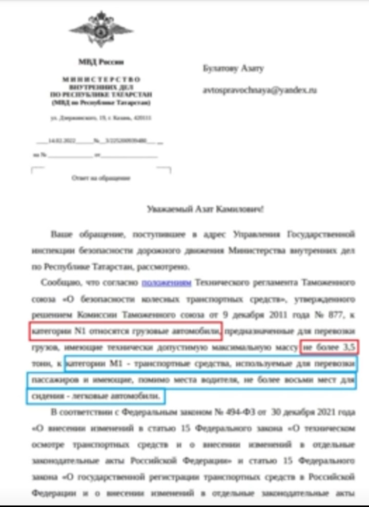

# Технический осмотр — подготовка и типичные причины отказа

> Применимость: все двигатели
> Модели: Соболь 2217, 2752, 2310 — все

## Периодичность

| Тип ТС | Периодичность ТО |
|---|---|
| Соболь-автобус (2217) — пассажирские перевозки | Каждый год с момента выпуска |
| Соболь до 4 лет | Не требуется |
| Соболь 4–10 лет | Каждые 2 года |
| Соболь старше 10 лет | Каждый год |
| Соболь с ГБО | По общим правилам + освидетельствование баллона |

## Что проверяют

### Тормоза
- Эффективность торможения: тормозной путь, замедление
- Усилие на педали, стояночный тормоз (минимум 16% от веса автомобиля)
- Отсутствие течей, трубки и шланги

**Типичная причина отказа:** колодки в нижнем пределе, текущий суппорт или РТЦ, закисший поршень.

### Рулевое управление
- Люфт рулевого колеса: для Соболя норма **до 25 мм** (на ободе рулевого колеса)
- Отсутствие самопроизвольного движения руля
- Нет течи ГУР

**Типичная причина отказа:** люфт более 25 мм в рулевом редукторе или наконечниках, течь ГУР.

### Шины и колёса
- Остаток протектора: летние ≥1.6 мм, зимние ≥4 мм (для ТС с М+S)
- На одной оси — шины одной марки и типа
- Нет грыж, порезов, оголённого корда
- Давление и затяжка гаек (визуально)

**Типичная причина отказа:** разный тип шин на осях, износ протектора.

### Освещение и сигнализация
- Все лампы исправны: фары, поворотники, стоп-сигналы, габариты, задний ход, номерной знак
- Регулировка фар (угол наклона пучка)
- Звуковой сигнал работает

**Типичная причина отказа:** одна лампа — уже отказ. Проверить все до поездки на ТО.

### Стеклоочистители и стекло
- Дворники чистят без разводов
- Нет трещин лобового стекла в зоне работы дворников со стороны водителя
- Омыватель работает

**Типичная причина отказа:** трещина или скол на лобовом стекле в зоне обзора водителя.

### Двигатель и выхлоп
- Нет подтёков масла, ОЖ, топлива
- Токсичность выхлопа: CO, HC в норме (зависит от стандарта двигателя)
- Нет посторонних шумов

**Типичная причина отказа:** повышенная токсичность (нагар на свечах, неисправный лямбда-зонд, ДМРВ).

### Прочее
- Ремни безопасности исправны и застёгиваются
- Аптечка, огнетушитель (≥2 кг), знак аварийной остановки
- VIN-номер читаем, соответствует документам
- Нет неоговорённых изменений конструкции

## Чек-лист подготовки к ТО

**За неделю:**
- [ ] Проверить все лампочки (особенно стоп-сигналы — сам не видишь)
- [ ] Проверить дворники — заменить щётки если оставляют разводы
- [ ] Осмотреть лобовое стекло на трещины
- [ ] Проверить уровень и состояние тормозной жидкости
- [ ] Проверить давление шин

**За 2–3 дня:**
- [ ] Помыть машину (грязные фонари = риск отказа)
- [ ] Проверить звуковой сигнал
- [ ] Убедиться что аптечка, огнетушитель, знак — на месте
- [ ] Подтянуть гайки колёс

**В день ТО:**
- [ ] Долить омыватель
- [ ] Проверить работу всех световых приборов ещё раз

## Частые ошибки при прохождении

| Ошибка | Последствие |
|---|---|
| Одна нерабочая лампа | Отказ по освещению |
| Трещина на лобовом | Отказ, нужна замена стекла |
| Разные шины на одной оси | Отказ |
| Нет аптечки/огнетушителя | Отказ |
| Люфт рулевого > 25 мм | Отказ |
| Не работают передние стоп-сигналы | Часто не замечают |

## Нюансы Соболя

- Соболь-автобус (2217): дополнительно проверяют крепления сидений, наличие выходов из салона, таблички маршрута у маршрутных ТС
- При ГБО: баллон должен быть в срок освидетельствования (каждые 2–5 лет по типу). Без отметки — отказ
- Старые Соболи с люфтом рулевого редуктора — самая частая причина отказа. Отрегулировать или заменить редуктор заранее
- Тонировка: Соболь-автобус — не допускается (передние окна <70% светопропускания)

## Источники

- [Техосмотр 2025 — rosstrah.ru](https://rosstrah.ru/baza-znanyi/iz-za-chego-mozhno-ne-projti-to/)
- [ТО грузовых авто 2025 — spmag.ru](https://spmag.ru/articles/novye-pravila-tehosmotra-dlya-gruzovyh-avtomobilej-v-2024-godu)
- [Техосмотр Газель 2025 — drive2.ru](https://www.drive2.ru/l/697033748234905243/)

---
*Собрано: 2026-05-26*
