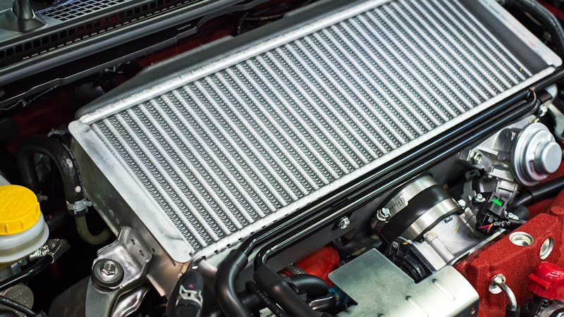

# Подготовка к лету

> Применимость: все модели Соболь
> Когда делать: март-апрель, при стабильной температуре выше +7°C

## Чек-лист подготовки к лету

### 1. Замена резины

- Менять при стабильных температурах выше **+7°C**
- Минимальная высота протектора летней резины: **1.6 мм** по ПДД, реально — не менее 3–4 мм
- Проверить давление в шинах (холодная летняя резина — нормальное давление, как в инструкции)
- Осмотреть боковины на порезы и грыжи — зима жёсткая к боковинам

### 2. Масло в двигателе

Если зимой была залита **5W-40** или **0W-40** — можно оставить на лето. Если планируется жаркая эксплуатация (Юг, степь) — рассмотреть **10W-40**.

Проверить уровень и качество масла. Если потемнело, есть осадок — заменить.

### 3. Система охлаждения — приоритет перед летом

- Проверить уровень ОЖ в расширительном бачке (норма — между метками)
- Проверить антифриз ареометром или тест-полосками
- **Промыть радиатор снаружи** — тополиный пух и пыль забивают соты → перегрев летом. Мыть мойкой Керхер с обратной стороны (от двигателя наружу), давление не более 3 атм
- Проверить патрубки системы охлаждения — не должно быть вздутий и трещин
- Проверить хомуты патрубков

### 4. Тормоза

- Осмотреть колодки через смотровые отверстия (зимой интенсивный износ на соли)
- Проверить диски на наличие глубоких бороздок и трещин
- Проверить уровень тормозной жидкости
- Проверить задние РТЦ — часто закисают за зиму

### 5. Кузов и антикоррозийная обработка

**Важнейший пункт после зимы с солью:**
- Промыть днище и арки мойкой — соль с дорог разрушает металл
- Осмотреть пороги, лонжероны, крепления подвески на предмет коррозии
- Обработать сколы краски (замазать, чтобы не ржавело летом)
- Обработать скрытые полости антикором если обнаружена ржавчина

### 6. Вентиляция и охлаждение двигателя

- **Проверить электромуфту вентилятора** (ЗМЗ-405): нажать педаль тормоза на прогретой машине — вентилятор должен включиться. Или проверить руками вращение при работающей машине.
- Проверить натяжение и состояние ремня привода агрегатов

### 7. Стеклоочистители и омыватель

- Заменить зимние щётки на летние (или проверить резинки)
- Залить летнюю жидкость омывателя (зимняя с антифризом летом пахнет и мутит лобовое)

### 8. Аккумулятор

- Проверить напряжение (≥12.4 В)
- Почистить клеммы от окисла
- Зарядить зарядником если напряжение ниже нормы

### 9. Кондиционер (если установлен)

- Включить, проверить — холодный воздух должен выйти за 1–2 минуты
- Если не охлаждает — заправить фреоном (раз в 2–3 года)

## Типичные проблемы после зимы

| Проблема | Причина | Решение |
|---|---|---|
| Скрип тормозов при движении | Ржавый диск (ночевал под снегом) | Пройдёт сам через 2–3 торможения |
| Закисший ручник | За зиму трос примёрз | Расшевелить, смазать |
| Мутное лобовое стекло | Зимний омыватель + летняя грязь | Промыть, залить летний |
| Перегрев в пробке | Забитый радиатор | Промыть радиатор снаружи |

## Нюансы Соболя

- На Соболях-фургонах с изотермическим кузовом — проверить **уплотнители кузова** (дверей, люков). Зима ломает резину.
- На 4x4 — проверить масло в **переднем мосту и раздатке** (весной — ревизия трансмиссии).
- Перед летним сезоном — хорошее время для **промывки системы охлаждения** если ОЖ старая.

## Источники

- gazavtomir.ru — инструкция по эксплуатации Соболя (ТО)
- solaraclub.ru — сезонное обслуживание автомобиля
- carcity.by — чек-лист подготовки к лету

---
*Собрано: 2026-05-26*
