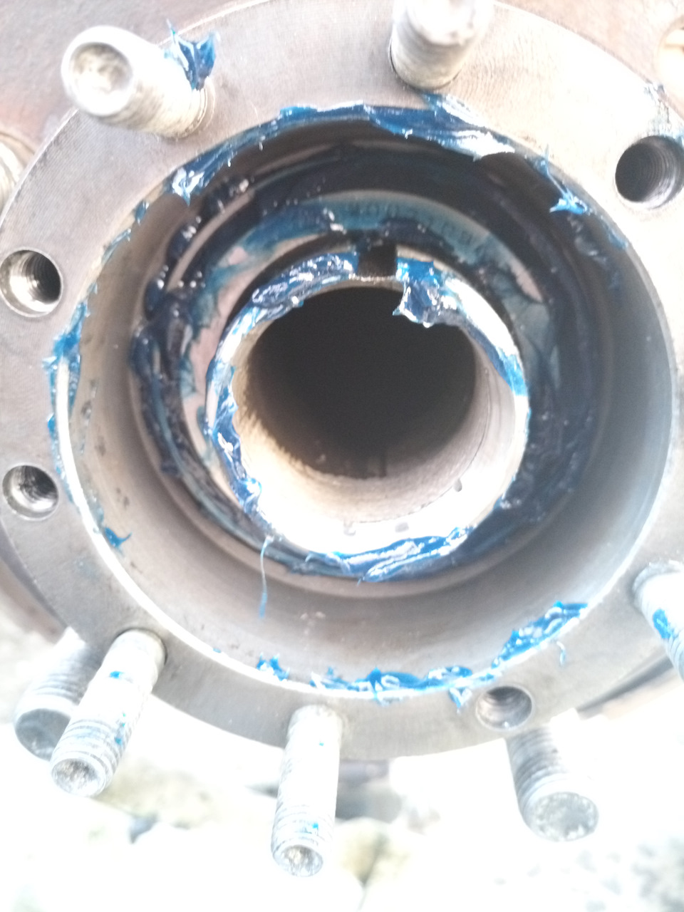

# Гул на скорости — диагностическое дерево

> Применимость: все двигатели
> Модели: Соболь 2217, 2752, 2310 — все

## Характер гула — первичная классификация



| Признак | Вероятный источник |
|---|---|
| Гул меняется при смене скорости | Подшипники ступиц |
| Гул не меняется в нейтрали | Шины |
| Гул пропадает в нейтрали | Коробка/редуктор |
| Гул зависит от угла поворота руля | Передние ступицы |
| Гул усиливается при нагрузке | Задние ступицы / редуктор |
| Вибрация + гул | Дисбаланс колёс, кардан |

## Диагностическое дерево

```
ГУЛ НА СКОРОСТИ
│
├── Тест в нейтрали (60 км/ч → выжать сцепление → нейтраль):
│   ├── Гул остался → подшипники ступиц, шины
│   └── Гул пропал → КПП или редуктор
│
├── ПОДШИПНИКИ СТУПИЦ?
│   ├── Тест рулём: на 60–80 км/ч покачать рулём влево-вправо
│   │   ├── Гул усиливается при повороте влево → левый передний подшипник
│   │   ├── Гул усиливается при повороте вправо → правый передний подшипник
│   │   └── Не меняется → задние ступицы или шины
│   │
│   ├── Поднять колесо домкратом, покачать за 12 и 6 часов → люфт?
│   │   ├── ДА → подшипник ступицы (или шаровая — проверить отдельно)
│   │   └── НЕТ → крутить руками и слушать (хруст, неравномерность)
│   │
│   └── Задние ступицы: гул на прямой + усиливается под нагрузкой?
│       └── Задние конические подшипники 32209/32210
│
├── ШИНЫ?
│   ├── Переставить колёса крест-накрест → гул переместился?
│   │   ├── ДА → шины (направленный рисунок или неравномерный износ)
│   │   └── НЕТ → другой источник
│   │
│   ├── Давление в шинах: низкое → гул усиливается
│   └── Зимняя резина с агрессивным рисунком — всегда гудит на асфальте
│
├── КПП?
│   ├── Гул только в одной передаче?
│   │   └── Изношена пара шестерён
│   ├── Гул во всех передачах, пропадает в нейтрали?
│   │   └── Первичный вал КПП (передний подшипник)
│   └── Скрежет + гул при включении передачи?
│       └── Синхронизаторы
│
└── РЕДУКТОР ЗАДНЕГО МОСТА?
    ├── Гул пропадает в нейтрали при движении накатом (60 км/ч → нейтраль)?
    │   └── ДА → редуктор под нагрузкой
    ├── Гул зависит от нагрузки (груз → усиливается)?
    │   └── ДА → подшипники редуктора
    └── Металлическая стружка в масле моста?
        └── ДА → срочно на дефектовку (шестерни)
```

## Подробно по узлам

### Передние ступичные подшипники
**Признаки:** гул меняется при покачивании рулём на 60–80 км/ч. Люфт при покачивании поднятого колеса.
**4x2:** парные конические подшипники 7305+7307. Замена требует регулировки преднатяга.
**4x4:** хабовый подшипник в сборе 6У537909К1С17. SKF/FAG — ресурс 100+ тыс., штатные — 8–20 тыс.
→ [Детали](kb/suspension/wheel_hub.md)

### Задние ступичные подшипники
**Признаки:** гул усиливается при нагрузке (груз), не зависит от руля.
**Подшипники:** наружный 32209 (45×85×24.75 мм), внутренний 32210.
**Проверка:** после 50 км езды потрогать ступицу рукой — горячая (не терпит) = преднатяг нарушен или подшипник умирает.
→ [Детали](kb/suspension/rear_hub_bearing.md)

### Шины
**Признаки:** гул не зависит от нагрузки, меняется при перестановке колёс.
**Частые случаи на Соболе:**
- Агрессивная шипованная резина в -5°C — гудит всегда
- Неравномерный износ (пилообразный) — гул только от одного колеса
- Разный износ передних и задних шин
**Решение:** при пилообразном — ротация колёс каждые 15 000 км.

### Редуктор заднего моста
**Признаки:** гул в нагруженном состоянии, пропадает в нейтрали на накате.
**Причины:** задиры на конических шестернях, изношенный подшипник ведущей шестерни.
**Тест на масло:** стружка в масле при замене → серьёзный износ.
→ [Детали](kb/transmission/rear_axle.md)

### КПП
**Признаки:** гул только под нагрузкой в определённой передаче, пропадает в нейтрали.
→ [Детали](kb/transmission/gearbox_diagnosis.md)

## Практика — последовательность диагностики

1. **Шины:** переставить колёса крест-накрест (5 мин) → проверить на ходу
2. **Нейтраль:** на 60 км/ч — нейтраль → гул пропал? → КПП/редуктор, а не ступицы
3. **Руль:** на 70 км/ч покачать рулём → гул меняется? → передние ступицы
4. **Домкрат:** поднять каждое колесо, прокрутить рукой, почувствовать хруст
5. **Нагрузка:** гул усиливается с грузом → задние ступицы

## Нюансы Соболя

- Штатные ступичные подшипники на 4x4 имеют ресурс всего 8–20 тыс. км на плохих дорогах — заменить на SKF/FAG при первом обслуживании
- Соболь-фургон под нагрузкой: задние подшипники работают в тяжёлом режиме — проверять каждые 50 тыс. км
- Зимняя резина до +7°C → летом её не снять сразу: сначала гудит, потом тише по мере износа
- Редуктор после замены масла (если надолго залито GL-5): шум уменьшается при прогреве → нормально

## Источники

- [Диагностика гула Газель — gazelleclub.ru](https://www.gazelleclub.ru/forum/)
- [Подшипник ступицы Соболь — drive2.ru](https://www.drive2.ru/)
- [Гул в заднем мосту — forum.allgaz.ru](https://forum.allgaz.ru/)

---
*Собрано: 2026-05-26*
