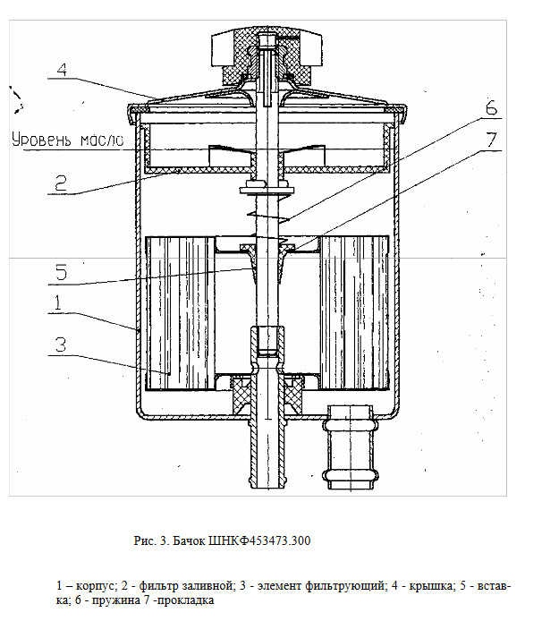

# Жидкость ГУР — замена и обслуживание

> Применимость: все Соболь с ГУР
> Модели: Соболь 2217, 2752 — с гидроусилителем руля

## Жидкость и объём

| Параметр | Значение |
|---|---|
| Тип жидкости | **ATF Dexron II/III** |
| Объём системы | ~1–1.5 л |
| Интервал замены | **40–50 тыс. км** или при потемнении |

**Нельзя:** смешивать ATF с «зелёной» жидкостью PSF. PSF — только если в инструкции прямо указана.

## Проверка уровня

На холодном двигателе, машина на ровной площадке:
- Открыть крышку бачка ГУР
- Уровень по щупу-палочке на крышке: отметки «MAX»/«MIN»
- При необходимости — долить ATF

**Признаки проблем с ГУР:**
- Тяжёлый руль → мало жидкости или изношен насос
- Пена в бачке → воздух в системе
- Тёмная/горелая жидкость → металлические частицы, редуктор изнашивается
- Скрип при повороте руля → пора менять жидкость или промывать

## Замена жидкости (метод «промывки»)

Полного слива жидкости не предусмотрено — менять методом вытеснения:

### Простой метод (шприц)

1. Заглушить двигатель
2. Шприцем откачать жидкость из бачка до дна
3. Залить свежий ATF до MAX
4. Запустить двигатель
5. Повернуть руль влево до упора, затем вправо до упора (3–5 раз)
6. Заглушить двигатель, снова откачать шприцем
7. Повторить 2–3 раза — до светлой жидкости

### Метод «через шланг» (более полная промывка)

1. Отсоединить возвратный шланг от бачка ГУР, опустить конец в ёмкость
2. Помощник медленно поворачивает руль влево-вправо при работающем двигателе
3. Вы доливаете ATF в бачок по мере вытекания
4. Когда вытекающая жидкость стала светлой — промывка окончена
5. Подсоединить шланг, долить ATF до нормы

**Объём ATF на промывку:** ~1 л для промывки + 1 л финальная заправка.

## Нюансы Соболя

- Насос ГУР на ЗМЗ-405 приводится ремнём. При замене жидкости — осмотреть ремень на трещины.
- Бачок ГУР — пластик. Со временем мутнеет, трескается. При металлической стружке в жидкости — менять бачок вместе с жидкостью.
- После промывки с металлическими частицами — диагностировать насос и редуктор ГУР: причина стружки должна быть устранена.
- Шланги ГУР: высокого и низкого давления. Стальные трубки между ними. Любая течь → потеря жидкости → потеря усиления → тяжёлый руль. Осматривать при каждом ТО.
- Зимой на морозе ГУР может «не работать» первые секунды после пуска — ATF загустела. Это нормально, если уровень в порядке.

## Типичные ошибки

**Лить другую жидкость кроме ATF Dexron** — несовместимость манжет → течь по всем уплотнениям.

**Не доливать при низком уровне** — насос работает «на воздухе» → разрушение за 5–10 минут.

**Крутить руль до упора при заглушённом двигателе** — насос не работает → клапан давления открыт → шланги под нагрузкой.

**Игнорировать металлическую стружку** — признак износа рейки или насоса, промывка не помогает.

## Источники

- [Замена жидкости ГУР Газель — drive2.ru](https://www.drive2.ru/l/557354539821304409/)
- [Как заменить жидкость ГУР — kolesa.ru](https://www.kolesa.ru/article/legkoe-techenie-kak-i-zachem-menyat-zhidkost-gur)
- [Замена жидкости ГУР — znanieavto.ru](https://znanieavto.ru/rulim/zamena-zhidkosti-gur.html)

---
*Собрано: 2026-05-26*
