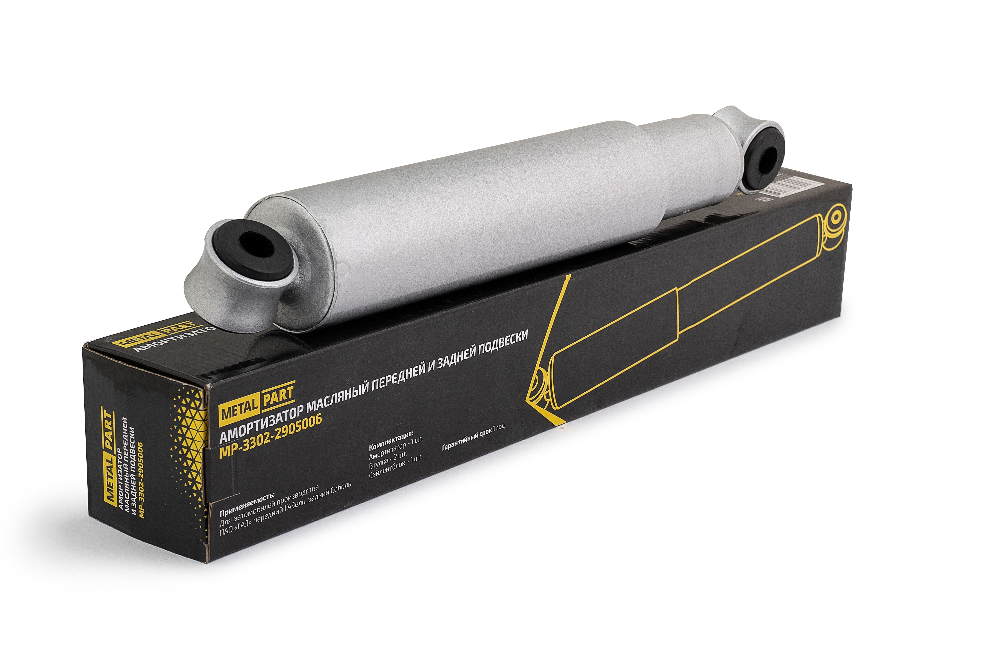

# Амортизаторы задние — замена

> Применимость: все модели Соболь
> Модели: Соболь 2217, 2752, 2310

## Конструкция задней подвески

Задняя подвеска Соболя — **рессорная зависимая**. Две продольные листовые рессоры + два амортизатора. Рессоры бывают:
- **Многолистовые** (5 листов) — стандартные, жёстче
- **Малолистовые** (3 листа) — комфортнее, но слабее при нагрузке

Амортизаторы работают в паре с рессорами — гасят колебания.

## Симптомы износа

- Машина долго «раскачивается» после ям (более 2 качаний)
- Пробои подвески — удары в буферы
- Стук амортизатора на кочках
- Потёки масла на корпусе

## Артикулы

| Вариант | Артикул | Примечание |
|---|---|---|
| Задний масляный (с втулками) | 3302-2905006 | Для Соболь/Газель |
| Задний газомасляный (с втулками) | 3302-2905006-10 (ПЕКАР) | Рекомендован |
| ГАЗ-2217 задний | 27527.2905006 | Оригинальный ГАЗ |

Газомасляные предпочтительнее — лучше гасят и дольше служат.

## Замена

Задние амортизаторы доступнее передних.

1. Поднять машину под раму (не под рессору)
2. Открутить нижний болт крепления амортизатора к рессоре (ключ 19 мм)
3. Открутить верхний болт крепления к кузову (ключ 17–19 мм)
4. Снять амортизатор
5. **Прокачать новый** (особенно газомасляный): 3–5 раз растянуть-сжать
6. Установить, затянуть болты (момент 50–80 Нм)

## Рессоры — обслуживание

**Смазка рессор:** листы трутся → скрип при нагрузке. Смазывать графитовой смазкой между листами при разборке.

**Рессорные пальцы (серьги):** изнашиваются втулки — появляется стук. Проверять при ТО, смазывать через маслёнки (если есть).

**Признаки усталости рессоры:** машина «осела» (клиренс уменьшился), рессора уплощилась. Менять лист или рессору в сборе.

## Нюансы Соболя

- **Нагрузка** сильно влияет на выбор амортизаторов: для пустого Соболя — стандартные, для Соболя с кузовом под нагрузкой — усиленные (SS20, РИФ).
- При установке нового амортизатора с новыми резиновыми втулками — **не затягивать болты полностью** пока машина стоит на весу (смята в одну сторону). Опустить на колёса, затянуть в нагруженном положении.
- Задние амортизаторы работают мягче передних — срок службы обычно больше.

## Типичные ошибки

**Затянуть болты в вывешенном положении** — резиновые втулки постоянно скручены → трескаются через 10–15 тыс. км.

**Заменить один задний** — машина будет кренить в одну сторону.

**Не прокачать газомасляный** — первые 100 км стучит и пугает.

## Источники

- auto.kombat.com.ua — конструкция рессорной подвески Соболь/Газель
- metalpart.ru — амортизаторы задние ГАЗ-3302/Соболь
- bazashop.ru — артикулы амортизаторов ПЕКАР

---
*Собрано: 2026-05-26*
