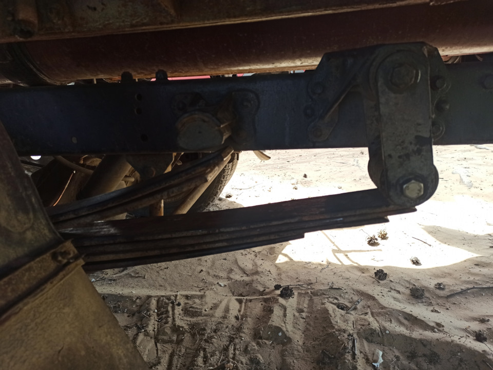

# Рессоры задние — замена и обслуживание

> Применимость: все модели Соболь с рессорной задней подвеской
> Модели: Соболь 2217, 2752, 2310 — все

## Конструкция задней подвески Соболя

Задняя подвеска Соболя — **рессорная, зависимая**. Задний мост на рессорах с амортизаторами.

Типы рессор на Соболе:
- **5-листовые** (более старые, традиционные)
- **3-листовые с пластиковыми вставками** (более современные, тише, легче)

## Симптомы неисправности рессор

- Машина «просела» (задняя часть ниже нормы)
- Одна сторона ниже другой (лопнул лист)
- Скрип рессор при езде по кочкам
- Пробои подвески при нагрузке (лист сломан)
- Осмотр: видимые трещины и изломы листов

**Диагностика:** нагрузить машину (полная нагрузка) и осмотреть рессоры. Сломанный лист виден визуально.

## Когда нужна замена

- Лист сломан
- Рессора провисла настолько, что регулировка колдуна на пределе
- Ресурс: 150–200 тыс. км (зависит от нагрузки и дорог)

## Замена рессор

### Необходимый инструмент

- Домкрат, подставки
- Ключ 19 мм (гайки стремянок)
- Ключ 22 мм (пальцы рессор)
- Трубный ключ или вороток для скруток
- Молоток, выколотка
- Графитовая смазка

### Порядок замены

1. Поднять заднюю часть машины домкратом (под кузов, не под мост)
2. Подставить опоры под кузов
3. Поддомкратить мост отдельно (чтобы разгрузить рессоры)
4. Отсоединить нижнее крепление амортизатора
5. Отвернуть гайки стремянок (4 гайки × 2 стороны = 8 гаек)
6. Снять стяжную скобу с центровочным болтом
7. Извлечь палец переднего ушка рессоры (выбить)
8. Извлечь палец задней серьги рессоры
9. Опустить рессору вниз

### Разборка рессоры (при замене отдельных листов)

1. Зажать рессору в тисках или специальным приспособлением
2. Выбить центровочный болт
3. Стянуть листы (распрямить)
4. Разобрать на листы

**Смазка листов 5-листовой рессоры:**
- Нанести графитовую смазку (ЦИАТИМ, Литол) на каждый лист
- Собрать, установить центровочный болт
- Надеть скобы-хомуты

**3-листовые рессоры с пластиковыми вставками:**
- Вставки не смазывать — они самосмазывающиеся
- При разборке: не потерять вставки

### Установка

1. Установить рессору, завести пальцы в ушки
2. Установить под мост — совместить отверстие центровочного болта с посадочным местом
3. Надеть стремянки
4. Закрутить гайки стремянок **без окончательной затяжки** (рессора должна двигаться)
5. Опустить мост на рессоры (снять домкрат из-под моста)
6. Подключить амортизаторы
7. Опустить машину на колёса — машина под нагрузкой
8. Затянуть гайки стремянок **под нагрузкой** (момент: 80–100 Нм)
9. Затянуть пальцы ушек рессор

**Важно:** затягивать стремянки только когда машина стоит на колёсах или нагрузка на рессоры соответствует рабочей. Иначе — рессора перекручивается.

10. После замены — **отрегулировать колдун** (регулятор давления задних тормозов) — жёсткость рессор изменилась.

## Нюансы Соболя

- Пальцы рессор закисают намертво. Залить WD-40 за день до работы — иначе молоток и болгарка.
- Гайки стремянок затягивать **строго под нагрузкой** (машина на колёсах). Иначе — при нагрузке рессора перекручивает мост → ведёт в сторону.
- После замены рессор обязательно проверить и при необходимости отрегулировать **колдун тормозов** — жёсткость рессор влияет на его работу.
- Машина с Соболём 4x4 — дополнительно проверить крепление кронштейнов раздаточной коробки.
- Скрип рессор при незначительном износе устраняется нанесением графитовой смазки на листы (без полной разборки — шприцем через зазоры).

## Типичные ошибки

**Затягивать стремянки на вывешенной машине** — при нагрузке рессора перекрутится, машину поведёт.

**Не регулировать колдун после замены рессор** — изменилась жёсткость → другое поведение тормозов.

**Смазывать пластиковые вставки 3-листовых рессор** — они не нуждаются в смазке, графитная смазка их портит.

**Не выбивать закисший палец** — попытки крутить без выколотки срывают гайку.

## Источники

- [Замена задних рессор Газель/Соболь — autohelpgid.ru](http://autohelpgid.ru/gaz/podveska/212-zamena-zadnih-ressor-na-gazele-sobole-video.html)
- [Эксперимент с рессорами Соболь — drive2.ru](https://www.drive2.ru/l/647113171554795742/)
- [Снятие и ремонт задней рессоры Газель — autoruk.ru](https://autoruk.ru/gaz-2705/snyatie-ustanovka-i-remont-zadnej-ressory-avtomobilya-gazel)

---
*Собрано: 2026-05-26*
