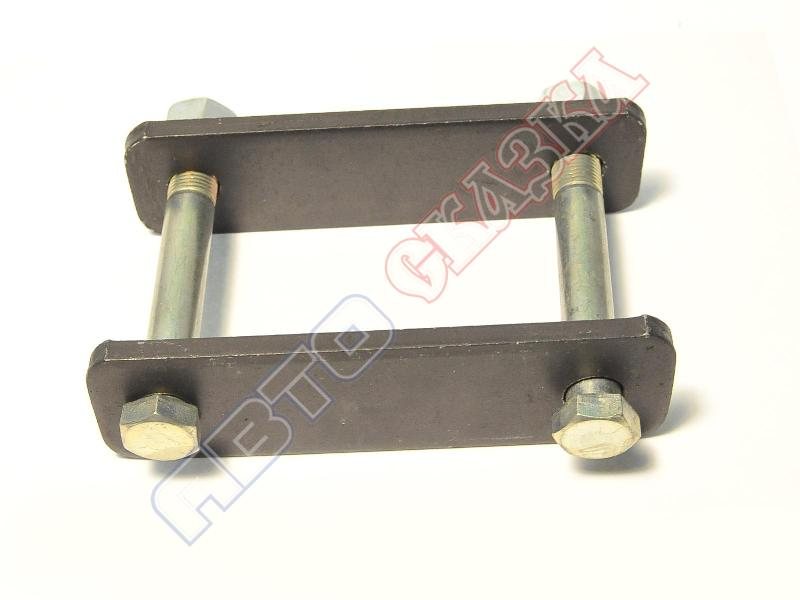

# Рессорные пальцы и втулки — замена

> Применимость: все модели Соболь (задняя рессорная подвеска)
> Модели: Соболь 2217, 2752, 2310 — все

## Конструкция крепления рессоры

Рессора крепится к раме в двух точках:
- **Передний конец** — палец в кронштейне рамы (неподвижно)
- **Задний конец** — палец в серьге (серьга позволяет рессоре удлиняться при прогибе)

Пальцы проходят через **резинометаллические втулки** (сайлентблоки) или **бронзовые втулки** с набивкой смазкой.

## Симптомы износа

- Стук в задней подвеске при проезде ям, лежачих полицейских
- Резина втулок разрушена (видно при осмотре снизу)
- Люфт пальца в серьге (покачать рессору поперёк)
- Кузов наклонён на одну сторону

## Норма прогиба рессоры (диагностика усталости)

| Тип рессоры | Нормальный прогиб (ненагруженная) |
|---|---|
| 5-листовая | 130–140 мм |
| 3-листовая | 140–160 мм |

Разница прогибов между правой и левой рессорой: **не более 10 мм**.

## Замена втулок и пальцев

### Инструмент

- Домкрат, опоры
- Накидной ключ 19–22 мм (гайки пальцев)
- Выколотка и молоток
- Съёмник или самодельный (шпилька с гайками)
- Литол-24 или Графитовая смазка
- WD-40 (на пальцы за сутки до работы)

### Подготовка

1. Смочить пальцы (оба — передний и задний) WD-40 за **24 часа** до работы
2. Поднять автомобиль, вывесить заднюю ось
3. Подставить домкрат под мост (не снимать нагрузку резко — рессора разогнётся)

### Замена переднего пальца

1. Открутить гайку пальца (ключ 19–22 мм)
2. Выбить палец выколоткой через монтажное отверстие в кронштейне рамы
3. Вынуть рессору из кронштейна
4. Запрессовать новые втулки (пресс или самодельный съёмник)
5. Смазать палец (Литол-24) и вставить в кронштейн
6. Затянуть гайку

### Замена заднего пальца (серьга)

1. Снять нижний болт амортизатора (чтобы не мешал)
2. Открутить гайку пальца серьги
3. Выбить палец
4. Заменить втулки
5. Собрать в обратном порядке

### Если палец не выбивается (закис)

1. Смочить мыльным раствором или тормозной жидкостью
2. Постучать по кронштейну через деревянную проставку — вибрация помогает
3. Нагреть кронштейн горелкой (металл расширится, зажим ослабнет)
4. Использовать выколотку через монтажное отверстие в раме (снизу)
5. Если не поддаётся — высверлить палец (14–16 мм), нарезать резьбу под болт

### Момент затяжки

Гайки пальцев рессор: **120–150 Нм**. Затягивать **только под нагрузкой** (машина стоит на колёсах, не поднята).

## Альтернатива замене рессоры при просадке

Удлинение стремянок серьги на **30–40 мм** восстанавливает клиренс без замены рессоры. Дешевле замены, актуально при просевшей но целой рессоре.

## Смазка пальцев

Пальцы с масленками — шприцевать **Литол-24** каждые 10–15 тыс. км.

На поздних автомобилях пальцы «необслуживаемые» (без масленок) — резинометаллические втулки, не требуют смазки. Срок службы 60–100 тыс. км.

## Нюансы Соболя

- На Соболе с коммерческой нагрузкой пальцы и втулки живут **40–60 тыс. км**
- Зимой закисшие пальцы — частая проблема при ремонте рессор. Обрабатывать WD-40 заранее
- Серьги задней рессоры — нижний палец стирается быстрее верхнего (больше нагрузка)
- При покупке б/у Соболя — обязательно проверить втулки рессор: люфт = замена, хруст = замена

## Типичные ошибки

**Затягивать гайки с вывешенной осью** — при опускании машины рессора прогибается, уже затянутые пальцы «скручивают» резину → втулки рвутся за 3–5 тыс. км.

**Не смазывать перед выбиванием** — срыв монтажных отверстий молотком.

**Устанавливать металлические втулки без смазки** — без смазки изнашиваются за 10–20 тыс. км.

## Источники

- [Снятие и ремонт задней рессоры Газели — autoruk.ru](https://autoruk.ru/gaz-2705/podveska/snyatie-ustanovka-i-remont-zadnej-ressory-avtomobilya-gazel)
- [Замена втулки рессорной Газель/Соболь — petroavtotrans.ru](https://www.petroavtotrans.ru/articles/zamena-vtulki-ressornoj-sajlentblok-gazel-sobol-valdaj/)
- [Замена сайлентблоков рессор Газели — avtogazel.kz](https://avtogazel.kz/zamena-sajlentblokov-ressor-gazel)

---
*Собрано: 2026-05-26*
