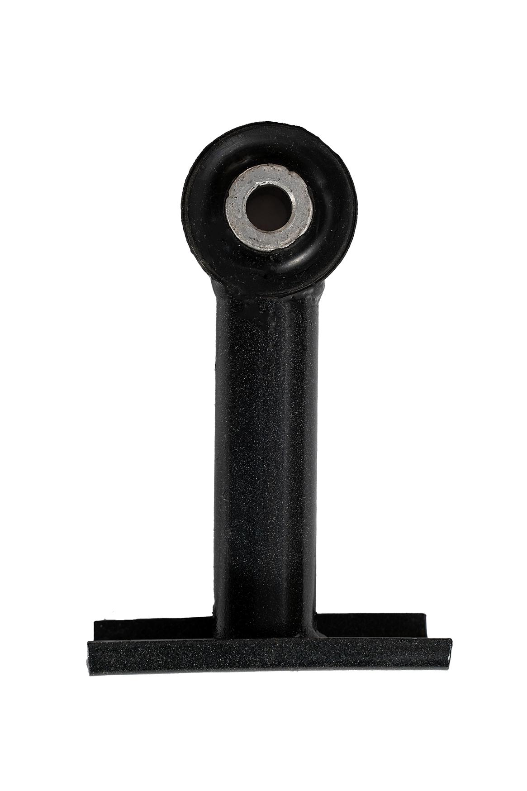

# Стабилизатор поперечной устойчивости — обслуживание и замена

> Применимость: все модели Соболь с передним стабилизатором
> Модели: Соболь 2217, 2752, 2310

## Конструкция

**Стабилизатор поперечной устойчивости** — торсионный стержень, соединяющий оба нижних рычага передней подвески. При кренах в повороте противодействует крену кузова.

Состоит из:
- **Штанги стабилизатора** — торсионный стержень
- **Стоек стабилизатора** — соединяют штангу с нижними рычагами
- **Подушек (втулок) стабилизатора** — удерживают штангу в кронштейнах подрамника

## Симптомы износа

| Что слышно/ощущается | Что изношено |
|---|---|
| Стук на малых кочках, асфальтовых швах | Стойки стабилизатора (шарнир) |
| Скрип при поворотах | Подушки (втулки) стабилизатора |
| Крен в повороте увеличился | Сломана или ослаблена штанга |

## Диагностика

Поднять машину, взять стойку стабилизатора и пошатать — люфт или стук = стойка изношена.

Втулки: визуально — трещины, расслоение, смещение резины.

## Артикулы

| Деталь | Артикул | Примечание |
|---|---|---|
| Штанга стабилизатора Соболь 2752 | 2752-2906016 | Голая штанга |
| Подушки стабилизатора | По каталогу по году | Резиновые или полиуретан |
| Стойки стабилизатора | По каталогу | Проверять парно |

## Замена стоек

1. Поднять машину, снять колесо (или без снятия — зависит от доступа)
2. Открутить верхнюю гайку стойки (крепится к стабилизатору — гайка + болт)
3. Открутить нижнюю гайку (крепится к нижнему рычагу)
4. Снять стойку
5. Установить новую

Стойки менять **попарно** (оба амортизатора стабилизатора одновременно).

## Замена подушек стабилизатора

Подушки сидят в кронштейнах на поперечине. Для снятия:
1. Открутить болты кронштейна
2. Снять кронштейн, извлечь подушку
3. Поставить новую, собрать

Подушки из **полиуретана** служат 3–5 раз дольше резиновых. Чуть жёстче, но для Соболя — оптимальный вариант.

## Нюансы Соболя

- На ряде кузовов Соболя стабилизатор **на задней оси тоже есть** (опция). При тюнинге подвески — иногда переносят или добавляют.
- Стойки стабилизатора Соболя **отличаются от Газели** — не всегда взаимозаменяемы. Уточнять при покупке.
- Стук стоек стабилизатора — один из самых частых источников «непонятного стука» в подвеске. Проверять первым.

## Типичные ошибки

**Заменить одну стойку** — через несколько тысяч километров придёт и вторая. Менять парой.

**Перетянуть болты крепления кронштейнов подушек** — резина выдавливается, подушка быстро изнашивается.

## Источники

- [Замена стабилизатора Соболь — gaz3110.ru](http://www.gaz3110.ru/sobol/9_6.htm)
- [Ремонт стабилизатора ГАЗ Соболь — YouTube](https://www.youtube.com/watch?v=CU6o-9OV9Wg)
- avtoall.ru — каталог запчастей стабилизатора ГАЗ-2217

---
*Собрано: 2026-05-26*
