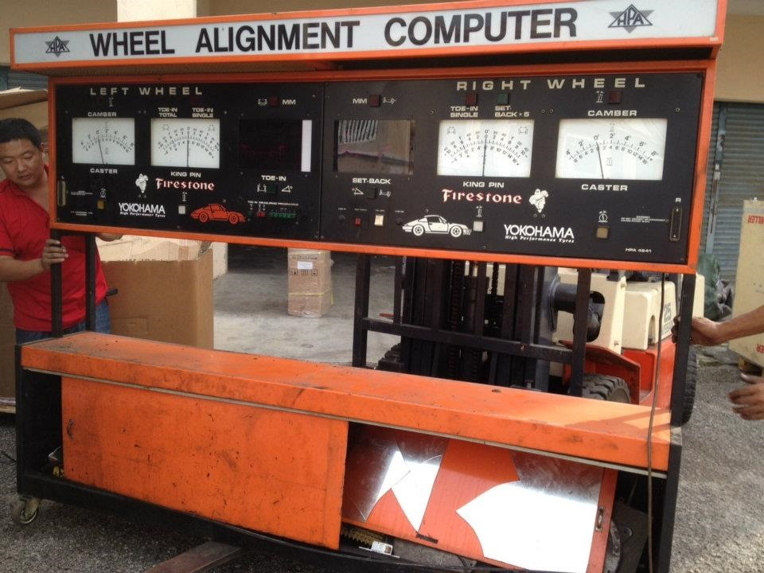

# Сход-развал — Соболь

> Применимость: все модели Соболь (передняя ось)
> Модели: Соболь 2217, 2752, 2310 — все

## Нормы углов установки колёс

| Параметр | Норма | Допуск разницы лево/право |
|---|---|---|
| Развал (камбер) | **+0°30'** | не более 0°30' |
| Схождение | **0–4 мм** (положительное — концы колёс сведены) | — |
| Кастор | 2°30' – 4°30' | не более 0°30' |

Схождение — расстояние между торцами колёсных дисков сзади минус спереди. Положительное = колёса «носками внутрь».

## Когда делать развал-схождение

**Обязательно после:**
- Замены шаровых опор
- Замены наконечников рулевых тяг
- Замены рычагов подвески
- Замены сайлентблоков рычагов
- Удара о яму / бордюр
- Любой разборки передней подвески

**По регламенту:** каждые 15–20 тыс. км или раз в год.

**Симптомы разбитого развал-схождения:**
- Автомобиль «уводит» в сторону
- Руль стоит «криво» при прямолинейном движении
- Неравномерный износ шин (внутренний или внешний край)
- Шины пилят — «пёрышки» на боковом протекторе

## Регулировка

### Схождение
Регулируется изменением длины **поперечной рулевой тяги**:
1. Ослабить хомуты на рулевой тяге (ключ 13–17 мм)
2. Провернуть тягу — удлинить (схождение уменьшится) или укоротить (увеличится)
3. Добиться нормы
4. Затянуть хомуты, не скручивая резиновый чехол

### Развал и кастор
На Соболе развал регулируется **эксцентриковыми пластинами (прокладками) под болтами верхнего рычага**. Пластины устанавливаются между рычагом и рамой.

1. Ослабить болты крепления верхнего рычага
2. Добавить/убрать прокладки
3. Затянуть болты, проверить угол

На стенде специалист выставляет комбинацию прокладок до достижения нормы.

**Важно:** развал и кастор связаны — изменение пакета прокладок меняет оба угла одновременно.

## Нюансы Соболя

- Соболь с пробегом 100+ тыс. — болты верхнего рычага могут «прикипеть». WD-40 заранее, работа займёт дольше.
- После замены шаровых опор — **обязательно** на стенд. Без стенда не обойтись — точность регулировки на глаз недостаточна.
- Соболь 4x4 — передняя ось с шарнирами, нормы те же, но стенд должен поддерживать 4x4.
- Схождение можно проверить самостоятельно рулеткой на ровном полу (измерить расстояние между ободами спереди и сзади). Но установить точно — только на стенде с нагрузкой.
- При сильном боковом износе одной шины — скорее всего схождение. При общем «пилении» обеих — развал.

## Типичные ошибки

**Делать развал-схождение не после замены подвески** — шаровая заменена, развал «уплыл» — шины через 5 тыс. сношены косо.

**Не проверять люфты в подвеске перед регулировкой** — на разбитых шаровых/наконечниках регулировка не держится.

**Ориентироваться только на прямолинейность движения** — руль может стоять прямо, но угол развала убивать шины изнутри.

## Источники

- [Сход-развал Газель/Соболь — gazel-repair.ru](http://gazel-repair.ru/remont-gazel/slesarnyj-remont-gazelej-materaily/158-skhod-razval.html)
- [Регулировка развала и схождения Соболь — drive2.ru](https://www.drive2.ru/l/614526670564499876/)
- [Развал-схождение Газель — gazel-time.com](https://gazel-time.com/raznoe/691-razval-shozhdenie-gazel.html)

---
*Собрано: 2026-05-26*
