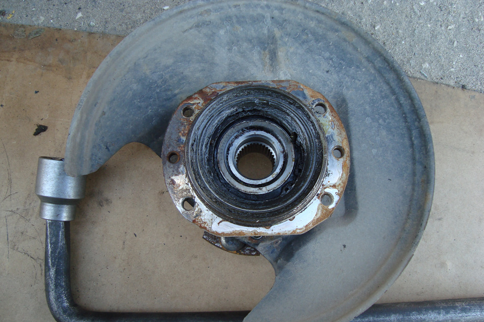

# Передний ступичный подшипник — замена и регулировка

> Применимость: все модели Соболь (4x2 и 4x4 — подшипники разные!)
> Модели: Соболь 2217, 2752, 2310

## Симптомы износа

- Гул или вой при движении, усиливается после 60 км/ч
- При покачивании поднятого колеса руками — ощутимый люфт
- Стрёкот или скрип при повороте руля
- Нагрев ступицы после поездки (норма — тёплая, не горячая)

Подшипники ходят ~**100 тыс. км**. Если купил б/у Соболь с пробегом 100+ — проверь первым делом.

## Артикулы подшипников

### Соболь 4x2 (задний привод)
Два конических подшипника в ступице:
- Внутренний: **7307** (или 7307А)
- Наружный: **7305** (или 7305А)
- Сальник ступицы: 3302-3103008
- Смазка: высокотемпературная литиевая (Литол-24 или NLGI-2)

### Соболь 4x4 (полный привод)
- Подшипник: **537909** (двухрядный конический, один на всю ступицу)
- Артикул комплекта (ГОСТех): 537909К1С17

## Замена — 4x2

1. Снять колесо, открутить тормозной суппорт (не отсоединять шланг, повесить на проволоке)
2. Снять тормозной диск
3. Вытащить шплинт из гайки ступицы
4. Открутить гайку ступицы (ключ **36 мм**, момент затяжки большой — нужен длинный рычаг)
5. Снять дистанционную шайбу
6. Стянуть ступицу с цапфы (специальный съёмник или аккуратно молотком через деревяшку)
7. Выбить старые подшипники из ступицы (съёмник или наставка)
8. Запрессовать новые подшипники, набить смазкой
9. Установить в обратном порядке

### Регулировка зазора (критично!)
1. Затянуть гайку ступицы до устранения люфта колеса
2. Проверить: колесо должно вращаться свободно, без заедания
3. Подтянуть/отпустить гайку до совпадения отверстия для шплинта
4. Вставить и загнуть новый шплинт
5. Осевой люфт колеса после регулировки: **0.02–0.06 мм** (практически не ощущается руками)

## Нюансы Соболя

- **На 4x4 подшипники другие** — не перепутать при покупке. У 4x4 полуось проходит через ступицу.
- Вологодские подшипники (ВПЗ) — хорошее качество по разумной цене, ставят на форумах.
- FAG, SKF — иностранные аналоги, ходят дольше но дороже.
- Китайские без бренда — лотерея, могут не дожить до 30 тыс. км.
- После замены подшипников **обязательно проверить регулировку** — перетянутый подшипник перегревается и разрушается за несколько тысяч км.

## Типичные ошибки

**Не набить смазку** — подшипники конические, смазка набивается руками в сепаратор. Без смазки — 5–10 тыс. км и замена снова.

**Не заменить сальник** — старый сальник обычно рвётся при снятии, смазка вытечет. Покупать сразу с подшипниками.

**Неправильная регулировка** — перетяжка = перегрев = быстрый износ. Недотяжка = люфт = разбитый подшипник. Регулировать аккуратно.

**Не поставить новый шплинт** — старый шплинт ломается при изгибании. Гайка откручивается на ходу — опасность.

## Инструмент

| Позиция | Что нужно |
|---|---|
| Ключ для гайки ступицы | 36 мм + вороток 0.5 м |
| Съёмник ступицы | Желательно, без него сложно |
| Наставка для запрессовки подшипников | Отрезок трубы подходящего диаметра |
| Шплинт | 5×45 мм (новый — обязательно) |
| Смазка | Литол-24 или аналог NLGI-2 |

## Источники

- [Замена подшипника ступицы Соболь 4x4](https://www.drive2.ru/l/483830747027735361/) — drive2.ru
- [Сказ про ступичные подшипники Соболь](https://www.drive2.ru/l/575460747551703233/) — drive2.ru
- [Регулировка ступичных подшипников Газель](https://gazel-rukovodstvo.ru/GAZ/7-4.html) — официальное руководство
- [Подшипники Metalpart — комплект для Соболь](https://metalpart.ru/catalog/remkomplekty_kolyes_i_stupits/podshipniki_peredney_stupitsy_kolesa_gaz_gazel_next_sobol_podshipniki_2_sht_salnik_1_sht_/)

---
*Собрано: 2026-05-26*
